# Deploy your Voice App to Azure

Learn how to host your Alexa Skills and Google Actions on Microsoft Azure with Azure Functions and Cosmos DB as your database.

* [Introduction](#introduction)
* [Azure Functions](#azure-functions)
   * [Create Azure FunctionApp](#create-azure-functionapp)
   * [Project Configuration to host on Azure Functions](#project-configuration-to-host-on-azure-functions)
* [Cosmos DB](#cosmos-db)
   * [Create Cosmos DB Account](#create-cosmos-db-account)
   * [Project Configuration to use Cosmos DB](#project-configuration-to-use-cosmos-db)

## Introduction

[Microsoft Azure](https://azure.microsoft.com) is the cloud provider by Microsoft. Azure provides a variety of cloud services, including Azure Functions (a serverless compute service) and Cosmos DB (a NoQSL database service). 

In this tutorial, you will go through the steps needed to host your Alexa Skills and Google Actions on Microsoft Azure by using Azure Functions for your code, and Azure Cosmos DB for storing user specific data.

## Azure Functions

> Find the Docs here: [Hosting: Azure Functions](https://www.jovo.tech/docs/hosting/azure-functions).

In this section, you will go through the necessary steps to host your voice app's code on Azure Functions:

* [Create Azure FunctionApp](#create-azure-functionapp)
* [Project Configuration to host on Azure Functions](#project-configuration-to-host-on-azure-functions)

### Create Azure FunctionApp

First of all, you have to create an Azure FunctionApp. For that press the `Create a resource` button on the top left:

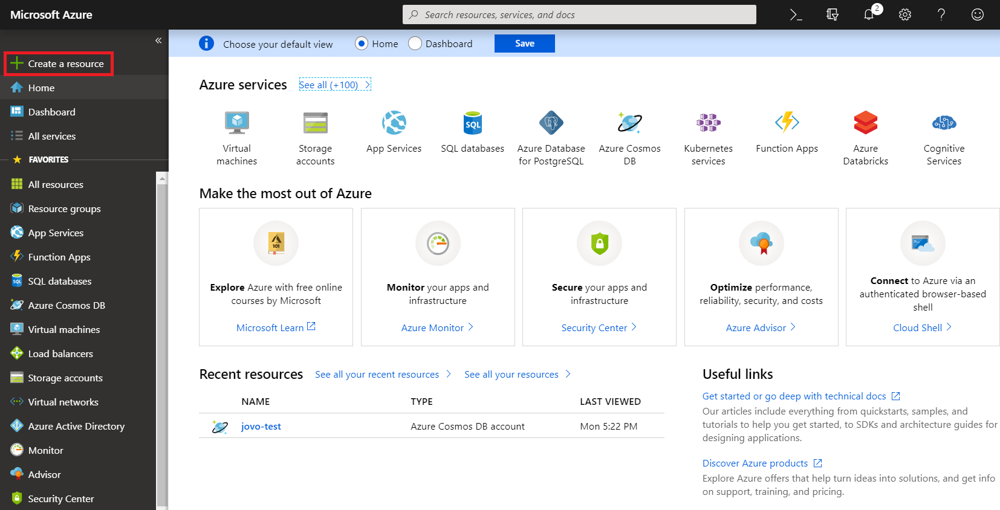

Search for `Function` and click on `Function App` and press `Create` on the bottom:

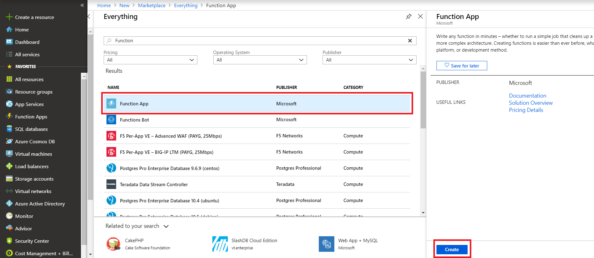

Name your `Function App` and select `JavaScript` as your `Runtime Stack`:

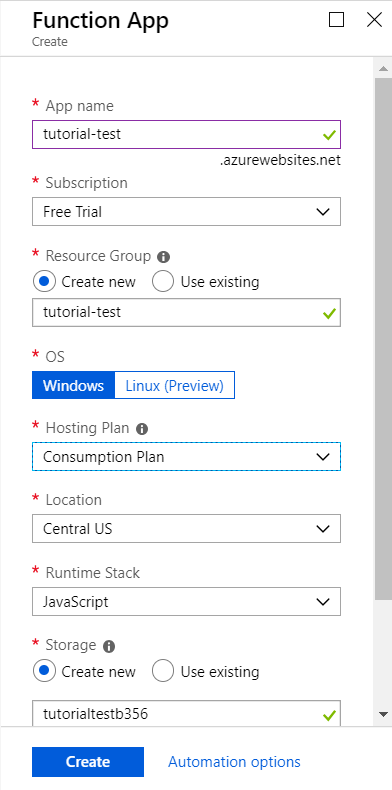

After your FunctionApp was created, click on it open up the `Application Settings`:

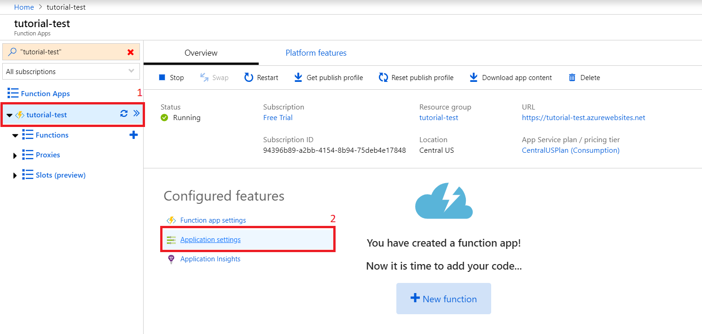

Scroll down to the `Application Settings` and create a new setting called `WEBSITE_RUN_FROM_PACKAGE` with the value `1`:

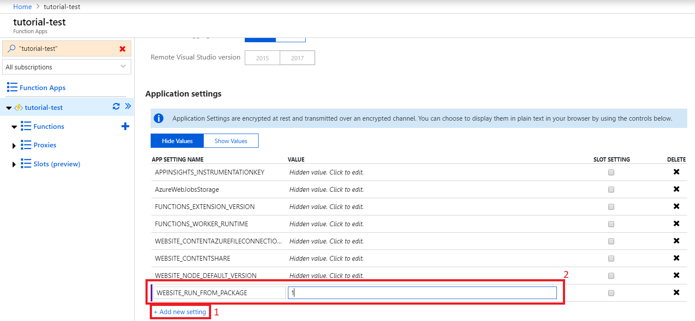

You can read about the benefits of that setting [here](https://docs.microsoft.com/en-us/azure/azure-functions/run-functions-from-deployment-package)

That's all you need to do here. Next, you have to make some configurations to your Jovo project.

### Project Configuration to host on Azure Functions

To host your app on Azure, you need to make some changes to an existing file as well as create new ones.

Let's start with the existing one, which is the `index.js` file.

You have to first import the `AzureFunction` class. For example, you can simply replace the `Lambda` with `AzureFunction` at the top of the file:

```javascript
// index.js

const { Webhook, ExpressJS, AzureFunction } = require('jovo-framework');
```

Next, replace the bottom part, where it says `AWS Lambda`, with the following code:

```javascript
// index.js

exports.handler = async (context, req) => {
    await app.handle(new AzureFunction(context, req));
};
```

Now create a new file called `host.json` inside the same directory as your `index.js` file (typically the `src` folder) with the following content:

```javascript
// host.json

{
  "version": "2.0"
}
```

As a last step, create a new folder, which you can name whatever want (e.g. "webhook"). It will be later used as your function's name. Inside that folder create a file called `function.json` and add the following:

```javascript
// function.json

{
  "scriptFile": "../index.js",
  "disabled": false,
  "bindings": [
    {
      "type": "httpTrigger",
      "webHookType": "genericJson",
      "direction": "in",
      "name": "req"
    },
    {
      "type": "http",
      "direction": "out",
      "name": "res"
    }
  ]
}
```

To upload your project to Azure, you need to zip everything and upload it using the Azure CLI.

To create an optimized zip file run the `npm run bundle` command:

```sh
$ npm run bundle
```

To upload the zip file, you need to the Azure CLI. You can find an installation guide for specific OS [here](https://docs.microsoft.com/en-us/cli/azure/install-azure-cli?view=azure-cli-latest)

After you have successfully installed the CLI run the following command to upload the zip file:

```sh
$ az functionapp deployment source config-zip  -g <resource_group_name> -n <app_name> --src <zip_file_path>
```

This make take a while.

After the zip was uploaded, go back to the Azure dashboard, open up your new function and press `Get function URL` to get your endpoint URL:

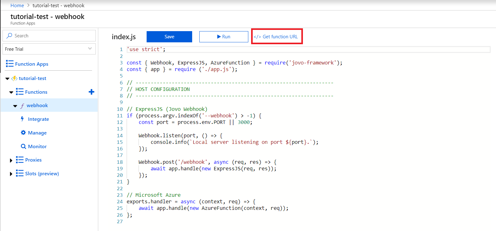

Copy the URL, add it as your endpoint for each platform and you're done.

The last thing left to do, is to set up Cosmos DB as your project's database.

## Cosmos DB

> Find the Docs here: [Database: Cosmos DB](https://www.jovo.tech/docs/databases/cosmosdb).

Now that we have our code running on Azure Functions, we can't rely on the default database integration ([FileDB](https://www.jovo.tech/docs/databases/file-db)) anymore. Learn how to use the Azure Cosmos DB to store user data in the following steps.

* [Create Cosmos DB Account](#create-cosmos-db-account)
* [Project Configuration to use Cosmos DB](#project-configuration-to-use-cosmos-db)

### Create Cosmos DB Account

Open up the Microsoft Azure dashboard and select `Azure Cosmos DB`:

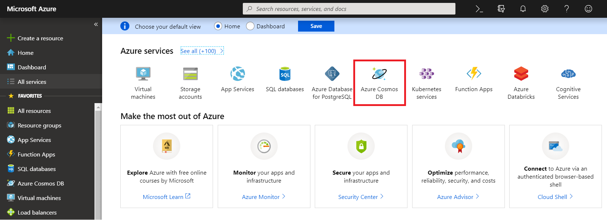

On the landing page press `Create Service Account`:

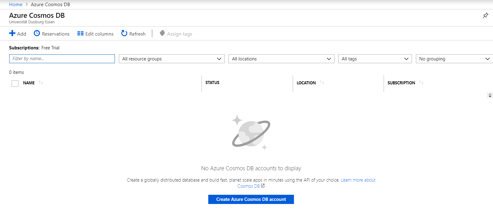

Name your account and select `Azure Cosmos DB for MongoDB API` as the API:

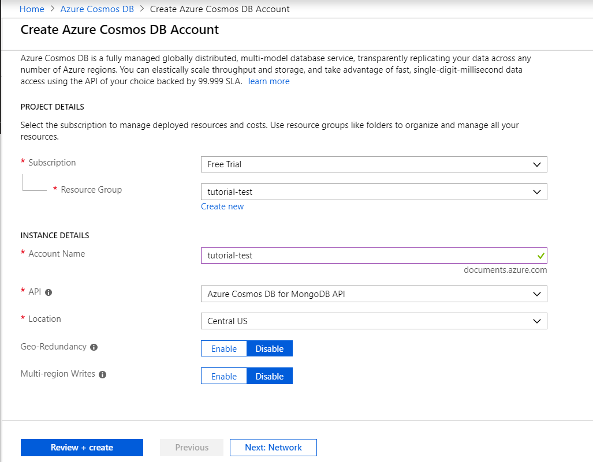

After Azure is done deploying, press `Go to resource` to get to your new Cosmos DB account:

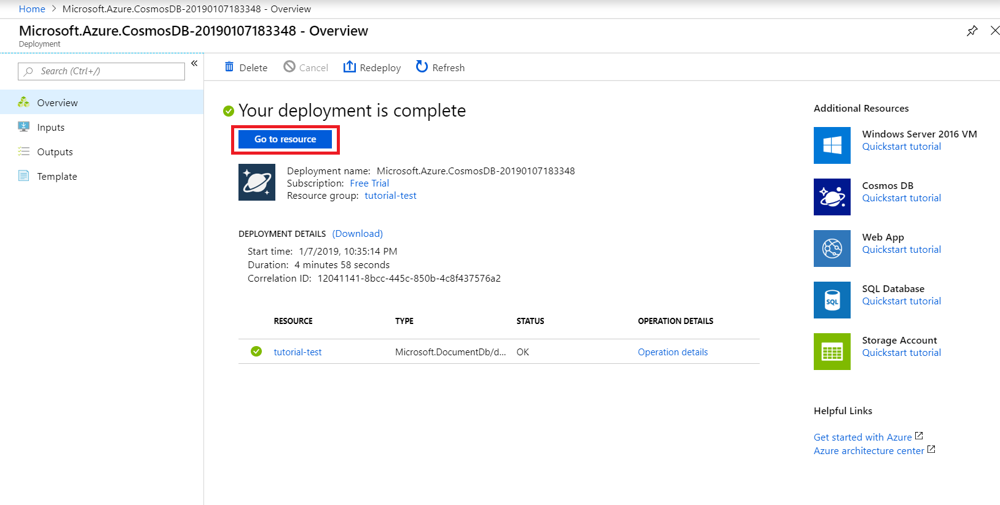

Switch to the `Quick Start` tab, choose `Node.js` as the platform to access your account's `primary connection string`, which we will need later on, so copy that:

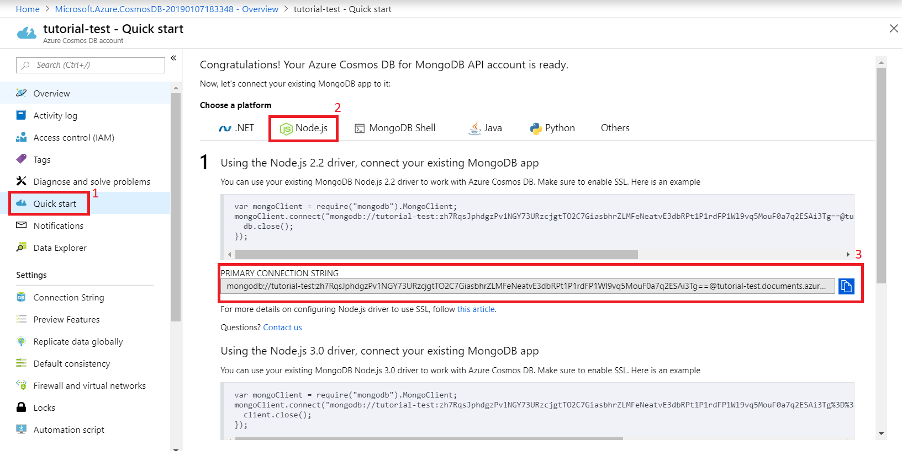

Now you need to open up your Jovo project, because it's time to make the necessary configurations to use Cosmos DB as your project's database.

### Project Configuration to use Cosmos DB

To use Cosmos DB in your project, you will need the `jovo-db-cosmosdb` plugin:

```sh
$ npm install jovo-db-cosmosdb --save
```

After that go to your `app.js` file and import as well as enable it:

```javascript
// app.js

const {CosmosDb} = require('jovo-db-cosmosdb');

app.use(
    // Other plugins
    new CosmosDb()
);
```

Last but not least, you have to add the `primary connection string` and the table name to your `config.js`:

```javascript
// config.js
module.exports = {
    // Other configurations

    db: {
        CosmosDb: {
            uri: '<primary-connection-string>',
            databaseName: '<table-name>'
        }
    },
};
```

Optionally you can also add the `collectionName`, which is `UserData` by default:

```javascript
module.exports = {
    // Other configurations

    db: {
        CosmosDb: {
            uri: '<primary-connection-string>',
            databaseName: '<table-name>',
            collectionName: '<collection-name>'
        }
    },
};
```

That's it. Your project will now use Cosmos DB as its database.


<!--[metadata]: { "description": "Learn how to deploy your Alexa Skill and Google Action to Azure Functions.", "author": "kaan-kilic", "tags": "Azure, Deployment, Hosting" }-->
