# Deploy your Voice App to Google Cloud

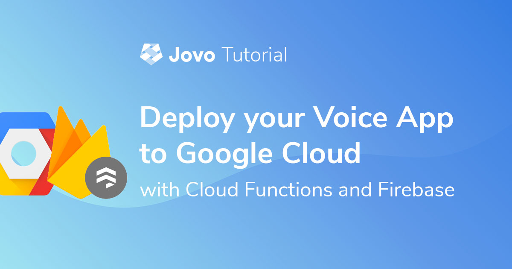

Learn how to host your Alexa Skills and Google Actions on Google Cloud with Cloud Functions and Firebase (Google Cloud Firestore) as your database.

* [Introduction](#introduction)
* [Google Cloud Functions](#google-cloud-functions)
  * [Project Configuration to host on Google Cloud](#project-configuration-to-host-on-google-cloud)
  * [Create Google Cloud Function](#create-google-cloud-function)
* [Google Firestore](#google-firestore)
  * [Create Firestore Database](#create-firestore-database)
  * [Project Configuration to use Firestore](#project-configuration-to-use-firestore)

## Introduction

[Google Cloud](https://cloud.google.com/) is the cloud computing service by Google. It provides a variety of cloud services, including Cloud Functions (a serverless compute service) and Firestore (the NoQSL database service by Firebase). 

In this tutorial, you will go through the steps needed to host your Alexa Skills and Google Actions on Google Cloud by using Cloud Functions for your code, and Firestore for storing user specific data.

## Google Cloud Functions

> Find the Docs here: [Hosting: Google Cloud Functions](https://www.jovo.tech/docs/hosting/google-cloud-functions).

In this section, you will go through the necessary steps to host your voice app's code on Google Cloud Functions:

* [Project Configuration to Host on Google Cloud](#project-configuration-to-host-on-google-cloud)
* [Create Google Cloud Function](#create-google-cloud-function)

### Project Configuration to Host on Google Cloud

The only change you have to make to your project to be able to host on Google Cloud Functions, will be made inside your `index.js` and `package.json` file. Instead of using `Lambda`, you have to use `GoogleCloudFunction`.

For that, first replace `Lambda` with `GoogleCloudFunction` at the `require` statement at the top of the file:

```javascript
// index.js

const { Webhook, ExpressJS, GoogleCloudFunction } = require('jovo-framework');
```

After that, replace the code snipped at the bottom, where it says `AWS Lambda` with the following piece:

```javascript
// index.js

exports.handler = async (req, res) => {
    await app.handle(new GoogleCloudFunction(req, res));
};
```

Inside your `package.json` file, you have to change value of the `main` option, which specifies the entry point to your program, from `src/index.js` to `index.js`:

```javascript
// package.json

"main": "index.js",
```
That's it.

### Create Google Cloud Function

First of all, you have to create a Cloud Function. For that, select `Cloud Functions` at the navigation menu of the [Google Cloud Console](https://console.cloud.google.com/):


You will be prompted to enable the Cloud Functions API as well as to create a new function, which will route you to the following form:

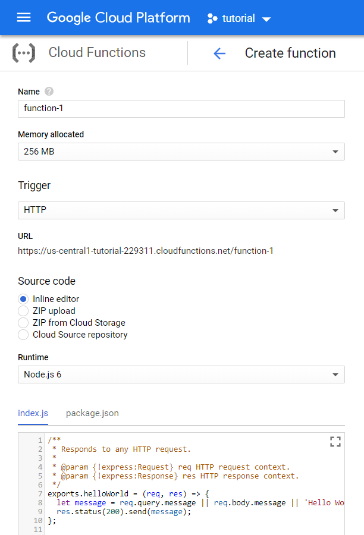

The `trigger` and `memory allocated` settings can be left untouched, but I would recommend to change the `Runtime` to `Node.js 8` to allow the use of `async/await`.

Also, instead of using the `Inline editor`, select the `ZIP upload` option. You can generate a `bundle.zip` file to upload by using the following command in your Jovo project:

```sh
$ npm run bundle
```

You also need to specify a `Stage bucket`, which you have to create, if you don't have one already, that will be used to store your code:

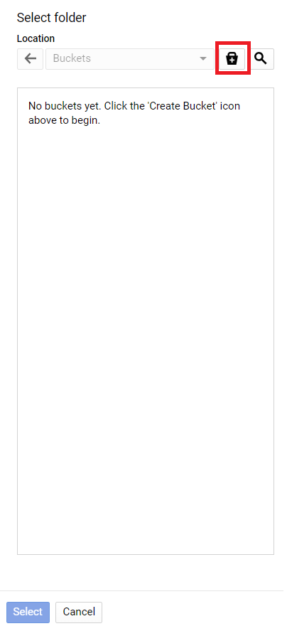

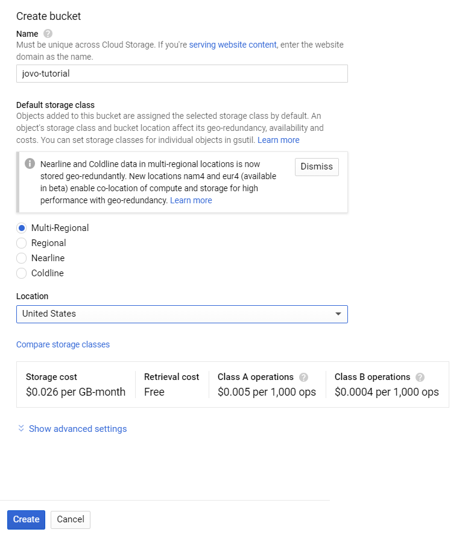

Last but not least, change the `Function to execute` to `handler`.

The filled form should look like this:

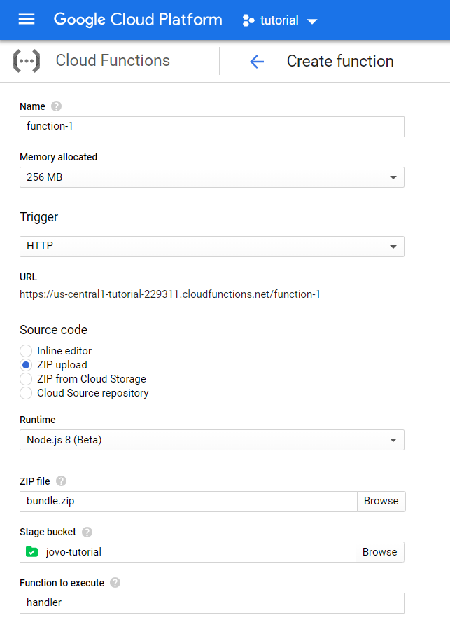

Press `Create` and lean back, as this will take a minute or two.

After your function was created, you will be redirected to the landing page of `Google Cloud Functions`, where you can select your new function:

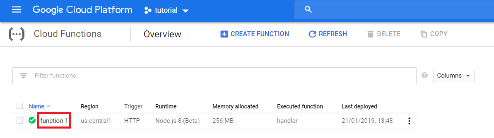

On the landing page of your function, you can find the `Trigger` section, where you will be able to find the URL, that you can use as the endpoint for each platform your voice app supports:

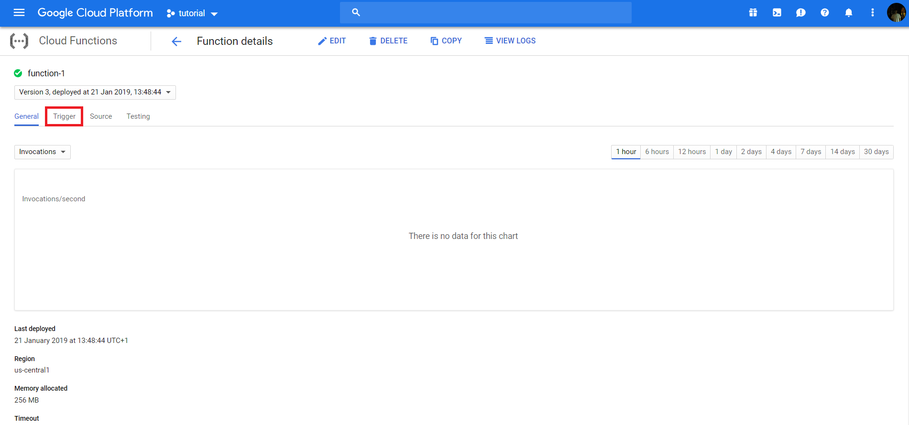

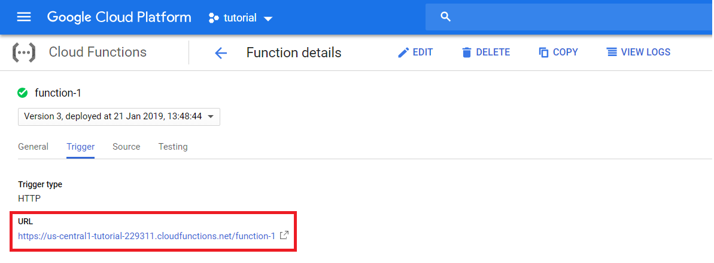


## Google Firestore

> Find the Docs here: [Database: Firestore](https://www.jovo.tech/docs/databases/firestore).

Now that you have your code running on Google Cloud Functions, you can't rely on the default database integration ([FileDB](https://www.jovo.tech/docs/databases/file-db)) anymore.

Instead, we are going to use Google Cloud Firestore, the NoSQL database by Firebase. An alternative could also be Google Cloud Datastore, which is also supported by Jovo. [You can find the Docs for Google Cloud Datastore here](https://www.jovo.tech/docs/databases/google-datastore).

Learn how to use Firestore to store user data in the following steps. 

### Create Firestore Database

Open up the [Firebase Console](https://console.firebase.google.com/) and select `Add project`:

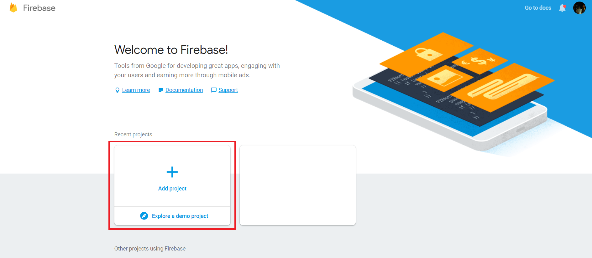

Select the project you created earlier on and press `Continue`:

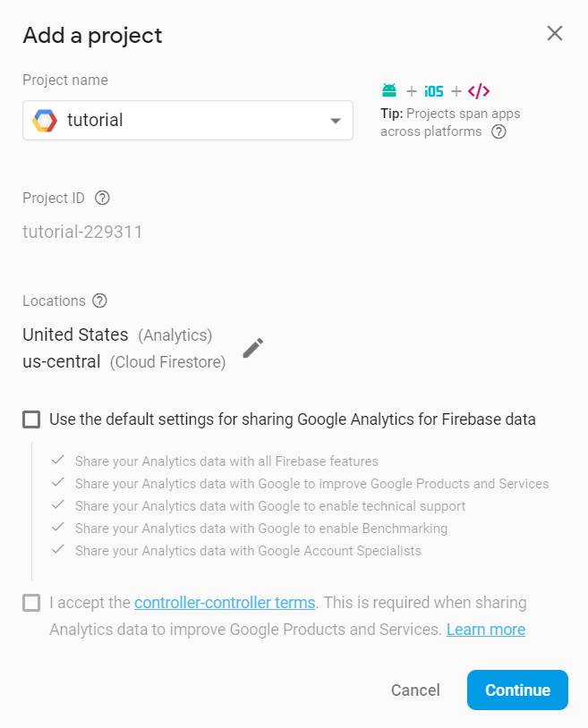

After your project was added, select `Database` to be routed to Firestore:

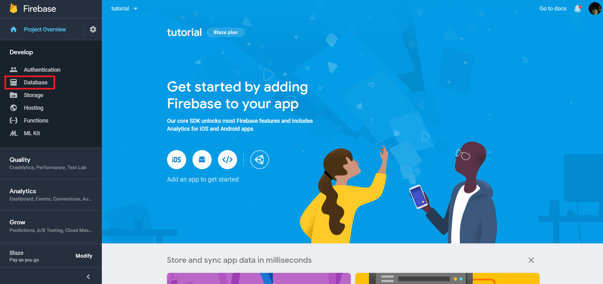

On there, select `Create database`:

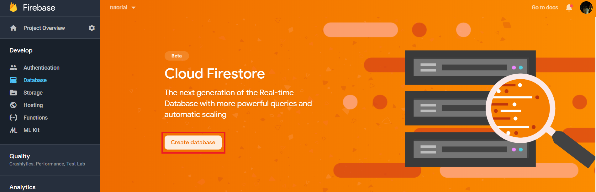

Stay with the `locked mode` option and press `Enable`:

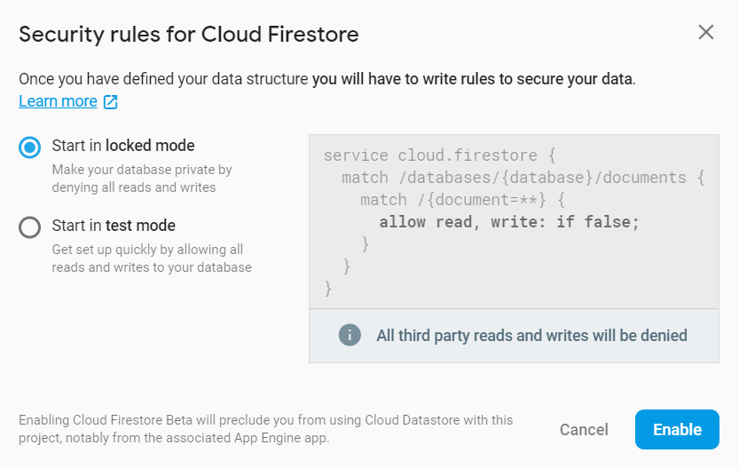

After that, your database should be created. 

To access the database, you have to authenticate yourself, for which you need add a service account. To create one, go to your project settings:

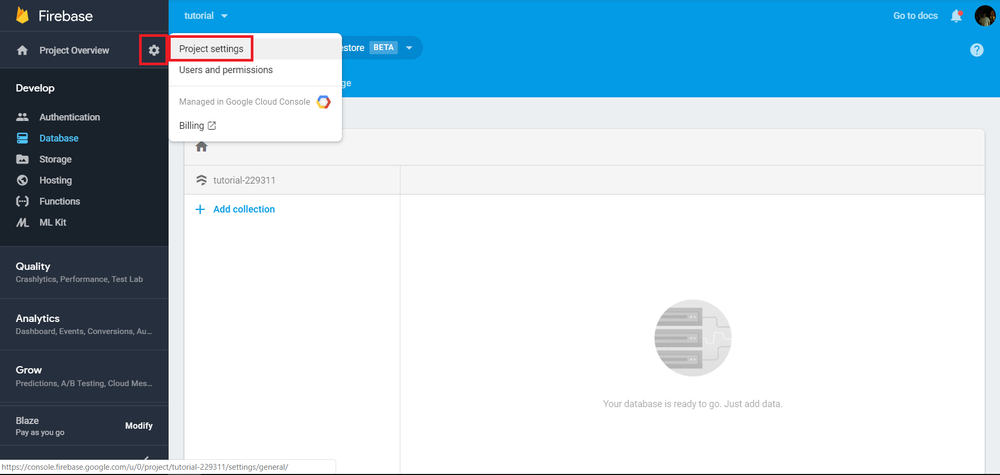

On there, switch to the `Service Accounts` tab:

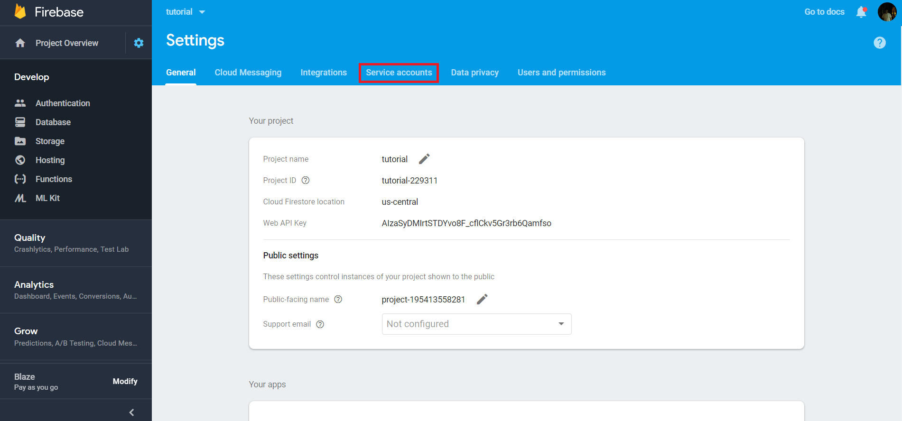

At the bottom of the page, you will find the `Generate new private key` button, which will download a `JSON` file that you will need later on:

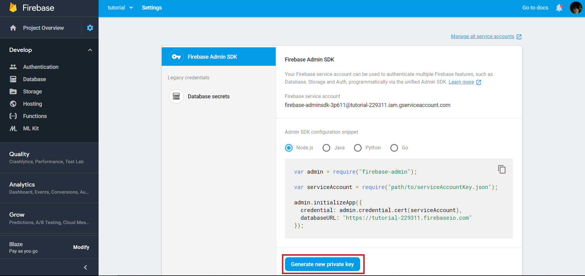

For now you're done here, but eep the tab open, since you will need it in a minute.

### Project Configuration to use Firestore

To use Firestore in your project, you will need the `jovo-db-firestore` plugin:

```sh
$ npm install jovo-db-firestore --save
```

After that go to your `app.js` file and import as well as enable it:

```javascript
// app.js

const {Firestore} = require('jovo-db-firestore');

app.use(
    // Other plugins
    new Firestore()
);
```

Last but not least, you have to configure the plugin. For that you will need the database url, which you can find on the tab you left open, as well as the `JSON` file you downloaded a minute ago:

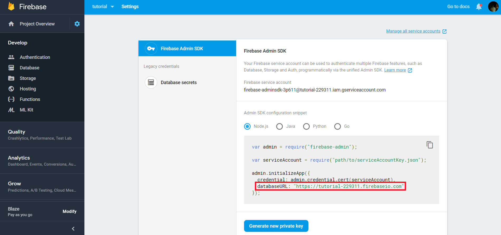

Move the `JSON` file inside your project's `src` folder and add the following to your `config.js` file:

```javascript
// config.js

module.exports = {
    // Other configurations

    db: {
        Firestore: {
            credential: require('<path-to-json-file>'),
            databaseURL: '<databaseURL>'
        }
    },
};
```

That's it. Your project will now use Firestore as its database.

<!--[metadata]: { "description": "Learn how to deploy your Alexa Skill and Google Action to Google Cloud with Cloud Functions and Firebase Firestore.", "author": "kaan-kilic", "tags": "Google Cloud, Deployment, Hosting", "og-image": "https://www.jovo.tech/img/tutorials/deploy-to-google-cloud/deploy-to-google-cloud.jpg" }-->
