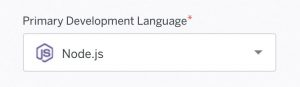
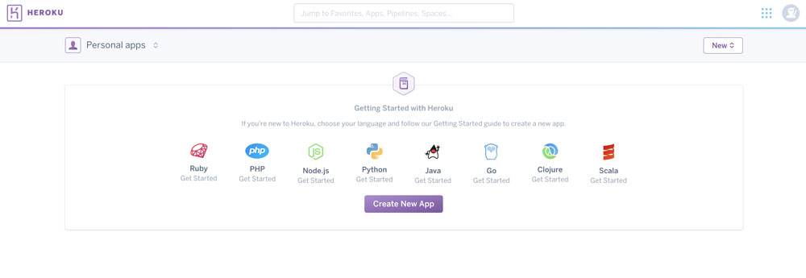
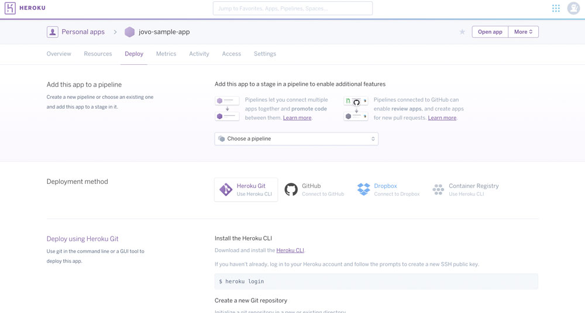
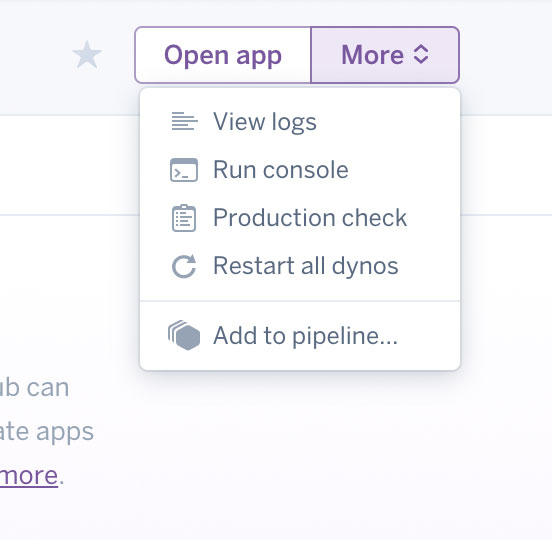
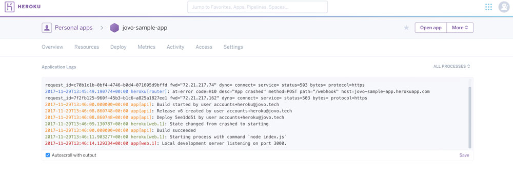
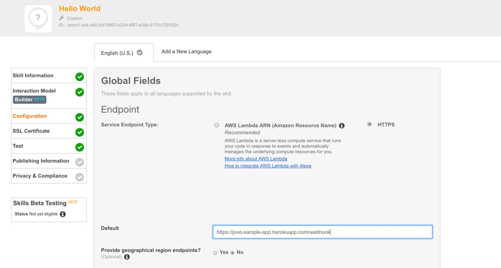
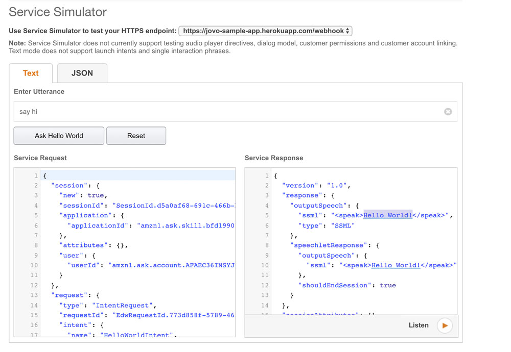
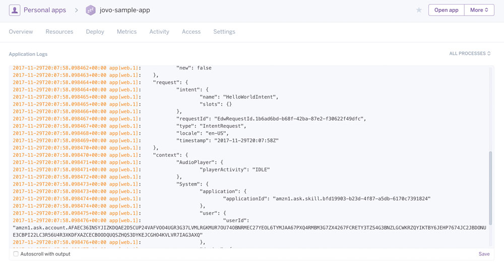

# How to Deploy your Alexa Skill and Google Action to Heroku

In this guide, you will learn how to host your voice apps on Heroku, a cloud service that offers an easy solution for developers to deploy, manage, and scale their code. We will walk you through the process of creating a Heroku app and modifying your code step by step.

* [Introduction](#introduction)
* [Setting up Heroku](#setting-up-heroku)
  * [Creating a Heroku App](#creating-a-heroku-app)
  * [Using the Heroku CLI](#using-the-heroku-cli)
* [Preparing the Jovo Code for Heroku](#preparing-the-jovo-code-for-heroku)
  * [Updating the Package.json](#updating-the-packagejson)
  * [Creating a Procfile](#creating-a-procfile)
  * [Adding Alexa Verification](#adding-alexa-verification)
* [Testing the Server](#testing-the-server)

## Introduction

Righ now, Jovo offers two ways to host your voice app: Either on [AWS Lambda](https://www.jovo.tech/docs/hosting/aws-lambda) or on a server by using a [ExpressJS](https://www.jovo.tech/docs/hosting/express-js).

In our [voice app tutorials](https://www.jovo.tech/learn), we usually use the [Jovo Webhook](https://www.jovo.tech/docs/jovo-webhook) for easy [local prototyping](https://www.jovo.tech/docs/project-lifecycle#local-development). However, when it's time to run your app in production, most people deploy their code to AWS Lambda.

But what if you want to host your code on a web server, for example [Heroku](https://www.heroku.com/)?

Let's try it out.

In this example, we will host our ["Hello World!" sample voice app](https://github.com/jovotech/jovo-sample-voice-app-nodejs) on Heroku. For a detailed overview on how to get started, take a look at our step by step course [Project 1: Hello World](https://www.jovo.tech/courses/project-1-hello-world/). We'll assume you've followed all the necessary steps until the last one ([Project 1 Step 6](https://www.jovo.tech/courses/project-1-hello-world/step-6-hello-world)), where we're running the voice app on a local server.

Instead, we're now deploying it to Heroku.

## Setting up Heroku

In this section, we will create an app on Heroku and deploy our [sample voice app](https://github.com/jovotech/jovo-sample-voice-app-nodejs) to the server. If you're new to Heroku, they a handy guide for beginners: [Getting Started on Heroku with Node.js](https://devcenter.heroku.com/articles/getting-started-with-nodejs#introduction).

First, let's create a Heroku account (if you don't already have one), create an app, and use the Heroku CLI to do an initial push to the server.

### Creating a Heroku App

[You can sign up for a free account here](https://signup.heroku.com/dc). When signing up, you can already choose _Node.js_ as a primary development language:



But no worries if you haven't selected it here. After signing up, you can create a new app in any language shown on the dashboard:



Choose _Node.js_ and then specify an app name on the next screen:


Now, we have several options how to deploy our code.



Let's go with the default option, Heroku Git, for which we need to install the Heroku CLI.

### Using the Heroku CLI

The Heroku command line tools are easy to install. You can find the full reference here: [Heroku CLI](https://devcenter.heroku.com/articles/heroku-cli) (Heroku Dev Center). Also, here's more information about the CLI in relation to Node.js: [Heroku: Getting Started with Node.js > Setup](https://devcenter.heroku.com/articles/getting-started-with-nodejs#set-up).

After you've installed the CLI, you can login like so:

```sh
$ heroku login
```

This prompts you to type in your account credentials.

When this is done, go to your project folder to initialize the repository and add it to your Heroku app:

```sh
# Initialize Git Repository
$ git init

# Add Heroku App Remote
$ heroku git:remote -a <app-name>

# Example
$ heroku git:remote -a jovo-sample-app
```

Now we can add and push changes to Heroku like so:

```sh
# Add Files and Commit Changes
$ git add .
$ git commit -am "Cool Stuff"

# Push to Heroku
$ git push heroku master
```

This should result in a success message similar to this one:

```text
remote: https://jovo-sample-app.herokuapp.com/ deployed to Heroku
remote: Verifying deploy... done
```

Cool, let's try it out. In your terminal, type this:

```sh
$ heroku open
```

This opens the application in your browers, which should look like this:


 
It doesn't seem like the server is running already. And it makes sense: We usually use a command like [`jovo run`](https://www.jovo.tech/docs/cli/run) or `node src/index.js --cwd src` to get the webhook started locally.

In the case of hosting the code online, we need to find a way to do that as well.

## Preparing the Jovo Code for Heroku

As mentioned above, we would usually use a command like [_jovo run_](https://www.jovo.tech/docs/cli/run) or `node src/index.js --cwd src` to start the server. Now, we need to find a way to tell Heroku to execute this command when the app is started.

### Updating the Package.json

Heroku suggests two things, to do so, first, to add a [postinstall script](https://devcenter.heroku.com/articles/nodejs-support#customizing-the-build-process) to your `package.json` file. You can do this by adding the following (the latest version of the Jovo voice app templates already has this script):

```javascript
"scripts": {
    "start": "cd src && node index.js --webhook"
},
```

Also, Heroku wants you to specify the node version you're using for the app ([learn more here](https://devcenter.heroku.com/articles/nodejs-support#specifying-a-node-js-version)). In this example, we're adding the following to `package.json`:

```javascript
"engines": {
    "node": "8.10.0"
},
```

This is what the complete file looks like in our example:

```javascript
{
  "name": "jovo-sample-voice-app-nodejs",
  "version": "2.0.0",
  "description": "A sample voice app that works with the Jovo framework",
  "engines": {
    "node": "6.12.0"
  },
  "main": "index.js",
  "scripts": {
    "tsc": "node -v",
    "test": "jest",
    "bundle": "gulp --gulpfile node_modules/jovo-framework/gulpfile.js --cwd ./",
    "start": "cd src && node index.js --webhook",
    "launch": "npm start -- --launch"
  },
  "dependencies": {
    "jovo-db-filedb": "^2.0.2",
    "jovo-framework": "^2.0.2",
    "jovo-platform-alexa": "^2.0.2",
    "jovo-platform-googleassistant": "^2.0.2",
    "jovo-plugin-debugger": "^2.0.2"
  },
  "devDependencies": {
    "gulp": "^4.0.0",
    "gulp-install": "^1.1.0",
    "gulp-run-command": "0.0.9",
    "gulp-zip": "^4.2.0",
    "jest": "^23.6.0"
  },
  "repository": {
    "type": "git",
    "url": "git+https://github.com/jovotech/jovo-sample-voice-app-nodejs.git"
  },
  "author": "Jovo",
  "license": "Apache-2.0",
  "bugs": {
    "url": "https://github.com/jovotech/jovo-sample-voice-app-nodejs/issues"
  },
  "homepage": "https://github.com/jovotech/jovo-sample-voice-app-nodejs#readme"
}
```

### Creating a Procfile

In the Heroku Getting Started guide, we learn that we can use a [Procfile](https://devcenter.heroku.com/articles/getting-started-with-nodejs#define-a-procfile) to let script Heroku execute scripts when deploying the code. We can use following line:

```sh
web: node src/index.js --webhook --cwd src
```

Take a look at the [Heroku sample app's Procfile here](https://github.com/heroku/node-js-getting-started/blob/master/Procfile). You can download the file from there or create it manually.

### Adding Alexa Verification

> [Learn more about verification here](https://www.jovo.tech/docs/hosting/express-js#verification).

When you're not host your Alexa Skill on AWS Lambda, you need to do one more thing: You need to verify that the requests are coming from Amazon.

To do this, simply replace this code in your [index.js](https://github.com/jovotech/jovo-sample-voice-app-nodejs/blob/master/src/index.js)

```javascript
const { Webhook, ExpressJS } = require('jovo-framework');
```

with this:

```javascript
const { WebhookVerified as Webhook, ExpressJS } = require('jovo-framework');
```

Also, install the verifier like so:

```sh
$ npm install alexa-verifier-middleware --save
```

That's it! Let's test your voice app on Heroku.

## Testing the Server

First, we need to push the changes to Heroku again:

```sh
# Add Files and Commit Changes
$ git add .
$ git commit -m "Changed files for Heroku"

# Push to Heroku
$ git push heroku master
```

To see if it worked, open your [Heroku dashboard](https://dashboard.heroku.com), and open the logs:



There, you can see the build process and then the result: 


 
Great!

The only thing that's left for us is to change the endpoint on the developer consoles at Amazon and Dialogflow, and we're good to go.

For example, this is what it looks like in the Amazon Developer Portal: 



If we try it in the testing simulator, it works: 



If you [enable request logging](https://www.jovo.tech/framework/docs/data#log-requests), you can see them in the Heroku logs as well: 



That's it for now!

**Any questions? You can reach us on [Twitter](https://twitter.com/jovotech) or [Slack](https://www.jovo.tech/slack).**

<!--[metadata]: { "description": "Learn how to host your voice apps on Heroku", "author": "jan-koenig", "tags": "Heroku, Hosting, Deployment", "og-image": "https://www.jovo.tech/blog/wp-content/uploads/2017/11/alexa-google-assistant-heroku.jpg" }-->
