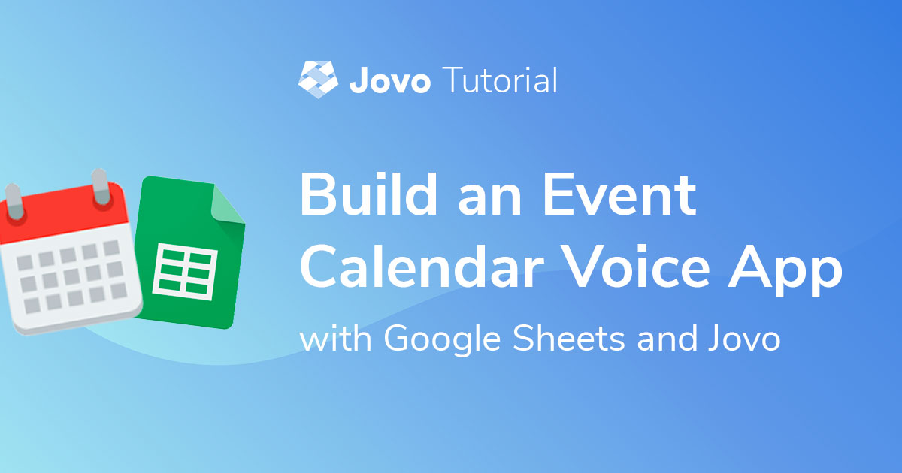
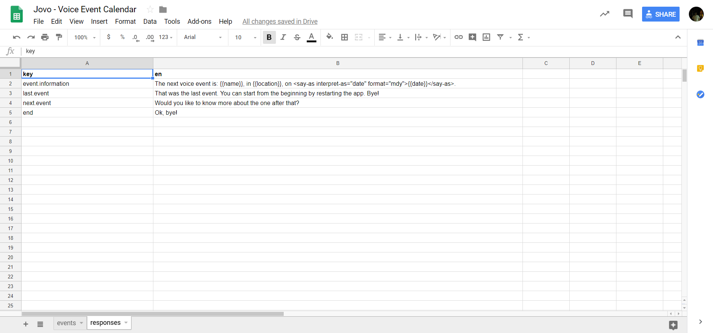

# Build an Event Calendar Voice App with Jovo and Google Sheets



In this tutorial, we are going to build an Event Calendar Alexa Skill and Google Action as practical example for the [Jovo Google Spreadsheet integration](https://www.jovo.tech/docs/cms/google-sheets).

> [You can find the full example code on GitHub](https://github.com/jovotech/jovo-templates/tree/master/tutorials/event-calendar).

* [Introduction](#introduction)
* [Getting Started](#getting-started)
   * [Building the Language Model](#building-the-language-model)
   * [Building the Logic](#building-the-logic)
* [Integrating Google Sheets as CMS](#integrating-google-sheets-as-cms)
   * [Setting up the Spreadsheet](#setting-up-the-spreadsheet)
   * [Installing the Plugin](#installing-the-plugin)
   * [Configuration](#configuration)
   * [Accessing the Event Data](#accessing-the-event-data)
   * [Responses Sheet](#responses-sheet)
* [Finishing the Interaction Logic](#finishing-the-interaction-logic)


## Introduction

Is your goal for 2019 to attend more events about voice? Why not build an event calendar Alexa Skill and Google Actions that helps us with this? We will walk through the steps to build a voice app that will have the single purpose of telling the user when the next voice conference or event will be.

For this, we will use the [Google Sheets CMS integration](https://www.jovo.tech/docs/cms/google-sheets) for Jovo. This will enable us to manage both the responses, (e.g. "Welcome to the Voice Event Calendar") and the event data (i.e. name, location and date) in a Google Spreadsheet.

Separating the content from the actual code base comes with two main advantages:
* Update the content regularly without having to touch and redeploy the code
* Collaboratively work on the content with people who don't have access to the code base


## Getting Started

Let's start by building out a lightweight version of a "Voice Event Calendar" Alexa Skill and Google Action with the Jovo Framework. The goal of this voice app is to:
* Allow users to ask for the next event
* Retrieve event information from a Google Spreadsheet
* Prompt users to tell them about more events (if there are more available)

Here's how the interaction will look like at the end:


**Note**: To keep the tutorial as light and short as possible, the app will have to work with the bare minimum. That means, we won't pay attention to error handling, creating a fully developed UI, or adding any other features besides the event information.


### Building the Language Model

> [Learn more about the Jovo Language Model here](https://www.jovo.tech/docs/model).

For the interaction with the event calendar voice app, we need three intents for our language model:
* `EventInfoIntent`: Allow users to ask for the next event
* `YesIntent` and `NoIntent`: As response to the question they want to hear another event

We could either create the language model on each of the platforms ([Alexa Developer Console](https://developer.amazon.com/) for the Alexa Skill, [Dialogflow](https://dialogflow.com/) for the Google Action). A faster way is to use the [Jovo Language Model](https://www.jovo.tech/docs/model), which can be translated into an Alexa Interaction Model and a Dialogflow Agent.

Inside our `models` folder, we can for example add an `en-US.json` file with our language model, that would look like this:

```javascript
{
	"invocation": "voice event calendar",
	"intents": [
		{
			"name": "EventInfoIntent",
			"phrases": [
				"event",
				"voice event",
				"next event"
			]
		},
		{
			"name": "YesIntent",
			"phrases": [
				"yes",
				"yeah",
				"ok",
				"alright",
				"yep",
				"yo",
				"okay",
				"sure",
				"yes please",
				"yeah please"
			],
			"alexa": {
				"name": "AMAZON.YesIntent",
				"samples": []
			}
		},
		{
			"name": "NoIntent",
			"phrases": [
				"no",
				"nope",
				"na",
				"don't",
				"I don't"
			],
			"alexa": {
				"name": "AMAZON.NoIntent",
				"samples": []
			}
		}
	],
	"alexa": {
		"interactionModel": {
			"languageModel": {
				"intents": [
					{
						"name": "AMAZON.CancelIntent",
						"samples": []
					},
					{
						"name": "AMAZON.HelpIntent",
						"samples": []
					},
					{
						"name": "AMAZON.StopIntent",
						"samples": []
					}
				]
			}
		}
	},
	"dialogflow": {
		"intents": [
			{
				"name": "Default Fallback Intent",
				"auto": true,
				"webhookUsed": true,
				"fallbackIntent": true
			},
			{
				"name": "Default Welcome Intent",
				"auto": true,
				"webhookUsed": true,
				"events": [
					{
						"name": "WELCOME"
					}
				]
			}
		]
	}
}
```

This language model contains a few concepts that are important to make it work on both Amazon Alexa and Google Assistant. For example, the `YesIntent` uses the built-in intent `AMAZON.YesIntent` for Alexa, and defines sample phrases for the Dialogflow Agent. You can learn more about this in the following tutorial: [Turn an Alexa Interaction Model into a Dialogflow Agent](https://www.jovo.tech/tutorials/alexa-model-to-dialogflow).

To [build](https://www.jovo.tech/docs/cli/build) and [deploy](https://www.jovo.tech/docs/cli/deploy) the language model, use the Jovo CLI:

```sh
# Build platform project files
$ jovo build

# Deploy to platforms
$ jovo deploy
```


### Building the Logic

> [Learn more about Routing here](https://www.jovo.tech/docs/routing).

Next, let's build out the logic of our voice app, which is happening inside the `app.js` file of the `src` folder. The handler with the intent structure would look like this:

```javascript
// src/app.js

app.setHandler({
    LAUNCH() {

    },

    EventInfoIntent() {

    },

    YesIntent() {
        
    },

    NoIntent() {
        
    },

    END() {
        
    }
});
```

In this case we make use of the [`intentMap`](https://www.jovo.tech/docs/routing/intents#intentmap), which we have to configure inside our `config.js` file, so we don't have to add an extra intent for the alexa specific `AMAZON.YesIntent` and `AMAZON.NoIntent`:

```javascript
// config.js

intentMap: {
    'AMAZON.StopIntent': 'END',
    'AMAZON.YesIntent': 'YesIntent',
    'AMAZON.NoIntent': 'NoIntent'
},
```

> [Learn more about the Jovo intentMap here](https://www.jovo.tech/docs/routing/intents#intentmap).

The [`END`](https://www.jovo.tech/docs/routing/intents#end) intent is a Jovo standard handler, which gets called when a session ends abruptly or the user stops it manually.

The basic implementation of each intent with the information from the diagram would look like this:

```javascript
app.setHandler({
    LAUNCH() {
        return this.toIntent('EventInfoIntent');
    },

    EventInfoIntent() {
        this.ask('<Event Information>. Would you like to know about the next one?');
    },

    YesIntent() {
        return this.toIntent('EventInfoIntent');
    },

    NoIntent() {
        return this.toIntent('END');
    },

    END() {
        this.tell('Ok, bye!');
    }
});
```

At launch we route to the `EventInfoIntent`, which is the key component of the app, where we respond with the information about the voice event. We ask if the user wants to know about the one after that, and depending on the answer, either route back to the `EventInfoIntent` or the `END` intent, where we end the session.

The only thing left to do would be the logic of the `EventInfoIntent` using the Google Sheets integration, which we will focus on now.

## Integrating Google Sheets as CMS

> Beginner Tutorial: [Use Google Sheets as CMS for your Voice App](https://www.jovo.tech/tutorials/google-sheets-cms).

In this section, we will create a Google Spreadsheet to manage the content for both our responses and the event data.

This makes use of the [Jovo integration for Google Sheets](https://www.jovo.tech/docs/cms/google-sheets), which offers different sheet types and enables you to store all sorts of content in different tabs of a Google Spreadsheet.

Here are all the steps:

* [Setting up the Spreadsheet](#setting-up-the-spreadsheet)
* [Installing the Plugin](#installing-the-plugin)
* [Configuration](#configuration)
* [Accessing the Event Data](#accessing-the-event-data)
* [Responses Sheet](#responses-sheet)


### Setting up the Spreadsheet

First of all, we have to create a spreadsheet with two sheets to manage the event data and our app's responses.

Let's start with the event data. Each row will represent one event, with the first column being the events name, the second its location and the third the date the event starts at.

[](https://docs.google.com/spreadsheets/d/1QC9RsBds8Z8hHG9sLAsP3-o_-v0SYFQYCXr5EDLhPMY/edit?usp=sharing)

> You can find the spreadsheet [here](https://docs.google.com/spreadsheets/d/1QC9RsBds8Z8hHG9sLAsP3-o_-v0SYFQYCXr5EDLhPMY/edit?usp=sharing)

To use it for yourself, click `File > Make a copy...` and save it to your own Google Drive.

You can then edit the content as much as you want. After editing, make sure that you publish it to the web by going to `File > Publish to the web...`. Your spreadsheet needs to be accessible to anyone with the link. You can make sure it is by clicking on the blue `SHARE` button and checking that it's available (at least to *view*) to *anyone* with the link.

After it's available for anyone, you can get the spreadsheet ID by copying the relevant part from the URL.

```sh
# If this is the URL to your Spreadsheet
https://docs.google.com/spreadsheets/d/1QC9RsBds8Z8hHG9sLAsP3-o_-v0SYFQYCXr5EDLhPMY/edit?usp=sharing

# Then this is your Spreadsheet ID
1QC9RsBds8Z8hHG9sLAsP3-o_-v0SYFQYCXr5EDLhPMY
```

### Installing the Plugin

> Learn more in the Jovo Docs: [Google Sheets CMS](https://www.jovo.tech/docs/cms/google-sheets).

Now we can integrate the spreadsheet into our voice app. For that, we have to first install the Google Sheets CMS plugin:

```sh
# Inside our Jovo project directory
$ npm install --save jovo-cms-googlesheets
```

In our `app.js` file, register it with the `use` command:

```javascript
// app.js

const { GoogleSheetsCMS } = require('jovo-cms-googlesheets');

app.use(new GoogleSheetsCMS());
```

### Configuration

> Docs: [Google Sheets CMS Configuration](https://www.jovo.tech/docs/cms/google-sheets#configuration).

Inside our `config.js` file we have to provide the necessary information needed to access the spreadsheet:

```javascript
// config.js

cms: {
    GoogleSheetsCMS: {
        spreadsheetId: '1QC9RsBds8Z8hHG9sLAsP3-o_-v0SYFQYCXr5EDLhPMY',
        access: 'public',
        sheets: [
            {
                name: 'events',
                position: 1
            },
        ]
    }
},
```

In this case, we won't provide the type of the sheet, to use the [default sheet type](https://www.jovo.tech/docs/cms/google-sheets#default-sheet-types), which will return us each row as an array.

### Accessing the Event Data

Inside our `EventInfoIntent`, we can now access the event data the following way:

```javascript
let data = this.$cms.<sheet-name>[<row-index>][<column-index>];
```

This means that we can access the different event details by counting the index they have. For example, the `name` is in the first column, and thus has index `0`, the `location` is in the second (index `1`), and the `date` in the third (index `2`):

```javascript
const NAME_INDEX = 0;
const LOCATION_INDEX = 1;
const DATE_INDEX = 2;

app.setHandler({
    // other intents

    EventInfoIntent() {
        const name = this.$cms.events[1][NAME_INDEX];
        const location = this.$cms.events[1][LOCATION_INDEX];
        const date = this.$cms.events[1][DATE_INDEX];
    }
});
```

We will add more functionality for this in the [Finishing the Interaction Logic](#finishing-the-interaction-logic) step, but let's first add the responses sheet.


### Responses Sheet

> [Learn more about the Responses Sheet Type here](https://www.jovo.tech/docs/cms/google-sheets#responses).

You can find the sheet containing our app's responses [here](https://docs.google.com/spreadsheets/d/1QC9RsBds8Z8hHG9sLAsP3-o_-v0SYFQYCXr5EDLhPMY/edit#gid=1530891892). Alternatively, you can also switch between the sheets at the bottom of the page (make sure to not change the order, because it is used by the `position` config for each sheet in the `config.js` file).



The responses are pretty straightforward, besides the `event.information` one. As the key says, it's the one containing the event data, as it takes in the name, location, and date as parameters, which is specified by the double curly brackets. [You can learn more about this in our i18n documentation](https://www.jovo.tech/docs/output/i18n#accessing-the-content).

Since the sheet containing the responses is inside the same file as our previous event data sheet, we can add the sheet to our `config.js` as a new object inside the `sheets` array:

```javascript
cms: {
    GoogleSheetsCMS: {
        spreadsheetId: '1QC9RsBds8Z8hHG9sLAsP3-o_-v0SYFQYCXr5EDLhPMY',
        access: 'public',
        sheets: [
            {
                name: 'events',
                position: 1
            },
            {
                name: 'responses',
                type: 'Responses',
                position: 2
            }
        ]
    }
},
```

It is of the [`Responses` type](https://www.jovo.tech/docs/cms/google-sheets#responses), which means we can access its content using `this.t('key')` or with the `addT('key')` method of the [Jovo SpeechBuilder](https://www.jovo.tech/docs/output/speechbuilder).

Inside our `EventInfoIntent` and `END` intent, that would look like this:

```javascript
EventInfoIntent() {
    const name = this.$cms.events[1][NAME_INDEX];
    const location = this.$cms.events[1][LOCATION_INDEX];
    const date = this.$cms.events[1][DATE_INDEX];

    this.$speech.addT('event.information', {name, location, date});
},

END() {
    this.tell(this.t('end'));
}
```

That's it! We have integrated a Google Spreadsheet with two sheets for the event data and the responses. Now you can easily update the content without having to do changes to the code.


## Finish Interaction Logic

The last thing left to do is to finish the actual interaction logic. We have to add a system to iterate over the events until the last one, at which point the session will end.

For that, we will use a [session attribute](https://www.jovo.tech/docs/data#session-data) called `eventIndex`, which we will set at launch and increment every time we pull data from the sheet. If the `eventIndex` reaches the same value as the `this.$cms.events` array, we will have reached the last event and end the session, otherwise we will ask the user, if they want to hear about the next event or not.

The implementation would look like this:

```javascript
app.setHandler({
    LAUNCH() {
        this.$session.$data.eventIndex = 1;
        return this.toIntent('EventInfoIntent');
    },

    EventInfoIntent() {
        let eventIndex = this.$session.$data.eventIndex;

        const name = this.$cms.events[eventIndex][NAME_INDEX];
        const location = this.$cms.events[eventIndex][LOCATION_INDEX];
        const date = this.$cms.events[eventIndex][DATE_INDEX];

        this.$speech.addT('event.information', {name, location, date});

        eventIndex++;

        if (eventIndex === this.$cms.events.length) {
            // No event left in the sheet. End session
            this.$speech.addT('last.event');
            this.tell(this.$speech);
        } else {
            this.$session.$data.eventIndex = eventIndex;
            // Events left. Ask, if user wants to hear more about next event
            this.$speech.addT('next.event');
            this.ask(this.$speech);
        }
    },

    YesIntent() {
        return this.toIntent('EventInfoIntent');
    },

    NoIntent() {
        return this.toIntent('END');
    },

    END() {
        this.tell(this.t('end'));
    }
});
```

Done!

To test it out locally, you can use the Jovo local development server and the [Jovo Debugger](https://www.jovo.tech/docs/debugger):

```sh
$ jovo run
```

That was a fairly basic example for the Google Spreadsheet CMS integration, which hopefully showcased the potential of the integration. Adding events in the future is as easy as adding a new row to the spreadsheet, without having to go through certification.

> [You can find the whole project here](https://github.com/jovotech/jovo-templates/tree/master/tutorials/event-calendar).

**Any questions? You can reach us on [Twitter](https://twitter.com/jovotech) or [Slack](https://www.jovo.tech/slack).**

<!--[metadata]: { "description": "Learn how to build an Event Calendar Alexa Skill and Google Action with Jovo and Google Sheets as Content Management System (CMS).", "author": "kaan-kilic", "tags": "Google Sheets, CMS",  "og-image": "https://www.jovo.tech/img/tutorials/event-calendar-google-sheets/event-calendar-google-sheets.jpg"}-->
