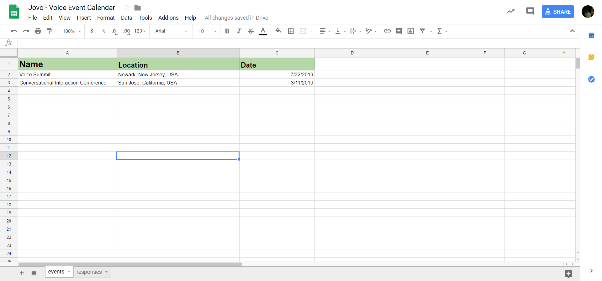

# Event Calendar

In this tutorial, we want to show you a more practical example for the Google Spreadsheet integration.

> Find the source code for the voice app [here](https://github.com/jovotech/jovo-templates/tree/master/tutorials/event-calendar)

## Introduction

We will walk through the steps to build a small voice app, that will have the single purpose of telling the user when the next voice conference or event will be.

The content we want to manage using Google Spreadsheets will be the responses, (e.g. "Welcome to the Voice Event Calendar") and the event data (i.e. name, location and date).

By splitting up the content from the actual code base, you will have two key benefits.

First, if you want to modify the content in any way, you won't be forced to go through certification. Second, you can have designers work on the content without having to access the code base.

## General Design

To keep the tutorial as light and short as possible, the app will have to work with the bare minimum. That means, we won't pay attention to error handling, creating a fully developed UI, or adding any other features besides the event information.

Here's how the interaction will look like at the end:


## Language Model

For that interaction we need three intents, namely a `YesIntent`, `NoIntent`, and an `EventInfoIntent`. Inside our language model, that would look like this:

```javascript
{
	"invocation": "my test app",
	"intents": [
		{
			"name": "EventInfoIntent",
			"phrases": [
				"event",
				"voice event",
				"next event"
			]
		},
		{
			"name": "YesIntent",
			"phrases": [
				"yes",
				"yeah",
				"ok",
				"alright",
				"yep",
				"yo",
				"okay",
				"sure",
				"yes please",
				"yeah please"
			],
			"alexa": {
				"name": "AMAZON.YesIntent",
				"samples": []
			}
		},
		{
			"name": "NoIntent",
			"phrases": [
				"no",
				"nope",
				"na",
				"don't",
				"I don't"
			],
			"alexa": {
				"name": "AMAZON.NoIntent",
				"samples": []
			}
		}
	],
	"alexa": {
		"interactionModel": {
			"languageModel": {
				"intents": [
					{
						"name": "AMAZON.CancelIntent",
						"samples": []
					},
					{
						"name": "AMAZON.HelpIntent",
						"samples": []
					},
					{
						"name": "AMAZON.StopIntent",
						"samples": []
					}
				]
			}
		}
	},
	"dialogflow": {
		"intents": [
			{
				"name": "Default Fallback Intent",
				"auto": true,
				"webhookUsed": true,
				"fallbackIntent": true
			},
			{
				"name": "Default Welcome Intent",
				"auto": true,
				"webhookUsed": true,
				"events": [
					{
						"name": "WELCOME"
					}
				]
			}
		]
	}
}
```

## Handler

Inside the handler that intent structure would look like this:

```javascript
app.setHandler({
    LAUNCH() {

    },

    EventInfoIntent() {

    },

    YesIntent() {
        
    },

    NoIntent() {
        
    },

    END() {
        
    }
});
```

In this case we make use of the [`intentMap`](https://www.jovo.tech/docs/routing/intents#intentmap), which we have to configure inside our `config.js` file, so we don't have to add an extra intent for the alexa specific `AMAZON.Yes-` and `NoIntent`:

```javascript
// config.js

intentMap: {
    'AMAZON.StopIntent': 'END',
    'AMAZON.YesIntent': 'YesIntent',
    'AMAZON.NoIntent': 'NoIntent'
},
```

The [`END`](https://www.jovo.tech/docs/routing/intents#end) intent, is a Jovo built-in one, which gets called, when a session ends abruptly or the user stops it manually.

The basic implementation of each intent with the information from the diagram would look like this:

```javascript
app.setHandler({
    LAUNCH() {
        return this.toIntent('EventInfoIntent');
    },

    EventInfoIntent() {
        this.ask('Event Information. Would you like to know about the next one?');
    },

    YesIntent() {
        return this.toIntent('EventInfoIntent');
    },

    NoIntent() {
        return this.toIntent('END');
    },

    END() {
        this.tell('Ok, bye!');
    }
});
```

At launch we route to the `EventInfoIntent`, which is the key component of the app, where we respond with the information about the voice event. We ask, if the user wants to know about the one after that, and depending on the answer, either route back to the `EventInfoIntent` or the `END` intent, where we end the session.

The only thing left to do would be the logic of the `EventInfoIntent` using the Google Sheets integration, which we will focus on now.

## Google Sheets CMS

### The Spreadsheet

First of all, we have to create the two spreadsheets to manage our apps responses and the event data.

Let's start with the event data. Each row will represent one event, with the first column being the events name, the second its location and the third the date the event starts at.

[](https://docs.google.com/spreadsheets/d/1QC9RsBds8Z8hHG9sLAsP3-o_-v0SYFQYCXr5EDLhPMY/edit?usp=sharing)

> You can find the spreadsheet [here](https://docs.google.com/spreadsheets/d/1QC9RsBds8Z8hHG9sLAsP3-o_-v0SYFQYCXr5EDLhPMY/edit?usp=sharing)

To use it for yourself, click `File > Make a copy...` and save it to your own Google Drive.

You can then edit the content as much as you want. After editing, make sure that you publish it to the web by going to `File > Publish to the web...`. Your spreadsheet needs to be accessible to anyone with the link. You can make sure it is by clicking on the blue `SHARE` button to the top right. It should look like this:


After it's available for anyone, you can get the spreadsheet ID by copying the relevant part from the URL.

```sh
# If this is the URL to your Spreadsheet
https://docs.google.com/spreadsheets/d/1QC9RsBds8Z8hHG9sLAsP3-o_-v0SYFQYCXr5EDLhPMY/edit?usp=sharing

# Then this is your Spreadsheet ID
1QC9RsBds8Z8hHG9sLAsP3-o_-v0SYFQYCXr5EDLhPMY
```

### Plugin Installation

Now we can integrate the spreadsheet to our voice app. For that, we have to first install the Google Spreadsheets plugin:

```sh
# Inside our Jovo project directory
$ npm install --save jovo-cms-googlesheets
```

In our `app.js` file, register it with the `use` command:

```javascript
// app.js

const { GoogleSheetsCMS } = require('jovo-cms-googlesheets');

app.use(new GoogleSheetsCMS());
```

### Configuration

Inside our `config.js` file we have to provide the necessary information needed to access the spreadsheet:

```javascript
// config.js

cms: {
    GoogleSheetsCMS: {
        spreadsheetId: '1QC9RsBds8Z8hHG9sLAsP3-o_-v0SYFQYCXr5EDLhPMY',
        access: 'public',
        sheets: [
            {
                name: 'events',
                position: 1
            },
        ]
    }
},
```

In this case, we won't provide the type of the sheet, to use the default sheet type, which will return us each row as an array.

### Accessing the Event Data

Inside our `EventInfoIntent`, we can now access the event data the following way:

```javascript
let data = this.$cms.<sheet-name>[<row-index>][<column-index>];
```

```javascript
const NAME_INDEX = 0;
const LOCATION_INDEX = 1;
const DATE_INDEX = 2;

app.setHandler({
    // other intents

    EventInfoIntent() {
        const name = this.$cms.events[1][NAME_INDEX];
        const location = this.$cms.events[1][LOCATION_INDEX];
        const date = this.$cms.events[1][DATE_INDEX];
    }
});
```

With that out of the way we can add the responses sheet next.

### Responses Sheet

You can find the sheet containing our app's responses [here](https://docs.google.com/spreadsheets/d/1QC9RsBds8Z8hHG9sLAsP3-o_-v0SYFQYCXr5EDLhPMY/edit#gid=1530891892). Alternatively, you can also switch between the sheets at the bottom of the page.


The responses are pretty much straight forward, besides the `event.information` one. As the key says, it's the one containing the event data, as it takes in the name, location, and date as parameters, which is specified by the double curly brackets.

Since the sheet containing the responses is inside the same file as our previous event data sheet, we can add the sheet to our `config.js` as a new object inside the `sheets` array:

```javascript
cms: {
    GoogleSheetsCMS: {
        spreadsheetId: '1QC9RsBds8Z8hHG9sLAsP3-o_-v0SYFQYCXr5EDLhPMY',
        access: 'public',
        sheets: [
            {
                name: 'events',
                position: 1
            },
            {
                name: 'responses',
                type: 'Responses',
                position: 2
            }
        ]
    }
},
```

It is of the [`Responses` type](https://www.jovo.tech/docs/cms/google-sheets#responses), which means we can access its content using `this.t('key')`.

Inside our `EventInfoIntent` and `END` intent, that would look like this:

```javascript
EventInfoIntent() {
    const name = this.$cms.events[1][NAME_INDEX];
    const location = this.$cms.events[1][LOCATION_INDEX];
    const date = this.$cms.events[1][DATE_INDEX];

    this.$speech.t('event.information', {name, location, date});
},

END() {
    this.tell(this.t('end'));
}
```

## Finish Interaction Logic

The last thing left to do, is to finish the actual interaction logic. We have add a system to iterate over the events until the last one, at which point the session will end.

For that, we will use a session attribute called `eventIndex`, which we will set at launch and increment every time we pull data from the sheet. If the `eventIndex` reaches the same value as the `this.$cms.events` array, we will have reached the last event and end the session, otherwise we will ask the user, if they want to hear about the next event or not.

The implementation would look like this:

```javascript
app.setHandler({
    LAUNCH() {
        this.$session.$data.eventIndex = 1;
        return this.toIntent('EventInfoIntent');
    },

    EventInfoIntent() {
        let eventIndex = this.$session.$data.eventIndex;

        const name = this.$cms.events[eventIndex][NAME_INDEX];
        const location = this.$cms.events[eventIndex][LOCATION_INDEX];
        const date = this.$cms.events[eventIndex][DATE_INDEX];

        this.$speech.t('event.information', {name, location, date});

        eventIndex++;

        if (eventIndex === this.$cms.events.length) {
            // No event left in the sheet. End session
            this.$speech.t('last.event');
            this.tell(this.$speech);
        } else {
            this.$session.$data.eventIndex = eventIndex;
            // Events left. Ask, if user wants to hear more about next event
            this.$speech.t('next.event');
            this.ask(this.$speech);
        }
    },

    YesIntent() {
        return this.toIntent('EventInfoIntent');
    },

    NoIntent() {
        return this.toIntent('END');
    },

    END() {
        this.tell(this.t('end'));
    }
});
```

That was a fairly basic example for the Google Spreadsheet CMS integration, which hopefully showcased the potential of the integration. Adding events in the future is as easy as adding a new row to the spreadsheet, without having to go through certification.

You can find the whole project [here](https://github.com/jovotech/jovo-templates/tree/master/tutorials/event-calendar).

**Any questions? You can reach us on [Twitter](https://twitter.com/jovotech) or [Slack](https://www.jovo.tech/slack).**

<!--[metadata]: { "description": "Learn how to get utilize the Google Sheets integration by creating an event calendar app", "author": "kaan-kilic", "tags": "Google Sheets, CMS", "og-image": "TODO"}-->