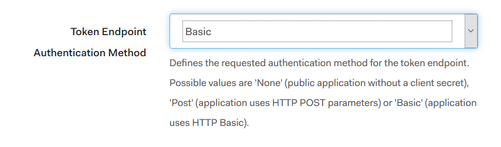
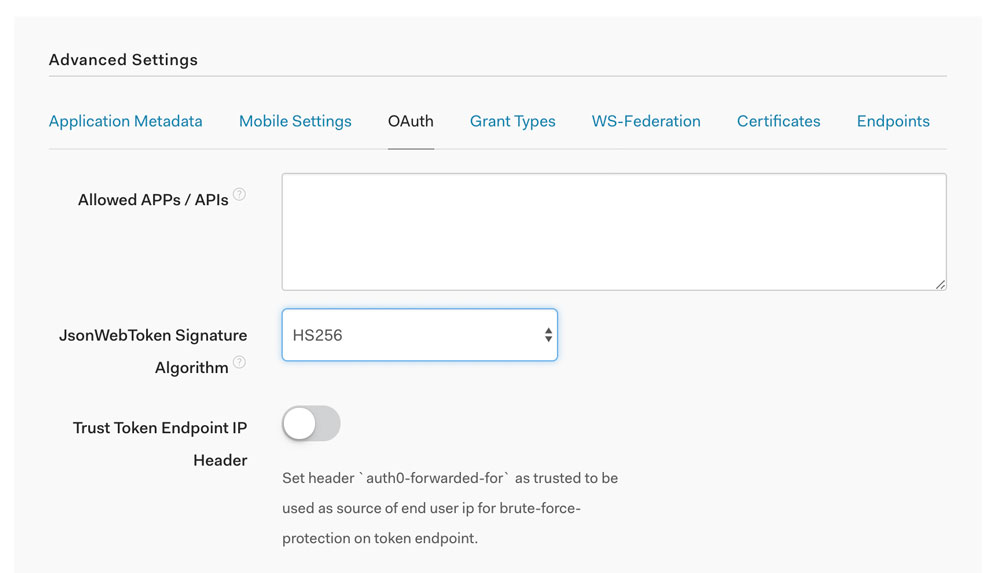
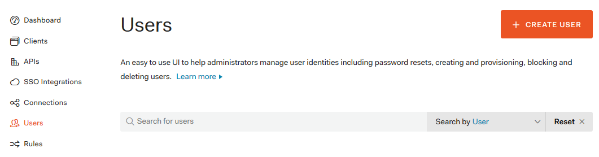
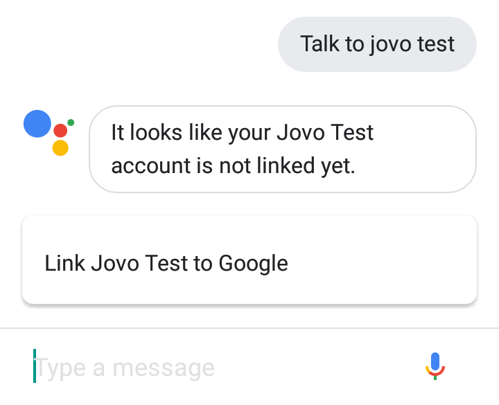
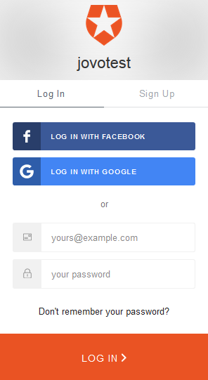

# [Tutorial] How to set up Account Linking for Google Actions with Auth0 and Jovo

In this guide, we will show you how to set up **Account Linking for your Google Assistant App** with the help of [Auth0](https://auth0.com/), a service for developers to authorize and authenticate users. You won't have to run your own OAuth 2.0 server and deal with security issues. Let's walk through the process of Google Action Account Linking together in simple steps.

### Contents

*   [Introduction](#introduction)
    *   [Requirements to use Account Linking with Google Actions](#google-actions-account-linking-requirements)
*   [How OAuth2 Works](#how-oauth2-works)
*   [What is Auth0?](#what-is-auth0)
*   [Google Action Account Linking: Connecting your App with Auth0](#connecting-your-google-action-with-auth0)
    *   [Auth0 Setup](#auth0-setup)
    *   [Google Action Setup](#google-action-setup)
    *   [Add Account Linking to your Code](#add-account-linking-to-your-code)

Jovo is an open-source development framework for building voice apps that work on both Amazon Alexa and Google Assistant with only one code base. Take a look at the [Jovo Framework Docs](https://www.jovo.tech/framework/docs) or our [Voice App Courses](https://www.jovo.tech/learn) to learn more.

👉 Interested in Alexa Account Linking? [How to set up Account Linking for Alexa with Auth0 and Jovo](https://www.jovo.tech/blog/alexa-account-linking-auth0/).   


## Introduction


 The easiest way to make your voice application stand out from the other apps on Google Home is by using **Account Linking**. It allows you to get to know your users and lets you personalize the experience with user specific data. For example, you could do things like this:

*   Greet your users with their name every time they start your voice application
*   Get access to an email address to provide a user with additional information via email
*   Create multimodal experiences by connecting a voice experience with e.g. a web service, Messenger chatbot, or other accounts

### Requirements to use Account Linking with Google Actions

Google requires the **OAuth 2.0 protocol for Account Linking**. You can find the official documentation by Google here: [Implementing Account Linking](https://developers.google.com/actions/identity/account-linking). If you want to use account linking for your apps on Google Assistant, you have two options:

*   You set up your own OAuth 2.0 server, or
*   You use one of the many identity providers (Google, Facebook, Twitter, etc.) out there

First of all, setting up an OAuth 2.0 server can be difficult (at least, I had a tough time), and using a single identity provider restricts your user. Not everybody has a Facebook account. A service like Auth0 comes in handy in such a situation. It allows us to use the many identity providers and the standard username-password login at the same time. We're first learning more about OAuth2 in general, and then walk through setting up a simple example of Google Actions Account Linking with Auth0, step by step.   


## How OAuth2 Works

The authorization protocol OAuth 2.0 allows third-party applications to gain limited access to an HTTP service. It enables the user to provide access to restricted resources, without giving away their credentials (username and password). The protocol defines the following four roles:

*   **Resource Owner**: In our case the user, who wants to link their account with your Google Action.
*   **Resource Server**: The server, where our user's data is located at. Has to be able to respond to resource requests using access tokens.
*   **Client**: The application, which wants to access the user's account. In this case it's the Google Assistant App.
*   **Authorization Server**: The server that authenticates the identity of the resource owner and provides the access token.

Here's how the roles interact with each other: 


   


## What is Auth0?


[](https://auth0.com/)

 [Auth0](https://auth0.com/) provides a service for developers to authorize and authenticate users without having to deal with all the security issues and the burden of running your own OAuth 2.0 server. Here are some of the tools Auth0 provides:

*   [User Management](https://auth0.com/user-management) that supports both standard username + password logins and social logins like Google, Facebook, etc.
*   [Auth0 Lock](https://auth0.com/lock), a login box
*   [Passwordless](https://auth0.com/passwordless) Logins

Usually, such a service is not free, but Auth0 does not bill you if you have less than 7,000 regular active users/month. In this case a regular active user is someone who has ‘authenticated with username/password, passwordless connections or any social provider in the last calendar month, counted per application’. In the following steps, we are going to use both _username + password_ and _social logins_ features by Auth0 to create an Account Linking process for our Google Action.   


## Google Action Account Linking: Connecting your App with Auth0

There are three steps needed, to connect your Google Action with Auth0: 1. Set up an Auth0 application and the providers we want to use for _social login_ 2\. Enable Account Linking on Dialogflow and the Actions on Google Console 3. Add the code, so we can prompt our users to link their account with your Action

### 1\. Auth0 Setup

In this section, we're going through all the necessary steps you need to create an application on Auth0 and to pick identity providers for your social login. First of all you have to create an account on [Auth0](https://auth0.com/).

#### Create an Application

To create an application click on the orange button on the top right corner of the dashboard: 


 Name your application and select '_Machine to Machine Applications_': 


 Choose the **Auth0 Management API** and select **all scopes**. Going over all the scopes would be to much for this blogpost. 


 The result should be a dashboard like this: 


 Switch to the **Settings** tab and change the _Token Endpoint Authentication Method_ to _Basic_. 



 At the bottom of the settings tab click on **Show Advances Settings** and switch to **OAuth**. Select _HS256_ on _JsonWebToken Signature Algorithm_ and save your changes. 




#### Social Logins

The next step is to enable the social logins you want to use. You can find them in _Connections > Social_: 


 Here is an overview of connections you can choose from: 


 Choose the provider you want to enable and the data you want to access. There is guide on how to set up every provider. It's marked on the screenshot: 


### 2\. Google Action Setup

On the Google Assistant you have two options to enable Account Linking. Either you prompt the user to link their account the moment they reach a specific intent, which is done in the [Dialogflow](https://dialogflow.com/) developer console, or you decide when to ask your user to login in your own code.

#### Dialogflow

If you want to do it with Dialogflow console, go to the **Integrations** tab and click on **Google Assistant**. There you can select which of your intents require the user to sign in. 


 This is how the Google Assistant integration window looks like: 


#### Google Actions Console

The next step is to enable Account Linking in your project settings. Therefor go back to your Project Overview, which you can find on the [Google Actions console](https://console.actions.google.com), and select **Account Linking:** 


 This will walk you through a step by step process, which looks like this: 


 Below, you can find a list of all the information needed for Account Linking, and where to get it from:

*   **Grant Type**: Authorization Code
*   **Client ID**: Auth0 client we created earlier → Settings → Client ID
*   **Client Secret**: Auth0 client → Settings → Client Secret
*   **Authorization URL**: Auth0 client → Settings → Advanced Settings → Endpoints → OAuth Authorization URL
*   **Token URL**: Auth0 client → Settings → Advanced Settings → Endpoints → OAuth Token URL
*   **Scopes**: openid, offline_access, profile, email

The scopes we use indicate the level of access we want on the user's data:

*   _openid_ allows us to use the API request we need later on, to access the stored user data.
*   _offline_access_ is needed because the access token we get will expire at some point. To request a new one, without having to re-authenticate the user, we need that scope.
*   _profile_ (basic data like name and birthdate) and _email_ are used to tell the server what kind of data we want.

On **Testing Instructions**, you have to provide both username and password of an actual account, so the review team of the Google Assistant Actions can test your application, if you plan to release it. You can simply create a throwaway account on Auth0, by going to the **Users** tab on **Auth0** and clicking on **Create User**: 



 Last but not least, we have to add the redirect url to our Auth0 client's settings. To create that url, we need the project ID of your google Action, so go back to the Actions on Google console and click on the project settings, to find your ID. 


 


 Now go back to your Auth0 client's settings settings and add the following url to the _Allowed Callback URLs_ field: https://oauth-redirect.googleusercontent.com/r/\[yourProjectID\] That's it! The last thing we want to show you is how to access the stored user data and how to add an Account Linking prompt in your code.

### 3\. Add Account linking to your code

👉 Just getting started with Google Action development? Take a look here: [Build a Google Action in Node.js with Jovo](https://www.jovo.tech/blog/google-action-tutorial-nodejs/).

First of all you have to know that your Action will get an **access token** added to the request, if your user has linked their account. So by checking if there is an access token, you will know if the user has already linked their account or not. In Jovo you check for access token like this:
```javascript
this.getAccessToken()
```
It will either return the access token or `undefined` So the following code will check if there's an access token and if that's not the case it will prompt your user to sign in:
```javascript
if (!this.getAccessToken()){
    this.googleAction().showAccountLinkingCard();
}
```
The prompt will look like this: 



 And that's how the sign in page will look like: 



 After the user completed the sign in, your Action will get another request, which will be mapped to the Jovo built-in intent `ON_SIGN_IN`. There you can check for the result using `this.googleAction().getSignInStatus()`, which will return either `CANCELLED`, `OK` or `ERROR`:
```javascript
'ON\_SIGN\_IN': function() {
    if (this.googleAction().getSignInStatus() === 'CANCELLED') {
		// User did not link their account
    } else if (this.googleAction().getSignInStatus() === 'OK') {
		// User linked their account
    } else if (this.googleAction().getSignInStatus() === 'ERROR') {
		// There was an error
    }
},
```
To access the stored user data, you simply make an API request, using the access token your skill gets with every request made after the user linked his account. I recommend the `request` package since it is the simplest solution. You can install it with npm:
```sh
$ npm install --save request
```
After that import it in your `app.js` file:
```javascript
const request = require('request');
```
Now let's get to the request:
```javascript
let token = this.getAccessToken();
let options = {
    method: 'GET',
    url: 'https://jovotest.auth0.com/userinfo/', // You can find your URL on Client --> Settings --> 
                                                 // Advanced Settings --> Endpoints --> OAuth User Info URL
    headers:{
        authorization: 'Bearer ' + token,
    }
};

// API request
request(options, (error, response, body) => {
    if (!error && response.statusCode === 200){

        let data = JSON.parse(body); //Store the data we got from the API request
        console.log(data);
        /*
        To see how the user data was stored,
        go to Auth -> Users -> Click on the user you authenticated earlier -> Raw JSON
        */
        this.tell("Hi, " + data.given_name);
    }
    else {
        this.tell("Error");
    }
}
```
At the end your request should look like this:
```javascript
'ON\_SIGN\_IN': function() {
    if (this.googleAction().getSignInStatus() === 'OK') {
        let token = this.getAccessToken();
        let options = {
            method: 'GET',
            url: 'https://jovotest.auth0.com/userinfo/', // You can find your URL on Client --> Settings --> 
            // Advanced Settings --> Endpoints --> OAuth User Info URL
            headers: {
                authorization: 'Bearer ' + token,
            }
        };
        
        // API request
        request(options, (error, response, body) => {
            if (!error && response.statusCode === 200) {
                let data = JSON.parse(body); //Store the data we got from the API request
                console.log(data);
                /*
                To see how the user data was stored,
                go to Auth -> Users -> Click on the user you authenticated earlier -> Raw JSON
                */
                this.tell("Hi, " + data.given_name);
            } else {
                this.tell("Error");
            }
        });
    }
}
```
That's it, you made it!   **Any questions? You can reach us on [Twitter](https://twitter.com/jovotech) or [Slack](https://www.jovo.tech/slack).**

<!--[metadata]: { "description": "Learn how to set up Account Linking for your Google Action with Auth0" }-->