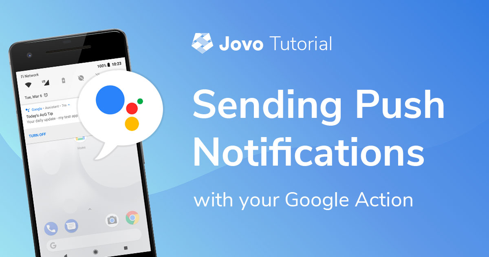
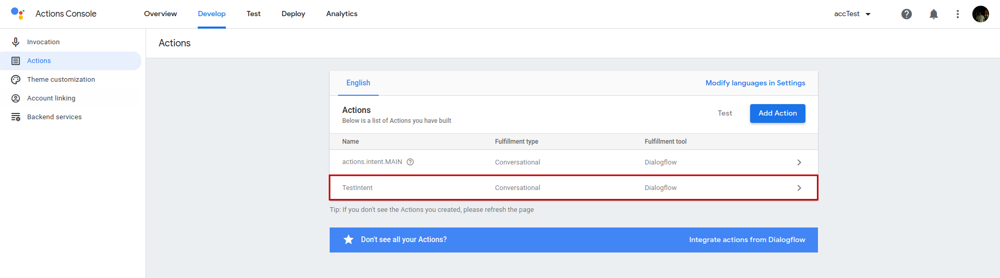
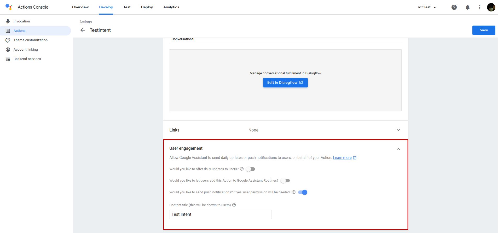
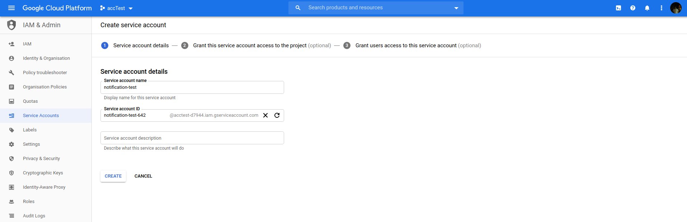
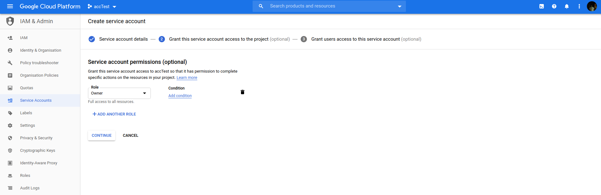
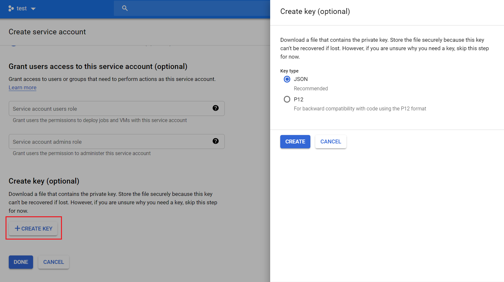
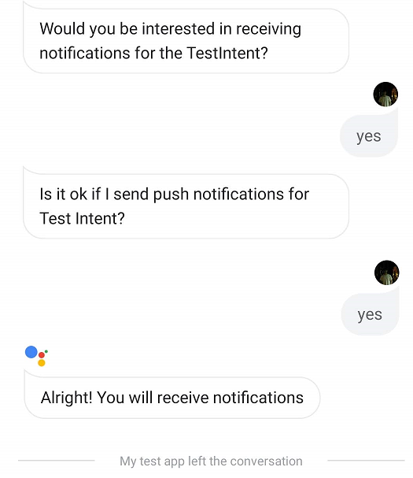

# Send Push Notifications With Your Google Action



In this tutorial, we will go through the necessary steps to send Google Action Push Notifications as well as how to send them outside of a live session.

> [Learn how to send notifications with your Alexa Skill here](https://www.jovo.tech/tutorials/alexa-notifications-proactive-events).

* [Introduction](#introduction)
* [Configuration](#configuration)
* [Ask For Permission](#ask-for-permission)
* [Send the Notification](#send-the-notification)
* [Send the Notification Outside a Session](#send-the-notification-outside-a-session)

## Introduction

> Docs: [Google Action Push Notifications](https://www.jovo.tech/marketplace/jovo-platform-googleassistant/notificationss)

The Google Action push notifications feature allows you to send notifications, which if tapped, trigger a predefined intent of your Action.

To be able to send notifications to a user they have to first explicitly opt-in to receive them for that specific intent. These intents have to be configured previously to be eligible as intents supporting push notifications.

In this tutorial, we will first take care of the configuration, go through the process for a user to opt-in and after that discuss one possible way to send notifications outside of a live session. 

> Note: Push notifications aren't currently supported on voice-activated speakers.

## Configuration

For an intent to be eligible to be used in push notifications you have to set it as one of the intents, which can be triggered by implicit invocations inside your Dialogflow Agent:


After you've done that, you can find the intent as one of your `Actions` on your Google Actions `Actions` tab:



Select the intent and at the bottom of the tab you will find the `User engagement` section, where you can enable the push notifications as well as set a content title:



After you've done that, you have to get a service account key for your Google Action as you will need it later on to get the access token needed to send out notifications.

For that, you have to first go the following url (replace the `your-project-id` part with your project's id) and enable the `Actions API`: https://console.developers.google.com/apis/api/actions.googleapis.com/overview?project=your-project-id. 


Now, go over to https://console.developers.google.com/apis/credentials?project=your-project-id, again replace the `your-project-id` part, and create a new service account key:


Select `Project Owner` as the role and `JSON` as the key type:







Now that you got your service account key as well, the necessary configuration is done.

## Ask For Permission

Before we can send our user the notification, we have to first ask them to opt-in to receive notifications. For that, we first use suggestion chips to ask if they are interested and after that send out the permission request using the `askForNotification(intent)` method.

```javascript
LAUNCH() {
    return this.toIntent('AskForNotifications');
},

AskForNotifications() {
    // You have to show them suggestion chips inviting them to opt-in, 
    // before you can send the actual permission request
    this.$googleAction.showSuggestionChips(['yes', 'no']);
    this.ask('Would you be interested in receiving notifications for the TestIntent?');
},

YesIntent() {
    this.$googleAction.askForNotification('TestIntent');
},
```

The response to the question will be mapped to the Jovo built-in `ON_PERMISSION` intent, where you can check wether the permission was granted using `this.$googleAction.isPermissionGranted()`:

```javascript
ON_PERMISSION() {
    if (this.$googleAction.isPermissionGranted()) {
        // Save user and the intent to db
        this.tell('Alright! You will receive notifications');
    } else {
        this.tell('Alright, I won\'t send you notifications');
    }
}
```

Go through this small interaction to provide the permission we need to send the notification to your dev account later on. While doing that also save the `userId` attribute (`originalDetectIntentRequest.payload.user.userId`) somewhere as we will need it later on.



## Send the Notification

Now we can go through and send the notification. The notification object we will send to the user has the following structure and attributes:

```javascript
{
    "customPushMessage": {
        "userNotification": {
            "title": "<title>",
        },
        "target": {
            "userId": "<userId>",
            "intent": "<intent>",
            "locale": "<locale>"
        },
    }
}
```

Name | Description | Value | Required
:--- | :--- | :--- | :---
`title` | Specifies the title of the notification | `string` | Yes
`userId` | Specifies the user who will receive the notification | `string` | Yes
`intent` | Specifies the intent which will be executed after the user tapped on the notification | `string` | Yes
`locale` | Specifies the locale | `string` | Yes

The intent we set here, **has** to be the one the user subscribed to, any other intent won't work.

To send the notification, we have to access the `$googleAction` object's `$notification` module, which needs the `googleapis` package to work. So first, install the package:

```sh
$ npm install --save googleapis
```

Besides that, we have to add the module manually to the `google-platform-googleassistant` plugin in our `app.js` file as it is not included by default:

```javascript
// src/app.js

// ------------------------------------------------------------------
// APP INITIALIZATION
// ------------------------------------------------------------------

const { App } = require('jovo-framework');
const { GoogleAssistant, NotificationPlugin } = require('jovo-platform-googleassistant');

const app = new App();

const googleAssistant = new GoogleAssistant();

googleAssistant.use(new NotificationPlugin());

app.use(
    googleAssistant
);
```

That's all, now we can access the `$notification` module.

Last but not least, we have to authorize ourselves, which will get us the access token needed to send out the notification.

To get the access token we use the `client_email` and `private_key` from the service account key we got at the beginning of the tutorial:

```javascript
const accessToken = await this.$googleAction.$notification.getAccessToken(clientEmail, privateKey);
```

With the access token and the notification object we have everything we need at last:

```javascript
const result = await this.$googleAction.$notification.sendNotification(notification, accessToken);
```

```javascript
async SendNotificationIntent() {
    const accessToken = await this.$googleAction.$notification.getAccessToken(
        'clientEmail',
        'privateKey'
    );
    const notification = {
        customPushMessage: {
            userNotification: {
                title: 'Notification Test Title',
            },
            target: {
                userId: this.$user.getId(),
                intent: 'TestIntent',
                locale: this.$request.getLocale()
            },
        }
    };
    const result = await this.$googleAction.$notification.sendNotification(notification, accessToken);
    this.tell('Notification sent!');
},
```

But, there is one issue. How are you going to trigger the intent to send out the event? You might find a creative solution where you somehow route through the intent sending the notification in the middle of a session, but even then you are bound to there actually being a session in the first place, which pretty much nullifies to actual benefits of notifications, namely messaging your user while they're **not** using your Action.

In the next section, we will go through **one possible way** to send out notifications outside a session.

## Send the Notification Outside a Session

We won't go through the initial trigger to send out the notification but rather walk over the steps to trigger your Jovo project, which will send the notification. One possible trigger could be a [AWS Lambda](https://aws.amazon.com/lambda/) function triggered every X minutes by a [CloudWatch](https://aws.amazon.com/cloudwatch/) event.

To trigger your project we will send out a request, where the intent is set to the one containing the code to send out the notification.

Here's a sample request we can use:

```javascript
{
    "responseId": "9db11303-3681-4de2-baa8-2ab338194f10",
    "queryResult": {
        "queryText": "yes",
        "parameters": {},
        "allRequiredParamsPresent": true,
        "fulfillmentMessages": [
            {
                "text": {
                    "text": [
                        ""
                    ]
                }
            }
        ],
        "outputContexts": [
            {
                "name": "projects/acctest-d7944/agent/sessions/ABwppHFUeMmq9MhVrBN7G5hMD0zABYwmmo9KLcY3bo149mBmggsh4DlvJAomYfjYyhqgaTAvoCDzEZpUdg/contexts/actions_capability_screen_output"
            },
            {
                "name": "projects/acctest-d7944/agent/sessions/ABwppHFUeMmq9MhVrBN7G5hMD0zABYwmmo9KLcY3bo149mBmggsh4DlvJAomYfjYyhqgaTAvoCDzEZpUdg/contexts/actions_capability_audio_output"
            },
            {
                "name": "projects/acctest-d7944/agent/sessions/ABwppHFUeMmq9MhVrBN7G5hMD0zABYwmmo9KLcY3bo149mBmggsh4DlvJAomYfjYyhqgaTAvoCDzEZpUdg/contexts/google_assistant_input_type_voice"
            },
            {
                "name": "projects/acctest-d7944/agent/sessions/ABwppHFUeMmq9MhVrBN7G5hMD0zABYwmmo9KLcY3bo149mBmggsh4DlvJAomYfjYyhqgaTAvoCDzEZpUdg/contexts/actions_capability_media_response_audio"
            },
            {
                "name": "projects/acctest-d7944/agent/sessions/ABwppHFUeMmq9MhVrBN7G5hMD0zABYwmmo9KLcY3bo149mBmggsh4DlvJAomYfjYyhqgaTAvoCDzEZpUdg/contexts/actions_capability_web_browser"
            }
        ],
        "intent": {
            "name": "projects/acctest-d7944/agent/intents/90122f8e-339f-4c51-8440-aae87b99786e",
            "displayName": "SendNotificationIntent"
        },
        "intentDetectionConfidence": 1,
        "languageCode": "en-us"
    },
    "originalDetectIntentRequest": {
        "source": "google",
        "version": "2",
        "payload": {
            "isInSandbox": true,
            "surface": {
                "capabilities": [
                    {
                        "name": "actions.capability.WEB_BROWSER"
                    },
                    {
                        "name": "actions.capability.SCREEN_OUTPUT"
                    },
                    {
                        "name": "actions.capability.MEDIA_RESPONSE_AUDIO"
                    },
                    {
                        "name": "actions.capability.AUDIO_OUTPUT"
                    }
                ]
            },
            "inputs": [
                {
                    "rawInputs": [
                        {
                            "query": "yes",
                            "inputType": "VOICE"
                        }
                    ],
                    "arguments": [
                        {
                            "rawText": "yes",
                            "textValue": "yes",
                            "name": "text"
                        }
                    ],
                    "intent": "actions.intent.TEXT"
                }
            ],
            "user": {
                "userStorage": "{}",
                "lastSeen": "2019-02-25T18:32:16Z",
                "permissions": [
                    "UPDATE"
                ],
                "locale": "en-US",
                "userId": "ABwppHEQSzwUcHZQ39qIuk2kzopSAoPjK2_BKfvXm89IQ9Q0XPu2FZM6kVQ66v-BEDaWjgq4Vm99Vdlfxw"
            },
            "conversation": {
                "conversationId": "ABwppHFUeMmq9MhVrBN7G5hMD0zABYwmmo9KLcY3bo149mBmggsh4DlvJAomYfjYyhqgaTAvoCDzEZpUdg",
                "type": "ACTIVE",
                "conversationToken": "[]"
            },
            "availableSurfaces": [
                {
                    "capabilities": [
                        {
                            "name": "actions.capability.WEB_BROWSER"
                        },
                        {
                            "name": "actions.capability.SCREEN_OUTPUT"
                        },
                        {
                            "name": "actions.capability.AUDIO_OUTPUT"
                        }
                    ]
                }
            ]
        }
    },
    "session": "projects/acctest-d7944/agent/sessions/ABwppHFUeMmq9MhVrBN7G5hMD0zABYwmmo9KLcY3bo149mBmggsh4DlvJAomYfjYyhqgaTAvoCDzEZpUdg"
};
```

The only thing you would have to add would be your own dev account's user id. 

To trigger the intent, you simply use this request as the body of a https request sent to your endpoint:

```javascript
const https = require('https');

async function sendRequest(postData) {
    return new Promise((resolve, reject) => {
        const opt = {
            hostname: 'webhook.jovo.cloud',
            path: '/<your-webhook-path>', // Add your own webhook path here, i.e the part after the ".cloud"
            method: 'POST',
            headers: {
                'Content-Type': 'application/json',
                'Accept': 'application/json',
                'Content-Length': Buffer.byteLength(postData),
                'Accept-Charset': 'utf-8'
            },https://www.jovo.tech/tutorials/alexa-notifications-proactive-events
        };
        const req = https.request(opt, (res) => {
            res.setEncoding('utf8');
            let rawData = '';
            res.on('data', (chunk) => {
                rawData += chunk;
            });
            res.on('end', () => {
                let parsedData;
                if (res.statusCode === 204) { // no content
                    return resolve(res.statusCode);
                }
                try {
                    if (rawData.length > 0) {
                        parsedData = JSON.parse(rawData);
                        return resolve(parsedData);
                    }
                } catch (e) {
                    return reject(JSON.parse(e));
                }
                resolve(res.statusCode);
            });
        }).on('error', (e) => {
            reject(e);
        });
        req.write(postData);
        req.end();
    });
}
```

Simply call the function and parse the stringified request object as a parameter to trigger your Google Action's `SendNotificationIntent`:

```javascript
const https = require('https');

async function sendRequest(postData) {
    return new Promise((resolve, reject) => {
        const opt = {
            hostname: 'webhook.jovo.cloud',
            path: '/ed7c57e3-a03b-4806-9f8d-5398aa8398d3',
            method: 'POST',
            headers: {
                'Content-Type': 'application/json',
                'Accept': 'application/json',
                'Content-Length': Buffer.byteLength(postData),
                'Accept-Charset': 'utf-8',
            },
        };
        const req = https.request(opt, (res) => {
            res.setEncoding('utf8');
            let rawData = '';
            res.on('data', (chunk) => {
                rawData += chunk;
            });
            res.on('end', () => {
                let parsedData;
                if (res.statusCode === 204) { // no content
                    return resolve(res.statusCode);
                }
                try {
                    if (rawData.length > 0) {
                        parsedData = JSON.parse(rawData);
                        return resolve(parsedData);
                    }
                } catch (e) {
                    return reject(JSON.parse(e));
                }
                resolve(res.statusCode);
            });
        }).on('error', (e) => {
            reject(e);
        });
        req.write(postData);
        req.end();
    });
}

let postData = {
    "responseId": "9db11303-3681-4de2-baa8-2ab338194f10",
    "queryResult": {
        "queryText": "yes",
        "parameters": {},
        "allRequiredParamsPresent": true,
        "fulfillmentMessages": [
            {
                "text": {
                    "text": [
                        ""
                    ]
                }
            }
        ],
        "outputContexts": [
            {
                "name": "projects/acctest-d7944/agent/sessions/ABwppHFUeMmq9MhVrBN7G5hMD0zABYwmmo9KLcY3bo149mBmggsh4DlvJAomYfjYyhqgaTAvoCDzEZpUdg/contexts/actions_capability_screen_output"
            },
            {
                "name": "projects/acctest-d7944/agent/sessions/ABwppHFUeMmq9MhVrBN7G5hMD0zABYwmmo9KLcY3bo149mBmggsh4DlvJAomYfjYyhqgaTAvoCDzEZpUdg/contexts/actions_capability_audio_output"
            },
            {
                "name": "projects/acctest-d7944/agent/sessions/ABwppHFUeMmq9MhVrBN7G5hMD0zABYwmmo9KLcY3bo149mBmggsh4DlvJAomYfjYyhqgaTAvoCDzEZpUdg/contexts/google_assistant_input_type_voice"
            },
            {
                "name": "projects/acctest-d7944/agent/sessions/ABwppHFUeMmq9MhVrBN7G5hMD0zABYwmmo9KLcY3bo149mBmggsh4DlvJAomYfjYyhqgaTAvoCDzEZpUdg/contexts/actions_capability_media_response_audio"
            },
            {
                "name": "projects/acctest-d7944/agent/sessions/ABwppHFUeMmq9MhVrBN7G5hMD0zABYwmmo9KLcY3bo149mBmggsh4DlvJAomYfjYyhqgaTAvoCDzEZpUdg/contexts/actions_capability_web_browser"
            }
        ],
        "intent": {
            "name": "projects/acctest-d7944/agent/intents/90122f8e-339f-4c51-8440-aae87b99786e",
            "displayName": "SendNotificationIntent"
        },
        "intentDetectionConfidence": 1,
        "languageCode": "en-us"
    },
    "originalDetectIntentRequest": {
        "source": "google",
        "version": "2",
        "payload": {
            "isInSandbox": true,
            "surface": {
                "capabilities": [
                    {
                        "name": "actions.capability.WEB_BROWSER"
                    },
                    {
                        "name": "actions.capability.SCREEN_OUTPUT"
                    },
                    {
                        "name": "actions.capability.MEDIA_RESPONSE_AUDIO"
                    },
                    {
                        "name": "actions.capability.AUDIO_OUTPUT"
                    }
                ]
            },
            "inputs": [
                {
                    "rawInputs": [
                        {
                            "query": "yes",
                            "inputType": "VOICE"
                        }
                    ],
                    "arguments": [
                        {
                            "rawText": "yes",
                            "textValue": "yes",
                            "name": "text"
                        }
                    ],
                    "intent": "actions.intent.TEXT"
                }
            ],
            "user": {
                "userStorage": "{}",
                "lastSeen": "2019-02-25T18:32:16Z",
                "permissions": [
                    "UPDATE"
                ],
                "locale": "en-US",
                "userId": "ABwppHEQSzwUcHZQ39qIuk2kzopSAoPjK2_BKfvXm89IQ9Q0XPu2FZM6kVQ66v-BEDaWjgq4Vm99Vdlfxw"
            },
            "conversation": {
                "conversationId": "ABwppHFUeMmq9MhVrBN7G5hMD0zABYwmmo9KLcY3bo149mBmggsh4DlvJAomYfjYyhqgaTAvoCDzEZpUdg",
                "type": "ACTIVE",
                "conversationToken": "[]"
            },
            "availableSurfaces": [
                {
                    "capabilities": [
                        {
                            "name": "actions.capability.WEB_BROWSER"
                        },
                        {
                            "name": "actions.capability.SCREEN_OUTPUT"
                        },
                        {
                            "name": "actions.capability.AUDIO_OUTPUT"
                        }
                    ]
                }
            ]
        }
    },
    "session": "projects/acctest-d7944/agent/sessions/ABwppHFUeMmq9MhVrBN7G5hMD0zABYwmmo9KLcY3bo149mBmggsh4DlvJAomYfjYyhqgaTAvoCDzEZpUdg"
};


postData = JSON.stringify(postData);

sendRequest(postData).then((result) => {
    console.log(result);
}, (reason) => {
    console.log(reason);
});
```

For testing purposes, we use the [Jovo Webhook](https://www.jovo.tech/docs/jovo-webhook#jovo-webhook) as it is the most convenient one for local testing. If you. later on, host your project on [AWS Lambda](https://aws.amazon.com/lambda/), you might use an [AWS API Gateway](https://aws.amazon.com/api-gateway/) which you point to the Lambda function and send the request to the API endpoint. Technically it works the same for every other cloud service provider. You simply want to send the https request to the endpoint, where your project is hosted on.

To test everything, simply create a new javascript file and add the code above. Run the code and you should receive a notification on your Google Assistant device.

```text
$ node <yourJsFile>
```

That's it, you made it to the end!

**Any questions? Please let us know in the comments below 👇. You can also reach us on [Twitter](https://twitter.com/jovotech) or [Slack](https://www.jovo.tech/slack).**

<!--[metadata]: { "description": "Learn how to send Google Action Push Notifications with Jovo", "author": "kaan-kilic", "tags": "Google Assistant, Notifications, Google Action", "og-image": "https://www.jovo.tech/img/tutorials/google-action-notifications/google-action-push-notifications.jpg"  }-->