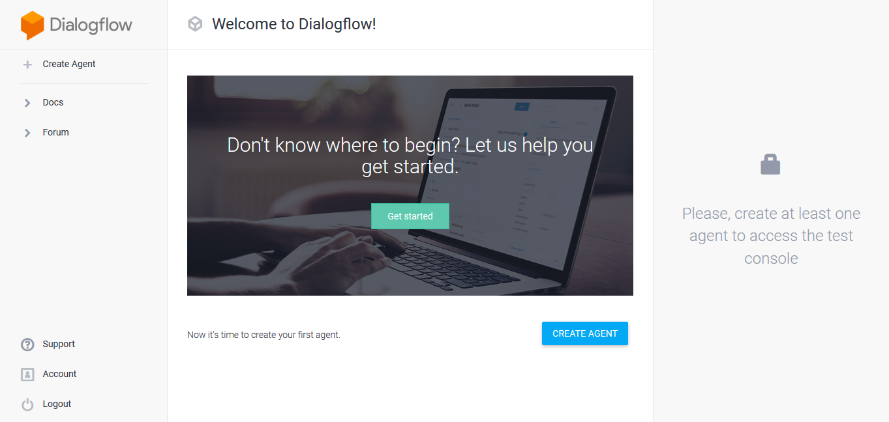
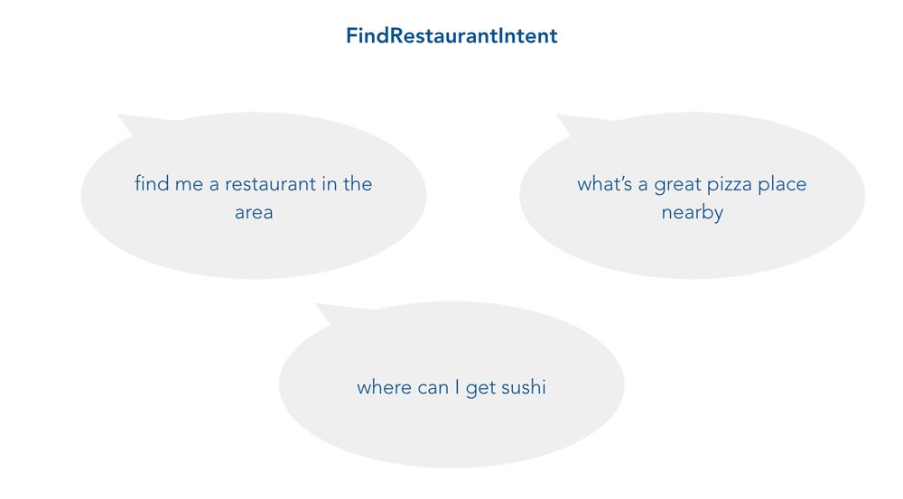
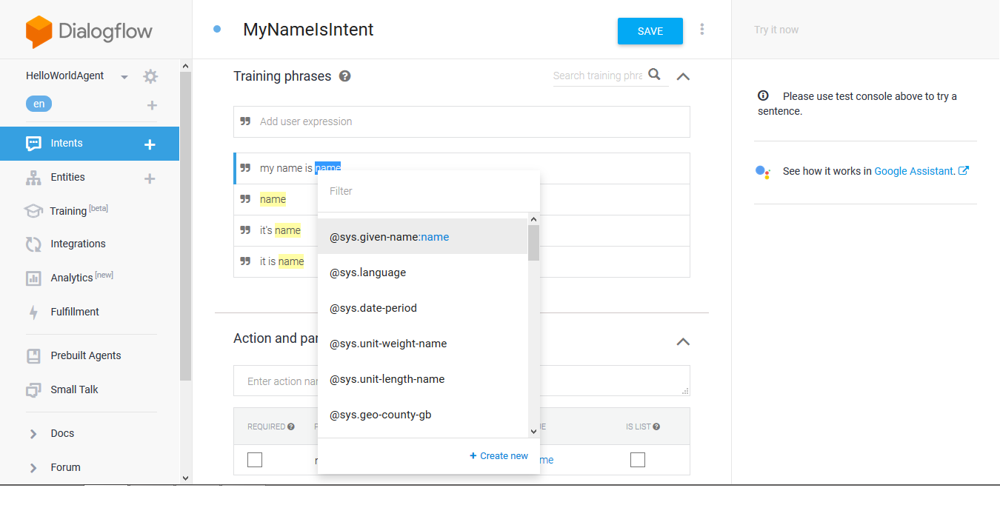
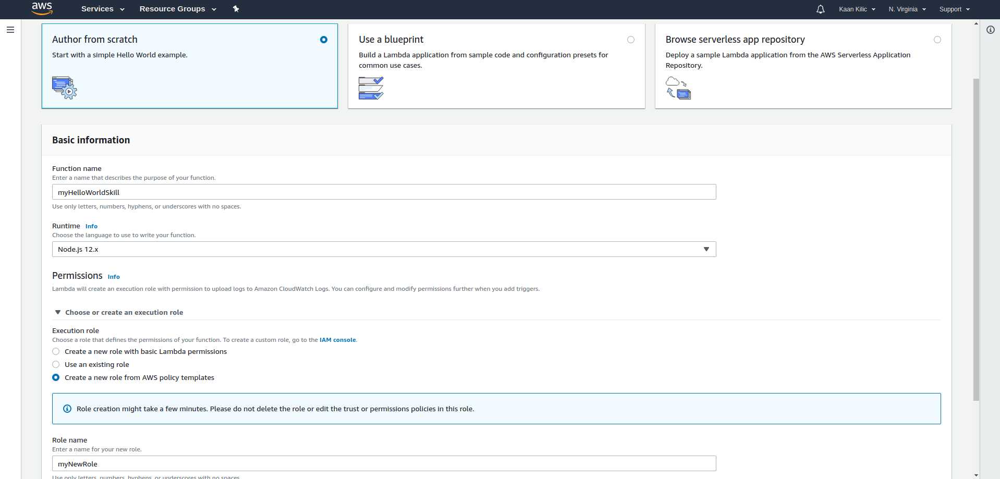
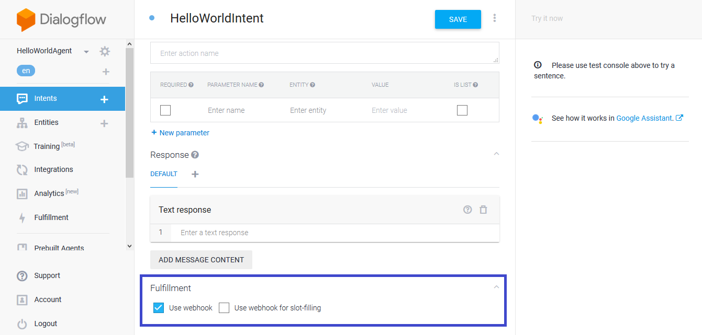
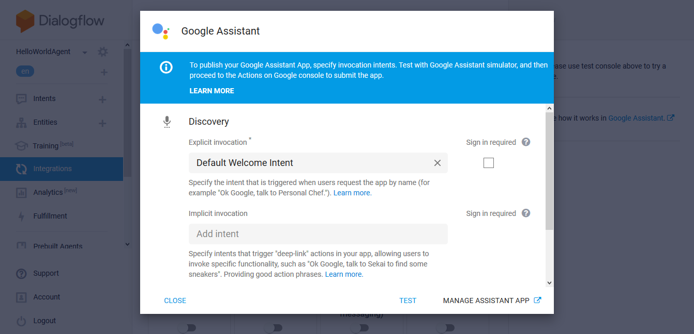
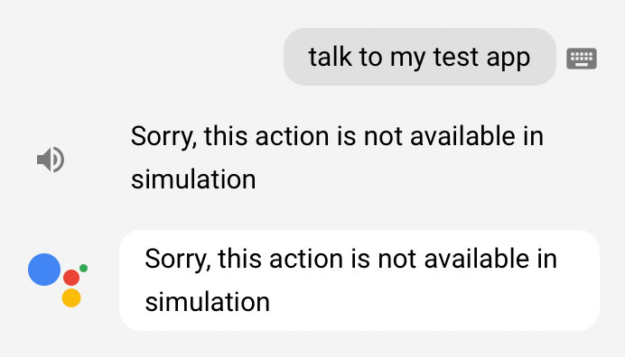

# Build a Google Action in Node.js with Jovo

In this Google Action tutorial for beginners, you will learn how to build an Action for Google Assistant (the voice assistant living inside Google Home) from scratch. We will cover the essentials of building an app for Google Assistant, how to set everything up on Dialogflow and the Actions on Google Console, and how to use [Jovo](https://www.jovo.tech/framework) to build your Action's logic. See also: [Build an Alexa Skill in Node.js with Jovo](https://www.jovo.tech/blog/alexa-skill-tutorial-nodejs/)

### What you'll learn

*   [1) How Google Actions work](#google-action-essentials)
*   [2) How to create an Agent with Dialogflow](#agent-apiai)
*   [3) How to create a Language Model](#language-model)
*   [4) How to build the actual code of the Action](#build-code)
*   [5) Where to run your code](#app-configuration)
*   [6) How to connect your application to Dialogflow](#endpoint)
*   [7) How to test your Action: "Hello World!"](#hello-world)
*   [Next Steps](#next-steps)

**About Jovo:** Jovo is an open source Node.js development framework for voice applications for both Amazon Alexa and Google Assistant. Check out the [GitHub repository](https://github.com/jovotech/jovo-framework-nodejs) or the [documentation](https://www.jovo.tech/framework/docs), if you're interested in learning more.

### What We're Building

To get you started as quickly as possible, we're going to create a simple Action that responds with "Hello World!"

Please note: This is a tutorial for beginners and explains the essential steps of Google Action development in detail. If you already have experience with Google Home or Google Assistant and just want to learn more about how to use Jovo, either skip the first few sections and go right to [Code the Skill](#code-the-skill), or take a look at the [Jovo Documentation](https://www.jovo.tech/framework/docs).

. 


## 1) How do Google Actions Work?

In this section, you will learn more about the architecture of Google Assistant and how users interact with its Actions. First, let's take a look at the wording of the different kinds of software and hardware that's involved: 


 While it's the hardware device that most users see, **Google Home** is not the name of the assistant you can develop actions for (wich sometimes causes confusion when people talk about "_building an Action for Google Home_"). The artificial intelligence you can hear speaking from inside the smart speaker is called **Google Assistant** (which is now also available on Android and iOS smartphones). **Actions on Google** are the applications that can be built on top of the Google Assistant platform. The main difference between the architecture of building Google Actions and [Alexa Skills](https://www.jovo.tech/blog/alexa-skill-tutorial-nodejs/) is that for Google you need an additional layer to handle the natural language. Most Action developers use [Dialogflow](https://dialogflow.com/) to configure their application's language model: 


 We will take a deeper look into Dialogflow in section 2: [Create an Agent on Dialogflow](#agent-apiai). To understand how Google Actions work, let's take a look at the two important elements:

*   [a) User Input](#user-input)
*   [b) Assistant Output](#assistant-output)

### a) User Input

There are a few steps that happen before a user's speech input is reaching your Action. The voice input process (from left to right) consists of three stages that happen at three (four, if you count Google and Dialogflow as two) different places: 


1.  A user talking to an **Assistant device** like Google Home (speech input), which is passed to...
2.  the **Actions API** which uses its **Dialogflow integration** to understand what the user wants (through natural language understanding), and creates a request, which is passed to...
3.  your **Action code** which knows what to do with the request.

### b) Assistant Output

The voice output process (from right to left) goes back and passes the stages again: 


1.  Your **Action code** now turns the input into a desired output and returns a response to...
2.  the **Assistant API** (through **Dialogflow**), which turns this response into speech via text-to-speech, sending sound output to...
3.  the **Assistant** **device**, where your user is happily waiting and listening

In order to make the Action work, we need to configure it on both **Dialogflow** (for the natural language understanding) and the **Actions on Google Console** (for the Assistant integration). We're going to create a new Dialogflow Agent in the next step. 


## 2) Create an Agent on Dialogflow

An [Dialogflow agent](https://dialogflow.com/docs/agents) offers a set of modules and integrations to add natural language understanding (NLU) to your product. Although it's owned by Google, it's platform agnostic and works for other channels like Facebook Messenger, as well. We're going to add our own agent now. Let's get started:

*   [a) Log in with your Google Account](#apiai-login)
*   [b) Create a New Agent](#new-agent)

### a) Log in with your Google Account

Go to [dialogflow.com](https://dialogflow.com/) and click "Go to console" on the upper right: 


 Now sign in with your Google account. To simplify things, make sure to use the same account that's registered with your Actions on Google enabled device like Google Home (if possible) for more seamless testing. 


### b) Create a New Agent

Great! Once you're in the console, click "create agent": 



 We're just going to name it "HelloWorldAgent" and leave the other information out for now: 


 After creating the agent, you can see the screen **Intents**: 


 These intents are part of the Agent's language model. Let's take a deeper look into how it works in the next section.   


## 3) Create a Language Model

Dialogflow offers an easy (but also highly customizable) way to create a language model for your Google Action. Let's take a look:

*   [a) An Introduction to Dialogflow Interaction Models](#introduction-interaction-models)
*   [b) Create a New Intent: HelloWorldIntent](#helloworldintent)

### a) An Introduction to Dialogflow Interaction Models

Google Assistant and Dialogflow help you with several steps in processing input. First, they take a user's speech and transform it into written text (speech to text). Afterward, they use a language model to make sense out of what the user means (natural language understanding). A simple interaction model for Google Assistant (built with Dialogflow) consists of three elements: **Intents**, **user expressions**, and **entities**.

#### Intents: What the User Wants

An intent is something a user wants to achieve while talking to your product. It is the basic meaning that can be stripped away from the sentence or phrase the user is telling you. And there can be several ways to end up at that specific intent. 



 For example, a **FindRestaurantIntent** from the image above could have different ways how users could express it. In the case of Dialogflow language models, these are called user expressions:

#### User Expressions: What the User Says

An user expression (sometimes called utterance) is the actual sentence a user is saying. There are often a large variety of expressions that fit into the same intent. And sometimes it can even be a little more variable. This is when entities come into play:

#### Entities

No matter if I'm looking for a super cheap place, a pizza spot that serves Pabst Blue Ribbon, or a dinner restaurant to bring a date, generally speaking it serves one purpose (user intent): to find a restaurant. However, the user is passing some more specific information that can be used for a better user experience. These are called entities: 


 These are just the very basic components for you to get introduced to some terms. We don't need to know a lot about entities for this simple tutorial. However, it's good to know for later steps. Now that we know a little bit about how language models work, let's create our first intent that's being used to ask for our user's name.

### b) Create a New Intent: HelloWorldIntent

After creating the agent, you can see that there are two standard intents already in place. We're going to keep them. The "Default Welcome Intent" will later be mapped to the Jovo ["LAUNCH"](https://www.jovo.tech/framework/docs/intents-states#intents) intent. 


 Let's create another intent and name it "HelloWorldIntent": 


 Also add the following example phrases to the "**Training Phrases**" tab:
```javascript
hello
say hello
say hello world
```


 Save the intent and create another one named "MyNameIsIntent". With this one we are also going to add example phrases of what the user could say to "**Training Phrases**" and also add an entity called "name" in the "**Action and parameters**":
```javascript
my name is name
it's name
it is name
name
```


 Now we have to map the entity we created to the "**Training Phrases**" section by selecting the word "name" and choosing "**@sys.given-name:name**": 



 Now, let's look at the code!   


## 4) Build Your Action's Code

Now let's build the logic of our Google Action. We're going to use our [Jovo Framework](https://www.jovo.tech/framework/) which works for both Alexa Skills and Actions on Google Home.

*   [a) Install the Jovo CLI](#jovo-cli)
*   [b) Create a new Project](#new-project)
*   [c) A First Look at a Jovo Project](#indexjs)
*   [d) Understanding the App Logic](#app-logic)

### a) Install the Jovo CLI

The Jovo Command Line Tools ([see the GitHub repository](https://github.com/jovotech/jovo-cli)) offer a great starting point for your voice application, as it makes it easy to create new projects from templates.
```sh
$ npm install -g jovo-cli
```
This should be downloaded and installed now ([see our documentation for more information like technical requirements](https://www.jovo.tech/framework/docs/getting-started#technical-requirements)). After the installation, you can test if everything worked with the following command:
```sh
$ jovo
```
This should look like this:
```sh

  Commands:

    help \[command...\]            Provides help for a given command.
    exit                         Exits application.
    new \[options\] \[directory\]    Create a new Jovo project
    init \[options\] \[platform\]    Initializes platform-specific projects in
                                 app.json.
    build \[options\]              Build platform-specific language models
                                 based on jovo models folder.
    deploy \[options\]             Deploys the project to the voice
                                 platform.
    get \[options\]      			 Downloads an existing platform project
                                 into the platforms folder.
    run \[options\]   			 Runs a local development server
                                 (webhook).

```
 

### b) Create a new Project

Let's create a new project with the `$ jovo new` command ("helloworld" is the default template and will clone our [Jovo Sample App](https://github.com/jovotech/jovo-sample-voice-app-nodejs) into the specified directory):
```sh
$ jovo new myGoogleAction
```
```sh

  I'm setting everything up

   V Creating new directory /myGoogleAction
   V Downloading and extracting template helloworld
   V Installing npm dependencies

  Installation completed.

```

### c) A First Look at a Jovo Project

For now, you only have to touch the `[app.js](https://github.com/jovotech/jovo-sample-voice-app-nodejs/blob/master/app/app.js)` file in the `/app` folder. This is where all the configurations and app logic will happen. You can learn more about the Jovo Architecture [here](https://www.jovo.tech/framework/docs/building-a-voice-app#jovo-app-structure). Let's take a look at `app.js`:

### d) Understanding the App Logic

The handlers variable is where you will spend most of your time when you're building the logic behind your Google Action. The "helloworld" template already has three intents:
```javascript
app.setHandler({
    'LAUNCH': function() {
        this.toIntent('HelloWorldIntent');
    },

    'HelloWorldIntent': function() {
        this.ask('Hello World! What\\'s your name?', 'Please tell me your name.');
    },

    'MyNameIsIntent': function(name) {
        this.tell('Hey ' + name.value + ', nice to meet you!');
    },
});
```
What's happening here? When your skill is opened, it triggers the [LAUNCH](https://www.jovo.tech/framework/docs/intents-states#launch-intent)-intent, which contains a [toIntent](https://www.jovo.tech/framework/docs/intents-states#tointent-tostateintent) call to switch to the HelloWorldIntent. Here, the [ask](https://www.jovo.tech/framework/docs/output#ask) method is called to ask for your user's name. After they answer, the MyNameIsIntent gets triggered, which greets your user with their name. That's it for now. Of course, feel free to modify this as you wish. To create more complex Google Actions, take a look at the framework's capabilities here: [Jovo Framework Docs: Building a Voice App](https://www.jovo.tech/framework/docs/building-a-voice-app).   


## 5) App Configuration: Where to Run Your Code

*   [a) Local Prototyping](#local-prototyping)
*   [b) AWS Lambda](#aws-lambda)

So where do we send the response to? Let’s switch tabs once again and take a look at the Fulfillment section at Dialogflow: 


 To make a connection between the Dialogflow and your application, you need to an HTTPS endpoint (a webhook). Jovo currently supports an Express server and AWS Lambda. We recommend the first one for local prototyping, but you can also [jump to the Lambda section](https://www.jovo.tech/blog/alexa-skill-tutorial-nodejs/#aws-lambda).  

### a) App Configuration: Local Prototyping with Express

Jovo project come with off-the-shelf server support so that you can start developing locally as easy as possible. You can find that part in the `index.js` file:
```javascript
const {Webhook} = require('jovo-framework');
const {app} = require('./app/app.js');

// =================================================================================
// Server Configuration
// =================================================================================

if (app.isWebhook()) {
    const port = process.env.PORT || 3000;
    Webhook.listen(port, () => {
        console.log(\`Example server listening on port ${port}!\`);
    });
    Webhook.post('/webhook', (req, res) => {
        app.handleWebhook(req, res);
    });
}
```

#### Run Local Server

Let's try that out with the following command (make sure to go into the project directory first):
```javascript
$
```
This will start the express server and create a subdomain,which you can then submit to Dialogflow:
```sh
Example server listening on port 3000!
This is your webhook url: https://webhook.jovo.cloud/ba4a309c-8a0a-45d9-88e2-a6d635131e3f
```
This should be enough for now to test and debug your Google Action locally. If you want to learn more about how to make it work on AWS Lambda, proceed to the next section. Or, jump to the section [Add Endpoint to Dialogflow](#endpoint).  

### b) App Configuration: Host your Code on AWS Lambda

[AWS Lambda](https://aws.amazon.com/lambda/) is a serverless hosting solution by Amazon. Many Alexa Skills are hosted on this platform, thus it might make sense for you to host your cross-platform voice application (including your Google Action). This is what we're going to do in this section. This usually takes a few steps, so be prepared. If you only want to get an output for the first time, go back up to [Local Prototyping](#local-prototyping). In the next steps, we are going to create a new Lambda function on the AWS Developer Console.

#### Create a Lambda Function

Go to [aws.amazon.com](https://aws.amazon.com) and log into your account (or create a new one): 


 Go to the [AWS Management Console](https://console.aws.amazon.com): 


 Search for "lambda" or go directly to [console.aws.amazon.com/lambda](https://console.aws.amazon.com/lambda): 


 Click "Create a Lambda function", choose "Author from scratch" and fill out the form: 



 You can either choose an existing role (if you have one already), or create a new one. We're going to create one from a template and call it "myNewRole" with no special policy templates: Now it's time to configure your Lambda function. Let's start by adding the Alexa Skills Kit as a trigger: 


 You can enable skill ID verification, if you want, but it's not neccessary. 


#### Upload Your Code

Now let's get to the fun part. You can either enter to code inline, upload a zip, or upload a file from Amazon S3. As we're using other dependencies like the [jovo-framework npm package](https://www.npmjs.com/package/jovo-framework), we can't use the inline editor. We're going to zip our project and upload it to the function. To upload the code to Lambda, please make sure to zip the actual files inside the directory, **not** the HelloWorld folder itself: 


 Let's go back to the AWS Developer Console and upload the zip: 


 Now save your changes with the orange button in the upper right corner: 


#### Test Your Lambda Function

Great! Your Lambda function is now created. Click "Test" right next to the "Save" button and select "Alexa Start Session" as the event template, since the [Jovo Framework](https://www.jovo.tech) supports both Google Action and Amazon Alexa requests: 


 Click "Test," aaand 🎉 it works! 


 If you want to test it with a "real" Google Assistant request, you can also copy-paste this one:
```javascript
{
	"originalRequest": {
		"source": "google",
		"version": "2",
		"data": {
			"isInSandbox": true,
			"surface": {
				"capabilities": \[
					{
						"name": "actions.capability.AUDIO_OUTPUT"
					},
					{
						"name": "actions.capability.SCREEN_OUTPUT"
					}
				\]
			},
			"inputs": \[
				{
					"rawInputs": \[
						{
							"query": "talk to my test app",
							"inputType": "KEYBOARD"
						}
					\],
					"intent": "actions.intent.MAIN"
				}
			\],
			"user": {
				"locale": "en-US",
				"userId": "1501754379730"
			},
			"device": {},
			"conversation": {
				"conversationId": "1501754379730",
				"type": "NEW"
			}
		}
	},
	"id": "ce231a64-af08-4c33-bfa3-0724a80d5b2c",
	"timestamp": "2017-08-03T09:59:39.741Z",
	"lang": "en",
	"result": {
		"source": "agent",
		"resolvedQuery": "GOOGLE\_ASSISTANT\_WELCOME",
		"speech": "",
		"action": "input.welcome",
		"actionIncomplete": false,
		"parameters": {},
		"contexts": \[
			{
				"name": "google\_assistant\_welcome",
				"parameters": {},
				"lifespan": 0
			},
			{
				"name": "actions\_capability\_screen_output",
				"parameters": {},
				"lifespan": 0
			},
			{
				"name": "actions\_capability\_audio_output",
				"parameters": {},
				"lifespan": 0
			},
			{
				"name": "google\_assistant\_input\_type\_keyboard",
				"parameters": {},
				"lifespan": 0
			}
		\],
		"metadata": {
			"intentId": "b0b7962c-cae0-4437-bddf-e72f457959d6",
			"webhookUsed": "true",
			"webhookForSlotFillingUsed": "false",
			"nluResponseTime": 2,
			"intentName": "Default Welcome Intent"
		},
		"fulfillment": {
			"speech": "Greetings!",
			"messages": \[
				{
					"type": 0,
					"speech": "Hi!"
				}
			\]
		},
		"score": 1
	},
	"status": {
		"code": 200,
		"errorType": "success"
	},
	"sessionId": "1501754379730"
}
```

#### Create API Gateway

For Alexa Skills, you can just use the Lambda function's ARN to proceed, for Dialogflow, we need to create an API Gateway. Go to [console.aws.amazon.com/apigateway](https://console.aws.amazon.com/apigateway) to get started: 


 Let's create a new API called "myGoogleActionAPIGateway" (you can call it whatever, though): 


 After successful creation, you will see the Resources screen. Click on the "Actions" dropdown and select "New Method": 


 Dialogflow needs a webhook where it can send POST requests to. So let's create a POST method that is integrated with our existing Lambda function: 


 Grant it permission: 


 And that's almost it. You only need to deploy the API like this: 


 And create a new stage: 


 Yes! Finally, you can get the URL for the API Gateway from here: 


 There's one more step we need to do before testing: we need to use this link and add it to Dialogflow.   


## 6) Add Endpoint to Dialogflow

Now that have either our local webhook or the API Gateway to AWS Lambda set up, it's time use the provided URL to connect our application with our agent on Dialogflow.

*   [a) Agent Fulfillment Section](#agent-fulfillment)
*   [b) Add Webhook to Intents](#intents-webhook)

### a) Agent Fulfillment Section

Go back to the Dialogflow console and choose the **Fulfillment** navigation item. Enable the webhook and paste either your Jovo webhook URL or the API Gateway: 


### b) Add Webhook to Intents

Dialogflow offers the ability to customize your language model in a way that you can choose for every intent how it's going to be handled. This means we need to enable **webhook fulfillment** for every intent we use in our model. Go to HelloWorldIntent first and check "Use webhook" in at the bottom of the page: 



 Do the same for the "MyNameIsIntent" and also take a look at the "Default Welcome Intent" and don't forget to check the box there as well. The intent comes with default text responses, which would otherwise cause random output instead of your model, when the application is launched. 


 Great! Now let's test your Action.   


## 7) "Hello World!"

The work is done. It's now time to see if Google Assistant is returning the "Hello World!" we've been awaiting for so long. There are several options to test our Google Action:

*   [a) Test in Dialogflow](#test-dialogflow)
*   [b) Test in the Actions on Google Simulator](#test-simulator)
*   [c) Test on your Assistant enabled device](#test-device)

### a) Test in Dialogflow

For quick testing of your language model and to see if your webhook works, you can use the internal testing tool of Dialogflow. You can find it to the right. Just type in the expression you want to test (in our case "my name is jan") and it returns your application's response and some other information (like the intent): 


 Testing with Dialogflow will often be enough (and especially useful, as other tools can sometimes be a bit buggy). However, it doesn't test the integration between Dialogflow and Google Assistant. For this, you need to use the Actions on Google Simulator (see next step).  

### b) Test in the Actions on Google Simulator

Now, let's make our Dialogflow agent work with Google Assistant. Open the Integrations panel from the sidebar menu: 


 Here, choose the "Actions on Google" integration: 



 Click "Test" and, on the success screen, "Continue": 


 In the Simulator, you can now test your Action: 


 Yeah! Your application is now an Action on Google Assistant.

#### Troubleshooting

The Simulator can be unreliable sometimes. For example, there are a few things that could make an error message show up: "Sorry, this action is not available in simulation" 



 There are several things that could be useful for troubleshooting:

*   Use the right sample prhase (Talk to my test app)
*   Make sure you're using the same Google account for logging into Dialogflow and the Actions on Google console
*   If you have more Actions projects, disable all others for testing
*   Turn on Voice & Audio Activity, Web & App Activity, and Device Information permissions for your Google Account here: [Activity controls](https://myaccount.google.com/activitycontrols)

It can also be helpful to go through the process one more time. Go to **Integrations** on Dialogflow, choose the Actions on Google integration, and click on "Test":   


 Let us know in the comments if it worked!

### c) Test on your Assistant enabled device

If you want to test your Action on a Google Home (or other device that works with Google Assistant), make sure you're connected to it with the same Google account you're using for the Simulator (and that testing is enabled, see previous step). Then, use the invocation that was provided by the Simulator: 


   


## Next Steps

Great job! You've gone through all the necessary steps to prototype your own Google Action. The next challenge is to build a real Action. For this, take a look at the Jovo Documentation to see what else you can do with our Framework: 

[](https://www.jovo.tech/framework/docs/)

<!--[metadata]: { "description": "Learn how to build Google Actions with the Jovo Framework from scratch" }-->