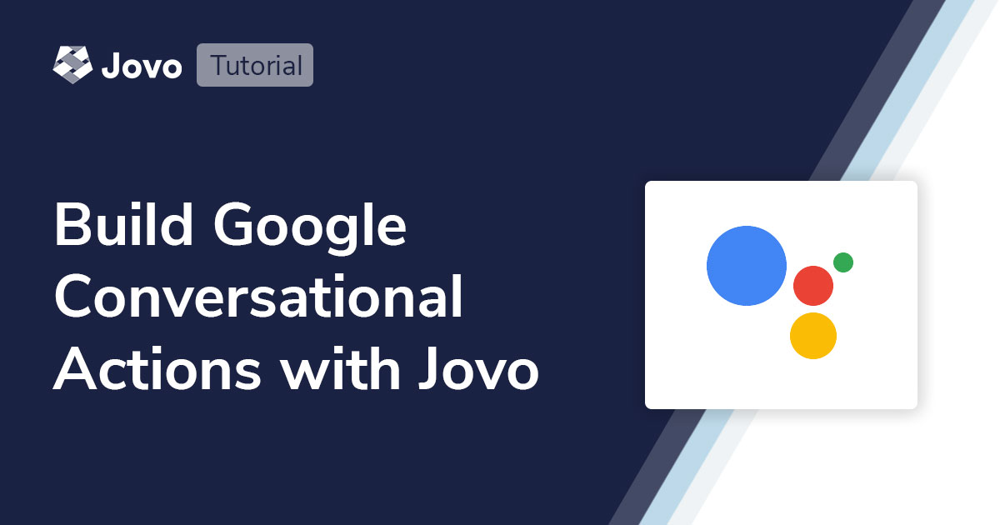
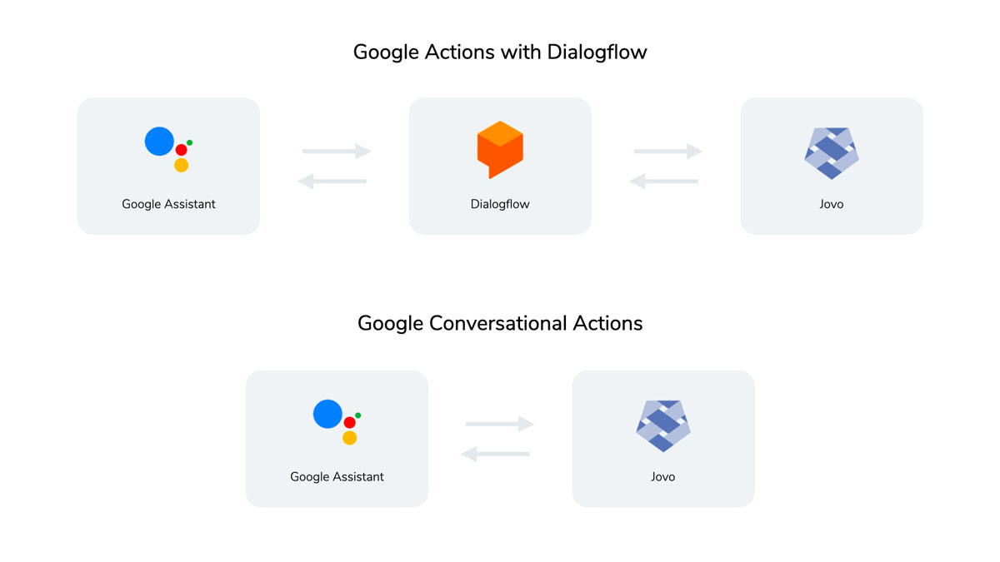
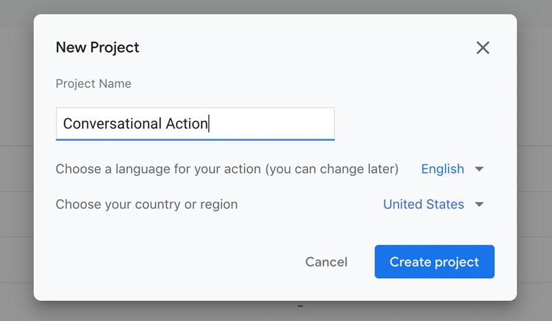
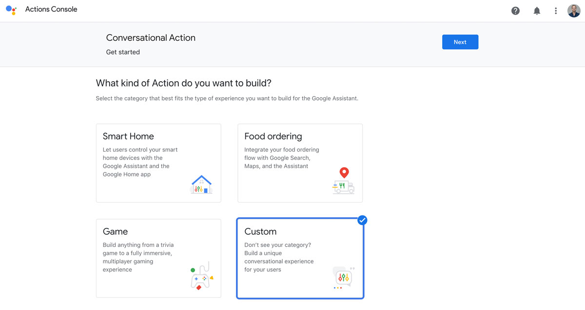
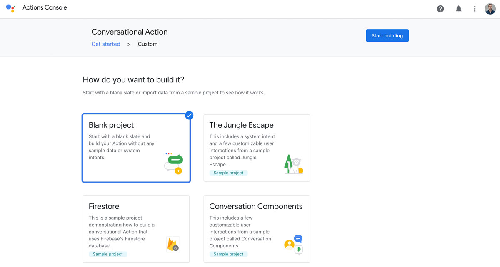
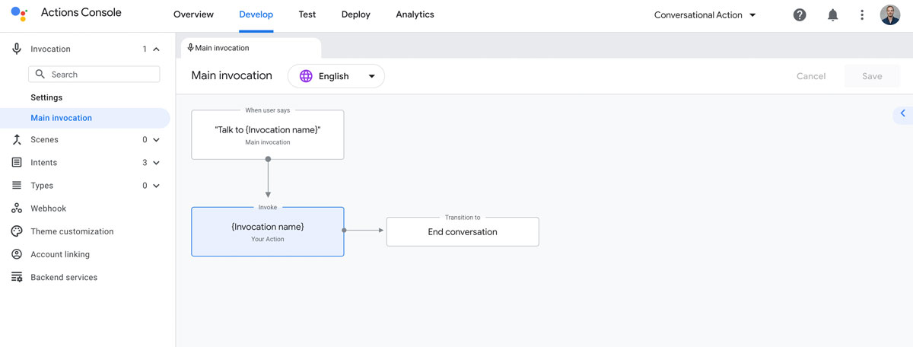
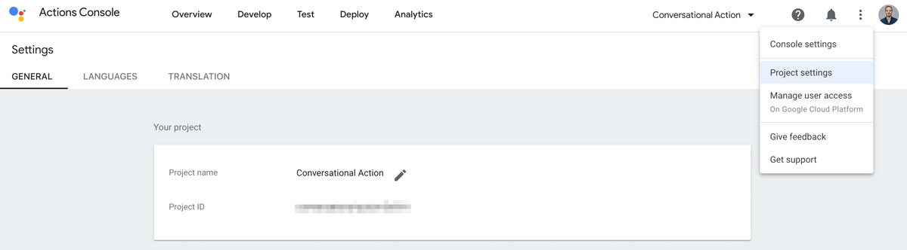
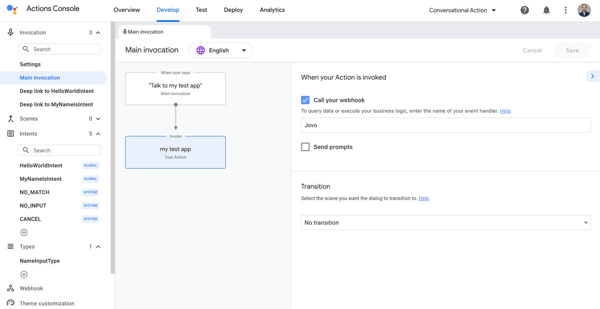
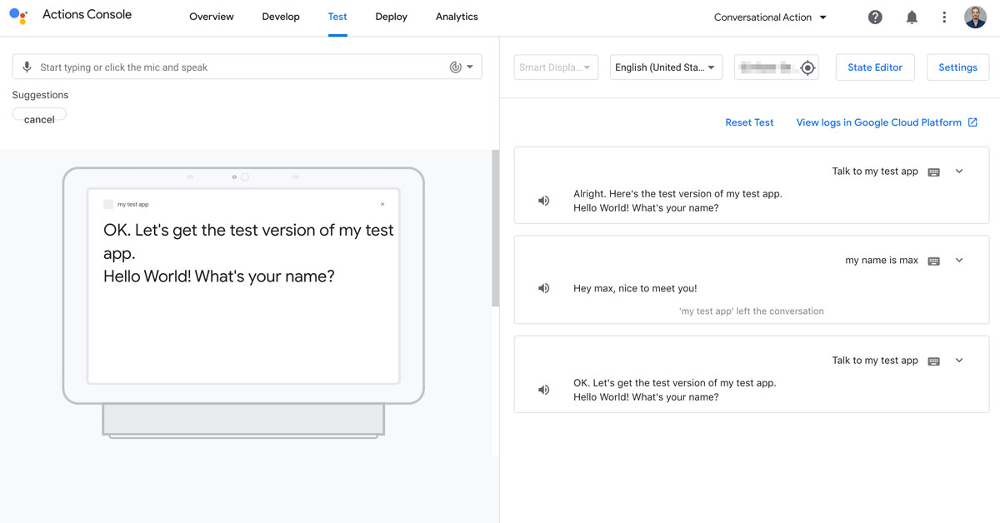

# Build Google Conversational Actions with Jovo and the Actions Builder



Learn how to use the new Google Conversational Actions Builder and Jovo to build Google Actions. This allows you to create apps for Google Assistant without the need to integrate with Dialogflow.

- [Introduction](#introduction)
- [Create Google Action in the Actions Builder](#create-google-action-in-the-actions-builder)
- [Create and Run Jovo Code Project](#create-and-run-jovo-code-project)
  - [Install Conversational Actions Jovo Template](#install-conversational-actions-jovo-template)
  - [Deploy Model to Actions Builder](#deploy-model-to-actions-builder)
  - [Run and Test Code](#run-and-test-code)

## Introduction



Jovo has been offering support for Google Assistant since our launch more than 3 years ago. From the beginning on, we integrated with Google's natural language understanding service Dialogflow, the then standard way to build Google Actions. Although this already worked great ([including support for additional integrations](https://www.jovo.tech/marketplace/jovo-platform-dialogflow)), our users had to create and configure a Dialogflow agent as an additional step.

Recently, Google introduced a new way to build apps for Google Assistant: [Conversational Actions](https://developers.google.com/assistant/conversational). This new release (including their Actions Builder graphical user interace) removed the necessity to connect with Dialogflow for natural language understanding.

In this tutorial, we will use Jovo to build a new Conversational Action for the Google Assistant platform. We will:

* Create Google Action in the Actions Builder
* Create a new Jovo project
* Update the Google Action with the Jovo CLI
* Run and test the Jovo code in the Google Action Simulator


## Create Google Action in the Actions Builder

First, we will create a new Google Action project that we will then connect to our Jovo code in the next step. [Learn more in the official documentation provided by Google](https://developers.google.com/assistant/actionssdk/gactions#create_and_set_up_a_project).

Go to [Actions Console](https://console.actions.google.com/) and create a new project.



In the next step, select "Custom" as the type of Action you want to build:



We will start with a fresh new project, so let's select "Blank" in the next step:



This opens the new Action Builder.



Feel free to click around a bit to get yourself acquainted with this new interface. There is no need to make any changes just now. We will later do this using the Jovo CLI.


## Create and Run Jovo Code Project

In this section, we're going to connect a Jovo project (the source code running the conversations of our Google Action) with the newly created Google Action project.

The app will do the following:

* `HelloWorldIntent`: Says "Hello World!" and asks the user for their name
* `MyNameIsIntent`: Greets the user with their name

It's the same functionality that is also used in the [Jovo Quickstart Guide](https://www.jovo.tech/docs/quickstart).

### Install Conversational Actions Jovo Template

First, install (or update to) the latest version of the [Jovo CLI](https://www.jovo.tech/marketplace/jovo-cli):

```sh
$ npm install -g jovo-cli
```

Next, we'll create a new Jovo project. The below command creates a new folder `my-google-action` and downloads a Jovo template called `google-conversational-actions-helloworld`. You can find the [source code of the Google Conversational Actions template here](https://github.com/jovotech/jovo-templates/tree/master/google/conversational-actions-hello-world).

We also specify the locale as `en` because the Google Action Builder doesn't use e.g. `en-US` which is used by other platforms like Alexa.

```sh
# Create new Jovo project
$ jovo new my-google-action --template google-conversational-actions-helloworld —-locale en

# Go into newly created directory
$ cd my-google-action
```

If you're unfamiliar with the Jovo project structure, take a look at the following items in our documentation:

* [Quickstart Guide](https://www.jovo.tech/docs/quickstart)
* [Project Structure](https://www.jovo.tech/docs/project-structure)
* [Project Lifecycle](https://www.jovo.tech/docs/project-lifecycle)


### Deploy Model to Actions Builder

We will use the [Jovo Model](https://www.jovo.tech/marketplace/jovo-model) to turn the language model defined in the `models/en.json` into a platform specific model for Google Conversational Actions.

We had to tweak our [Jovo Hello World Template](https://github.com/jovotech/jovo-templates/tree/master/01_helloworld) because the new Google Actions Builder does not provide a built-in entity type for first names. If you look at the [`models/en.json` file](https://github.com/jovotech/jovo-templates/blob/master/google/conversational-actions-hello-world/javascript/models/en.json), you can find that we created an input type called `NameInputType` that currently comes with 3 names (for demonstration purposes only):

```js
{
  "name": "NameInputType",
  "values": [
    {
      "value": "max"
    },
    {
      "value": "jane"
    },
    {
      "value": "joe"
    }
  ]
}
```

If you want to use additional names for testing, add them to the document.

The Jovo CLI will then use this information to update the Google Action project in the Actions Console. To point it to the right project, update the `projectId` in the `project.js` file:

```js
googleAction: {
    projectId: '<PROJECT ID>',
  },
```
The project ID can be found in the project settings of the Actions Console:



As a next step, we can run the [`jovo build` command](https://www.jovo.tech/marketplace/jovo-cli/build) to create platform specific files:

```sh
$ jovo build
```

This will create a new `platforms/googleAction` folder that contains several folders and files, including:

* `actions` folder with actions for each intent in your language model
* `custom` folder with language model content and scenes
* `settings` folder with invocation name, project ID (added from the `project.js` file)
* `webhooks` folder with your [Jovo Webhook URL for local development](https://www.jovo.tech/docs/local-development)

The files in the `platforms` are now ready to be deployed to the Actions console.

Before we can do so, we need to install the `gactions` CLI as explained in the [official Google documentation](https://developers.google.com/assistant/actionssdk/gactions#install_the_gactions_command-line_tool). Download it and then run the following command to connect with your Google account:

```sh
$ gactions login
```

This will show a permission screen like the one below. Connect with the account your Google Action is managed by.


After this, we can finally use the [`jovo deploy` command](https://www.jovo.tech/marketplace/jovo-cli/deploy) to push the new files to the Actions console.

```sh
$ jovo deploy
```

The deployment process might show a few warnings like a missing privacy URL. The warnings are OK for now and can be addressed later.

After successful deployment, the content in the Action Builder looks different:



Alright, let's get to testing.

### Run and Test Code

The intents in the Action Builder are all connected to your [Jovo Webhook](https://www.jovo.tech/docs/webhook) URL.

You can start the local development server by using the following command:

```sh
$ jovo run
```

Learn more in the [local development section of the Jovo Docs](https://www.jovo.tech/docs/local-development).

You can then go to the "Test" tab in the Actions console and try it out:




**Any questions? You can reach us on [Twitter](https://twitter.com/jovotech), [Slack](https://www.jovo.tech/slack), or the [Jovo Community Forum](https://community.jovo.tech/).**

<!--[metadata]: { "description": "Learn how to use the new Google Conversational Actions Builder and Jovo to build Google Assistant Actions.", "author": "jan-koenig", "tags": "Google Actions, Getting Started", "og-image": "https://www.jovo.tech/img/tutorials/google-conversational-actions-getting-started/google-conversational-actions-jovo.jpg"  }-->
