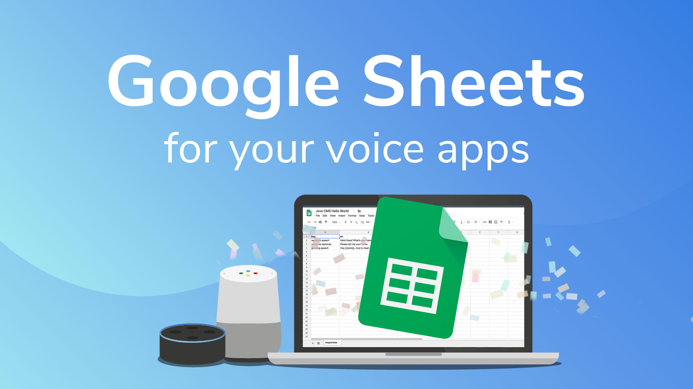
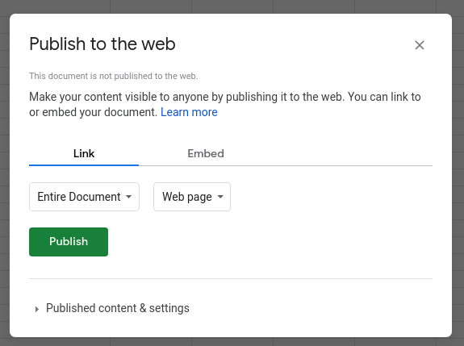

# Use Google Sheets as CMS for your Voice App



Learn how to use Google Spreadsheets as a content management system (CMS) for your Alexa Skills and Google Actions with the Jovo CMS integration.

> [You can find the full example code on GitHub](https://github.com/jovotech/jovo-templates/tree/master/tutorials/google-sheets-helloworld).

* [Introduction](#introduction)
   * [Why a CMS?](#why-a-cms)
   * [Why Google Sheets?](#why-google-sheets)
* [Preparing the Google Spreadsheet](#preparing-the-google-spreadsheet)
* [Using the Jovo Google Sheets CMS Integration](#using-the-jovo-google-sheets-cms-integration)
   * [Installation](#installation)
   * [Configuration](#configuration)
   * [Accessing the Content](#accessing-the-content)
* [Next Steps](#next-steps)

Watch the video here:

[](https://www.youtube.com/watch?v=B1dWJoVkGag)

## Introduction

### Why a CMS?

Right now, most people manage the content of their Alexa Skills and Google Actions in the code. This lets you start building out the functionality quickly without having to care about integrating external systems. Plus, Jovo offers an [i18next integration that allows you to localize content right from a JSON file](https://www.jovo.tech/docs/output/i18n).

However, with growing teams working on voice apps for Alexa and Google Assistant, changes are becoming higher that content is managed from a variety of people that don't necessarily have access to the code. Also, for adding fresh new content, or even doing minor changes, redeploying the complete code base can seem like a tedious task.

With the [Jovo CMS Integrations](https://www.jovo.tech/docs/cms), we want to remove that hurdle and help people work on content more collaboratively.

### Why Google Sheets?

We experienced ourselves that using Google Sheets as a CMS for our own Alexa Skills and Google Actions was the solution that required the least effort, while still being quite powerful and flexible.

Here are some reasons for using Google Sheets for content:
* It's a familiar interface (spreadsheets, Excel)
* Google Sheets has all the collaboration and permission features already built in
* You can create several sheets (displayed as tabs) in one spreadsheet, allowing you to manage several content types (we offer different [Sheet Types](https://www.jovo.tech/docs/v2/cms/google-sheets#default-sheet-types) for this)

Let's get started with Google Sheets and Jovo.

## Preparing the Google Spreadsheet

First, we need to prepare a Google Spreadsheet and add some content. We will just use a `responses` sheet that includes a `key` and a locale (in our case `en` for English).

Take a look at the sample spreadsheet we created:

[](https://docs.google.com/spreadsheets/d/19pRsPiW79nAcHNybD43thY2kAE5X3EpIz5WZb21yGh4)

> [You can find the Hello World Spreadsheet here](https://docs.google.com/spreadsheets/d/19pRsPiW79nAcHNybD43thY2kAE5X3EpIz5WZb21yGh4).

To use it for yourself, click `File > Make a copy...` and save it to your own Google Drive.

You can then edit the content as much as you want. After editing, make sure that you publish it to the web by going to `File > Publish to the web...`.



After it's available for anyone, you can get the spreadsheet ID by copying the relevant part from the URL.

```sh
# If this is the URL to your Spreadsheet
https://docs.google.com/spreadsheets/d/19pRsPiW79nAcHNybD43thY2kAE5X3EpIz5WZb21yGh4/edit?usp=sharing

# Then this is your Spreadsheet ID
19pRsPiW79nAcHNybD43thY2kAE5X3EpIz5WZb21yGh4
```


## Using the Jovo Google Sheets CMS Integration

In this section, we will integrate the Google Spreadsheet with a Jovo voice app in three simple steps:

* [Installation](#installation)
* [Configuration](#configuration)
* [Accessing the Content](#accessing-the-content)

> You can find the full documentation here: [Jovo Google Sheets CMS Integration](https://www.jovo.tech/docs/cms/google-sheets).

### Installation

> This integration works with Jovo v2. [Learn how to migrate from a v1 project here](https://www.jovo.tech/docs/v2/installation/v1-migration).

To get started, we need to enable the Google Sheets integration.

```sh
## Optional: Create a new Jovo project, if you don't have one already
$ jovo new <directory>
$ cd <directory>

# Download the npm package
$ npm install --save jovo-cms-googlesheets
```

In your `app.js` file, register it with the `use` command:

```javascript
// app.js

const { GoogleSheetsCMS } = require('jovo-cms-googlesheets');

app.use(new GoogleSheetsCMS());
```

### Configuration

You can simply add the following to your `config.js` file in the `src` folder:

```javascript
// config.js

cms: {
    GoogleSheetsCMS: {
        spreadsheetId: '19pRsPiW79nAcHNybD43thY2kAE5X3EpIz5WZb21yGh4',
        access: 'public',
        sheets: [
            {
                name: 'responses',
                type: 'Responses',
                position: 1,
            },
        ]
    }
},
```

The Google Sheets integration allows you to add several different sheets of various sheet types. For this example, we're just going to use the `Responses` sheet type.

> [Learn everything about Sheet configuration here](https://www.jovo.tech/docs/v2/cms/google-sheets).

### Accessing the Content

Now let's take a look at the `app.js` file in the `src` folder. Because we're using the [`Responses` sheet type](https://www.jovo.tech/docs/v2/cms/google-sheets#responses), you can access the content strings with the `this.('key')` method:

```javascript
// Instead of this
HelloWorldIntent() {
    this.ask('Hello World! What\'s your name?', 'Please tell me your name.');
},

// Use this
HelloWorldIntent() {
    this.ask(this.t('welcome.speech'), this.t('welcome.reprompt'));
},
```

If you want to pass additional parameters, you can add them as an object:

```javascript
// Instead of this
MyNameIsIntent() {
        this.tell('Hey ' + this.$inputs.name.value + ', nice to meet you!');
    },

// Use this
MyNameIsIntent() {
    this.tell(this.t('greeting.speech', { name: this.$inputs.name.value }));
},
```

> [Learn more about i18n here](https://www.jovo.tech/docs/output/i18n).


## Next Steps

That's it! If you now test it, you should be able to get the responses you defined in your Google Spreadsheet.

You can test it locally by using the following command:

```sh
$ jovo run
```

There are lots of additional things you can do with this integration, which we are going to focus on in upcoming tutorials.

For example:

* You can use private spreadsheets ([find the docs here](https://www.jovo.tech/docs/v2/cms/google-sheets#private-spreadsheets))
* You can use additional Sheet Types ([find the docs here](https://www.jovo.tech/docs/v2/cms/google-sheets#default-sheet-types))
* You can define your own Sheet Types ([find the docs here](https://www.jovo.tech/docs/v2/cms/google-sheets#defining-your-own-sheet-type))


**Any questions? Please let us know in the comments below 👇. You can also reach us on [Twitter](https://twitter.com/jovotech) or [Slack](https://www.jovo.tech/slack).**

<!--[metadata]: { "description": "Learn how to use Google Spreadsheets as a content management system (CMS) for your Alexa Skills and Google Actions with Jovo.", "author": "jan-koenig", "tags": "Google Sheets, CMS", "og-image": "https://www.jovo.tech/img/tutorials/google-sheets-cms/google-sheets-cms.jpg" }-->
