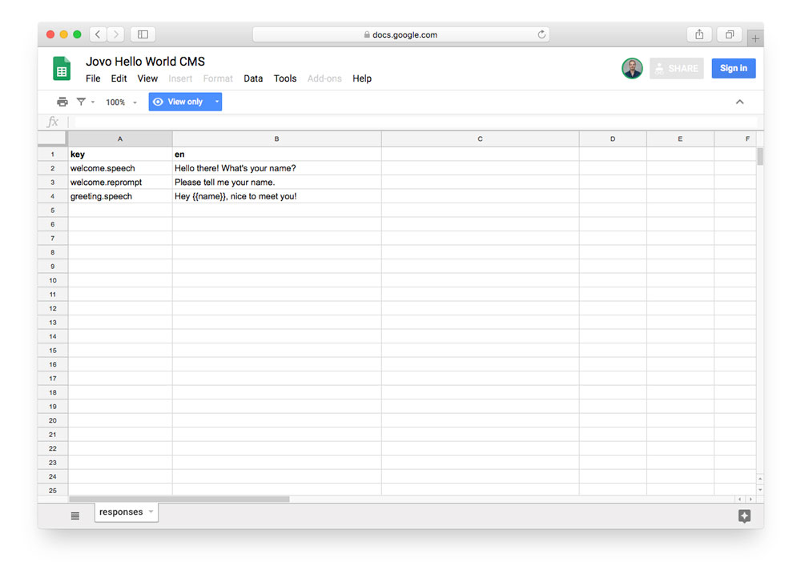
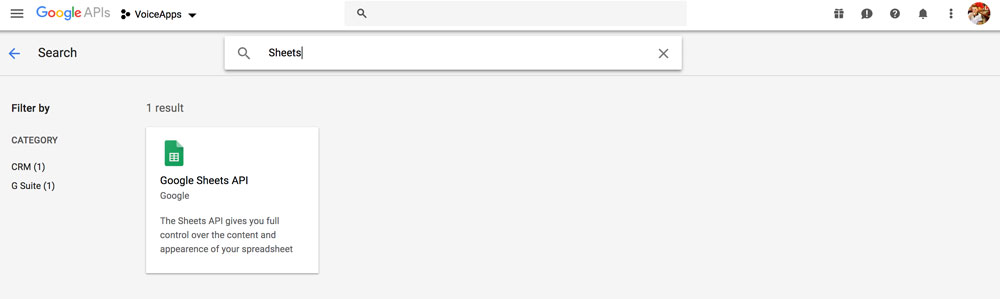
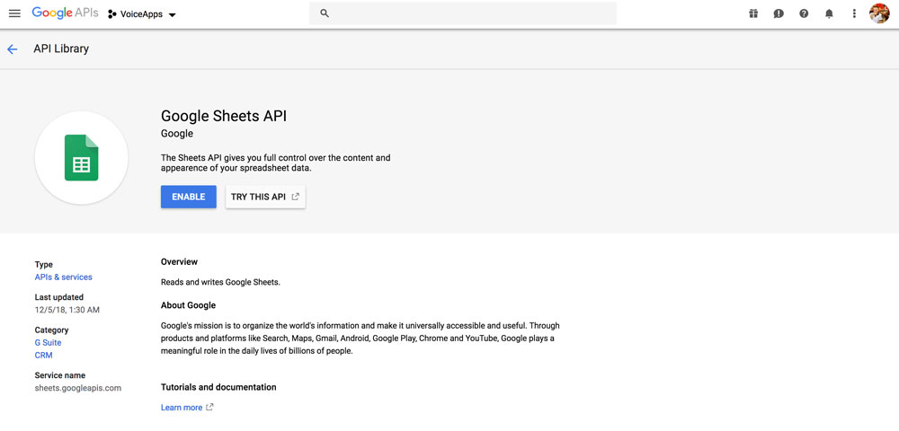
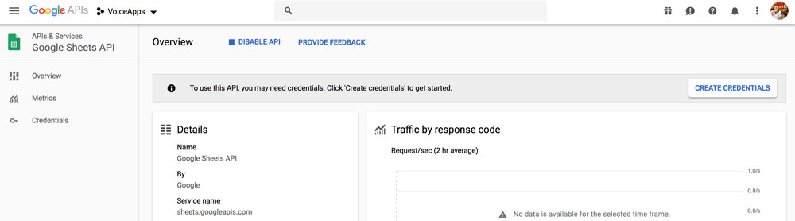
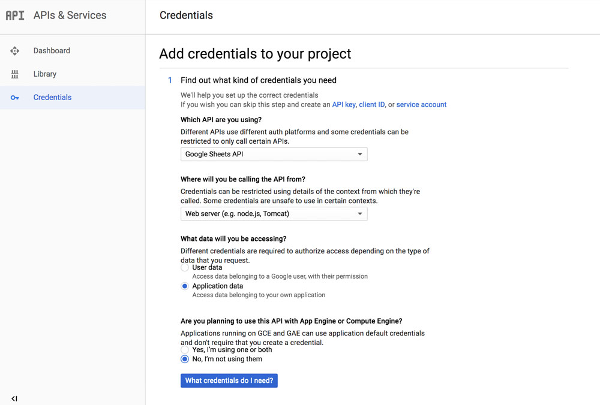
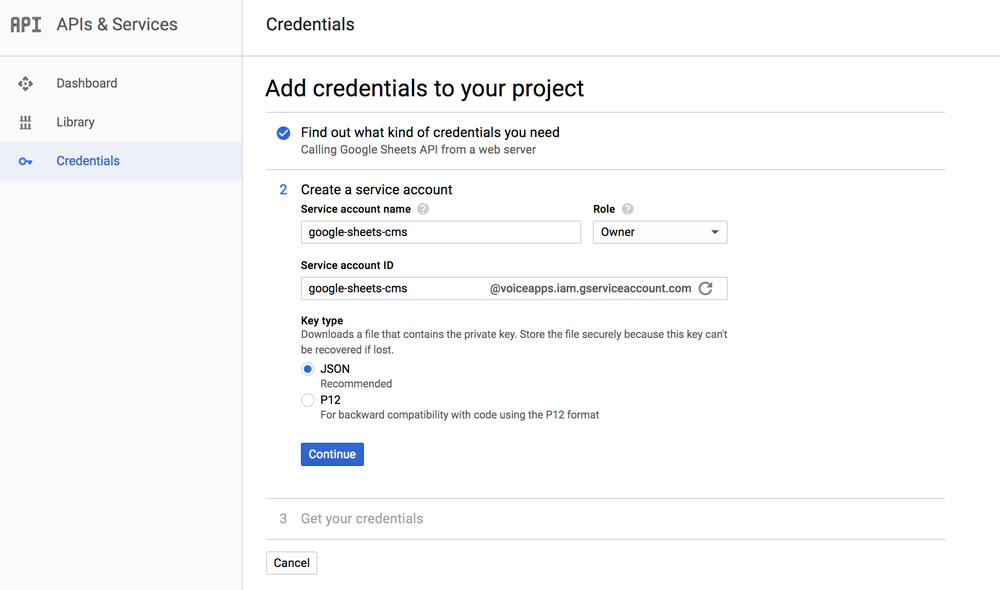
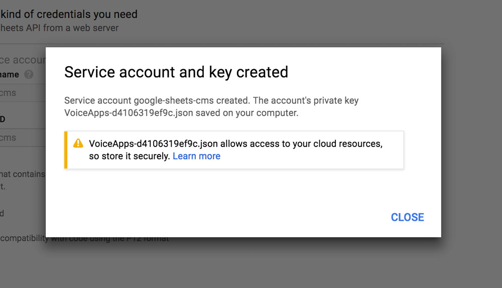
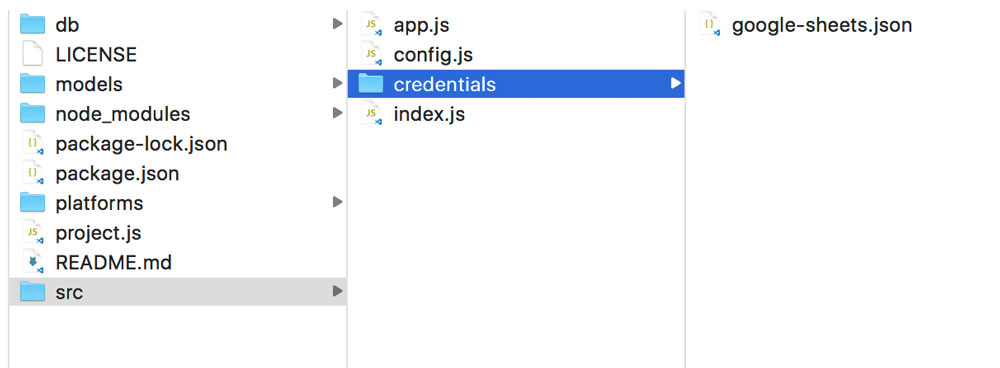
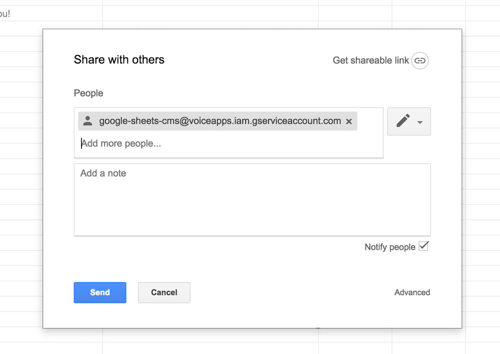

# Use Private Google Spreadsheets as a CMS

Learn how to get the credentials to use a private Google Spreadsheet in your Alexa Skills and Google Actions.

> Get started with public spreadsheets here: [Tutorial: Use Google Sheets as CMS for your Voice App](https://www.jovo.tech/tutorials/google-sheets-cms).

* [Introduction](#introduction)
* [Credentials](#credentials)
   * [Google API Console](#google-api-console)
   * [Spreadsheet Permissions](#spreadsheet-permissions)
* [Using the Jovo Google Sheets CMS Integration](#using-the-jovo-google-sheets-cms-integration)
   * [Configuration](#configuration)
   * [Accessing the Content](#accessing-the-content)
* [Next Steps](#next-steps)


## Introduction

In a previous tutorial ([Use Google Sheets as CMS for your Voice App](https://www.jovo.tech/tutorials/google-sheets-cms)), we used the [Jovo Google Sheets Integration](https://www.jovo.tech/docs/cms/google-sheets) to create a public spreadsheet that can be used to store and update content for your Alexa Skills and Google Actions.

The public spreadsheet looked like this:

[](https://docs.google.com/spreadsheets/d/19pRsPiW79nAcHNybD43thY2kAE5X3EpIz5WZb21yGh4)

> [You can find the Hello World Spreadsheet here](https://docs.google.com/spreadsheets/d/19pRsPiW79nAcHNybD43thY2kAE5X3EpIz5WZb21yGh4).

Very often, public spreadsheets are a great starting point. However, in many cases you might not want to allow anyone to access your spreadsheet (even though public means that people still need to have the full URL to be able to access it).

Luckily, the [Jovo Google Sheets Integration](https://www.jovo.tech/docs/cms/google-sheets) works the same way for both public and private spreadsheets. 

## Credentials

To convert the integration from a public spreadsheet to a private spreadsheet, you need to do two things:

* [Create a service account and credentials in the Google API Console](#google-api-console)
* [Invite the service account to the spreadsheet](#spreadsheet-permissions)

### Google API Console

First, you need to enable the Google Sheets API in the [Google API Console](https://console.developers.google.com):


Click the "Enable APIs and Services" button and search for "Sheets" to find the Google Sheets API:



The Google Sheets API overview has a blue "Enable" button that you need to click:



The next step is to create the credentials for this API. You can do this by clicking on the "Create Credentials" button:



In the "Add credentials to your project" menu, select "Google Sheets API", "Web server", and "Application data" as shown below:



Next, you need to create a service account. The "Service account ID" element also shows an email address that we're going to use in a later step: 



Saving this service account will save a JSON file to your computer.



Use this file and save it anywhere in your `src` folder of your Jovo project. You can also rename it. For example, we could name it `google-sheets.json` and save it in a `credentials` folder:



We will later use this credentials file in our Jovo config.

### Spreadsheet Permissions

As a next step, we need to make the spreadsheet accessible through the service account. Create a spreadsheet or make a copy of the spreadsheet mentioned above ([here's the link](https://docs.google.com/spreadsheets/d/19pRsPiW79nAcHNybD43thY2kAE5X3EpIz5WZb21yGh4)). Click `File > Make a copy...` and save it to your own Google Drive. By default, spreadsheets are set to private.

To add your spreadsheet to the service account, you need to use the above mentioned email address and invite it:



You can find the email in your credentials JSON file:

```javascript
// credentials/google-sheets.json

"client_email": "<your-service-account-email>",
```


## Using the Jovo Google Sheets CMS Integration

> Find a general introduction here: [Tutorial: Use Google Sheets as CMS for your Voice App](https://www.jovo.tech/tutorials/google-sheets-cms).

* [Configuration](#configuration)
* [Accessing the Content](#accessing-the-content)


### Configuration

In your `config.js` file, you need to make a few changes so that it works with the private spreadsheet:

```javascript
// config.js

cms: {
    GoogleSheetsCMS: {
        spreadsheetId: '<your-spreadsheet-Id>',
        access: 'private',
        credentialsFile: './credentials/google-sheets.json',
        sheets: [
            {
                name: 'responses',
                type: 'Responses',
            },
        ]
    }
},
```

Set `access` to `private` (which is the default setting) and reference the `credentialsFile`.

As a reminder, the `spreadsheetId` can be found in the URL of your spreadsheet:

```sh
# If this is the URL to your Spreadsheet
https://docs.google.com/spreadsheets/d/19pRsPiW79nAcHNybD43thY2kAE5X3EpIz5WZb21yGh4/edit?usp=sharing

# Then this is your Spreadsheet ID
19pRsPiW79nAcHNybD43thY2kAE5X3EpIz5WZb21yGh4
```

> You can find the full documentation here: [Jovo Google Sheets CMS Integration](https://www.jovo.tech/docs/cms/google-sheets).

## Accessing the Content

No need to change here! You can still access the content of your spreadsheet with the `t()` notation:

```javascript
// app.js

HelloWorldIntent() {
    this.ask(this.t('welcome.speech'), this.t('welcome.reprompt'));
},
```

If you want to pass additional parameters, you can add them as an object:

```javascript
// app.js

MyNameIsIntent() {
    this.tell(this.t('greeting.speech', { name: this.$inputs.name.value }));
},
```

> [Learn more about i18n here](https://www.jovo.tech/docs/output/i18n).


## Next Steps

That's it! If you now test it, you should be able to get the responses you defined in your Google Spreadsheet.

You can test it locally by using the following command:

```sh
$ jovo run
```


**Any questions? Please let us know in the comments below 👇. You can also reach us on [Twitter](https://twitter.com/jovotech) or [Slack](https://www.jovo.tech/slack).**

<!--[metadata]: { "description": "Learn how to get the credentials to use a private Google Spreadsheet in your Alexa Skills and Google Actions.", "author": "jan-koenig", "tags": "Google Sheets, CMS", "og-image": "https://www.jovo.tech/img/tutorials/google-sheets-cms/google-sheets-cms.jpg" }-->
