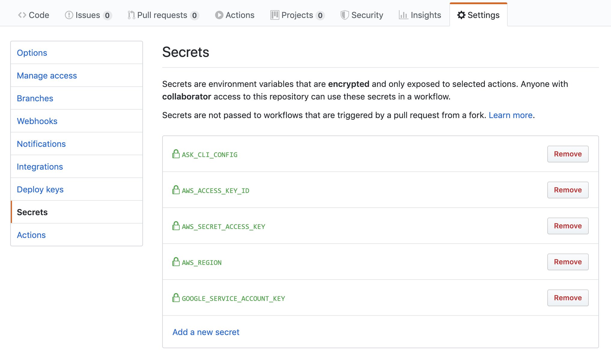
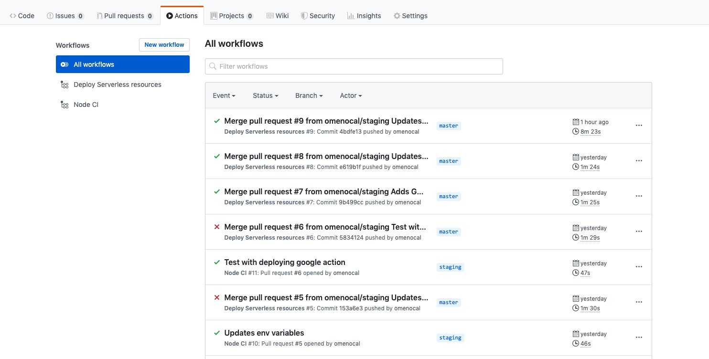
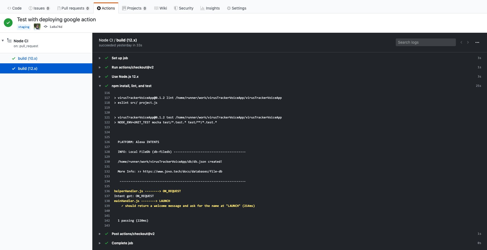
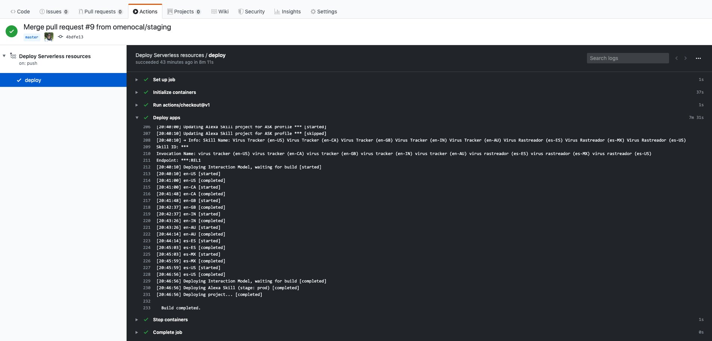

# Jovo CLI With GitHub Actions CI/CD


<div align="center">Photo by <a href="https://unsplash.com/@augie_ph">August Phlieger</a> on <a href="https://unsplash.com/photos/xmJ1sOzftdI">Unsplash</a></div><br/><br/>

Let's take a look how to set up GitHub Actions to do continuous integration/continuous deployment (CI/CD) with Jovo.

* [Configure the nodejs.yml file](#configure-the-nodejs.yml-file)
* [Configure the deploy-production.yml file](#configure-the-deploy-production.yml-file)
* [GitHub Secrets](#gitHub-secrets)
* [Send a Pull Request for CI](#send-a-pull-request-for-ci)
* [Merge Pull Request for CD](#merge-pull-request-for-cd)

## Configure the nodejs.yml file

When you work with GitHub Actions, you can add a file named nodejs.yml into this path of your project: **/.github/workflows/nodejs.yml** to define the CI/CD instructions. Here's an example of this file:

```sh
name: Node CI

on:
  pull_request:
    branches:
      - staging

jobs:
  build:

    runs-on: ubuntu-latest

    strategy:
      matrix:
        node-version: [10.x, 12.x]

    steps:
    - uses: actions/checkout@v2
    - name: Use Node.js ${{ matrix.node-version }}
      uses: actions/setup-node@v1
      with:
        node-version: ${{ matrix.node-version }}
    - name: npm install, lint, and test
      env:
        CI: true
      run: |
        NODE_ENV=development
        npm install
        npm run lint
        npm run test

```

In the **pull_request** section, we have defined the branches we want this yml file to run for when a new Pull Request is opened. We have also defined the steps that we want to run for Continuos Integration:

```sh
    - NODE_ENV=development
    - npm install
    - npm run lint
    - npm run test
```


## Configure the deploy-production.yml file

You can name the .yml files with whatever name you want, there is not any special nomenclature to follow for these names. We have created this file in the following path **/.github/workflows/deploy-production.yml** to push the code to the production environment, as well as the Alexa and Dialogflow resources.

```sh
name: Deploy Serverless resources

on:
  push:
    branches:
      - master
jobs:
  deploy:
    name: deploy
    runs-on: ubuntu-latest
    container:
      image: omenocal/jovo-deploy
    steps:
    - uses: actions/checkout@v1
    - name: Deploy apps
      env:
        NODE_ENV: prod
        ASK_CLI_CONFIG: ${{ secrets.ASK_CLI_CONFIG }}
        AWS_ACCESS_KEY_ID: ${{ secrets.AWS_ACCESS_KEY_ID }}
        AWS_DEFAULT_REGION: ${{ secrets.AWS_DEFAULT_REGION }}
        AWS_SECRET_ACCESS_KEY: ${{ secrets.AWS_SECRET_ACCESS_KEY }}
        GOOGLE_SERVICE_ACCOUNT_KEY: ${{ secrets.GOOGLE_SERVICE_ACCOUNT_KEY }}
      run: |
        npm install
        echo "jovo -v"
        jovo -v
        sh ./scripts/deployLambda.sh prod
        sh ./scripts/deployAlexa.sh prod
        sh ./scripts/deployGoogle.sh prod

```

In the **push** section, we have defined the branches we want this yml file to run for when a commit is merged. We have also defined the steps that we want to run for Continuos Deployment:

```sh
    - npm install
    - echo "jovo -v"
    - jovo -v
    - sh ./scripts/deployLambda.sh prod
    - sh ./scripts/deployAlexa.sh prod
    - sh ./scripts/deployGoogle.sh prod
```

In the container section of the file, you'll see the Docker image used: **omenocal/jovo-deploy**. You can find it on this [link](https://hub.docker.com/r/omenocal/jovo-deploy). This Docker image was built using this repository:

https://github.com/theBenForce/jovo-deploy-container

Shout out to [Ben Force](https://github.com/theBenForce) for creating this Jovo Docker image!

You can clone the repository and create your own Docker image without changing anything. You can do that if you want to have your image in your own Docker account.

Thanks to this image mounted in the CD process, we can use the ASK CLI and the Jovo CLI because they are preinstalled.

The **deployLambda.sh** file looks like this:

```bash
#!/usr/bin/env bash
set -euo pipefail
set -o xtrace

ENV=$1

jovo deploy -p alexaSkill -t lambda --stage $ENV

```

The **deployAlexa.sh** file looks like this:

```bash
#!/usr/bin/env bash
set -euo pipefail
set -o xtrace

ENV=$1

mkdir -p ~/.ask
echo $ASK_CLI_CONFIG > ~/.ask/cli_config

ask -v

jovo build -p alexaSkill --stage $ENV --deploy

```

You'll notice the environment variable **$ASK_CLI_CONFIG**. You can set up your environment variables in the Secrets section of your GitHub Repository settings, and this is what the next section is about.


## GitHub Secrets

To set up a GitHub Workflow, you need to have admin privileges on your repository. Go to the Settings tab, and on the left section, click on the Secrets label.

In this screen you'll be able to set up the environments variables used to push the code to AWS Lambda, push the interaction model to the Alexa Developer Console, and the agent to Dialogflow.




To automate deployments with Jovo CLI to push your code to your AWS Lambda function, your agent to Dialogflow, and to your interaction model to the Alexa Developer Portal, you need five environment variables:

- **AWS_ACCESS_KEY_ID** && **AWS_SECRET_ACCESS_KEY**: You can create access keys in the AWS IAM dashboard of your AWS account. You only need to attach a policy with the lambda:UpdateFunctionCode permission to an IAM user on the Lambda function to upload the code of your project.

- **AWS_DEFAULT_REGION**: the region for which your Lambda function is created - for example, us-east-1

- **ASK_CLI_CONFIG**: This is a JSON string the ASK CLI uses to deploy the skill metadata and interaction model to the Alexa developer console. This string looks like this:

```json
{
  "profiles": {
    "default": {
      "aws_profile": null,
      "token": {
        "access_token": "Atza|IwEBIE58G5DvmLtqUtmEI7vJebT_AEG0COAQcL1234",
        "refresh_token": "Atzr|IwEBIJvlOtPiJga-xhFEKqDknkhd2SOU0wHHZ58Q1234",
        "token_type": "bearer",
        "expires_in": 3600,
        "expires_at": "2018-03-30T01:42:13.049Z"
      }
    }
  }
}
```

To build the file with this string in your computer, you need to set up a profile using the ASK CLI. When you set up the profile, this file will be created in the *home* path of your computer. In Linux and Mac computers, you can find it in here: *~/.ask/cli_config*.

Grab the *access_token* and *refresh_token* values, and place them into this JSON string. Then, paste it into the environment variable in your deployment configuration.

- **GOOGLE_SERVICE_ACCOUNT_KEY**: this is the JSON key you create in your Google Cloud Project with the Actions API Enabled and with Dialogflow Admin permissions granted. For more information on how to get this key, follow this link: [Deploying your Dialogflow Agent using the Jovo CLI](https://www.jovo.tech/tutorials/deploy-dialogflow-agent).

The **deployGoogle.sh** file looks like this:

```bash
#!/usr/bin/env bash
set -euo pipefail
set -o xtrace

ENV=$1

echo $GOOGLE_SERVICE_ACCOUNT_KEY > key-file.json

jovo build -p googleAction --stage $ENV --deploy

```

You can see this is the file where we use the service account key to deploy our app to Dialogflow.

## Send a Pull Request for CI



When you open a pull request, the workflow will execute the **pull_request** portion of the configuration file in your GitHub repository to run ESLint and tests. This is how it looks like:




## Merge Pull Request for CD

When you merge this pull request into the master branch, a merge commit will be pushed to the branch, and the deployment process will be triggered.




<!--[metadata]: { "description": "Learn how to set up a GitHub repository with GitHub Actions to deploy a Jovo voice app.", "author": "octavio-menocal", "tags": "Jovo, CLI, GitHub, Actions, CI, CD, CI/CD", "og-image": "https://www.jovo.tech/img/tutorials/jovo-cli-and-github-actions-tutorial/intro.jpg"  }-->
