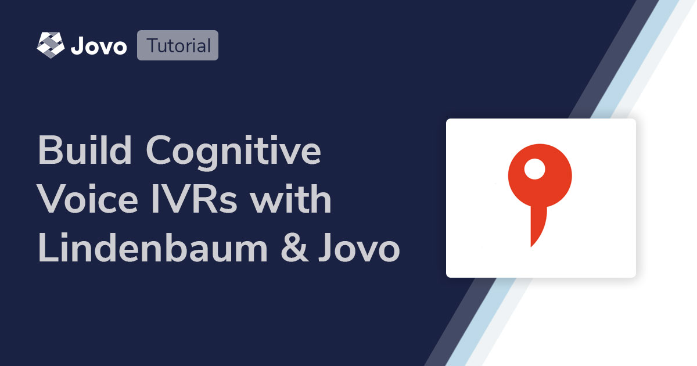
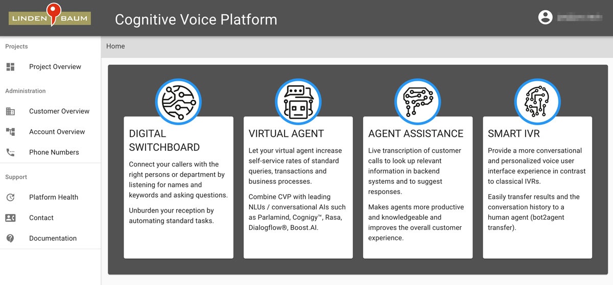
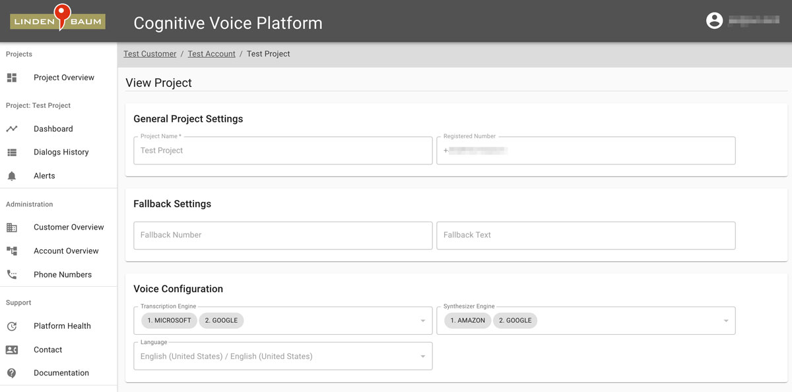
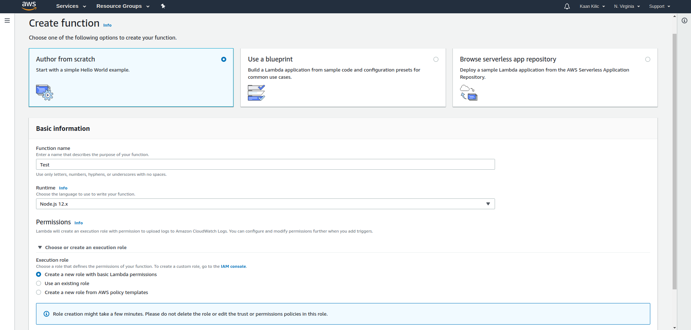
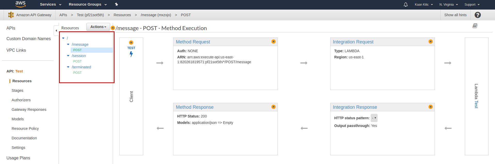

# Build IVRs with Lindenbaum Cognitive Voice and Jovo



[Lindenbaum Cognitive Voice](https://www.lindenbaum.eu/en/cognitive-voice-voice-bot-integration/) is a European platform to create voice bots that are deployable as smart IVR systems.

In this tutorial, we will go over all steps to get your first Lindenbaum project going. We will cover the basics of the platform, add a natural language understanding (NLU) service, prepare the handler, and go over the details on how responses work with the Jovo Lindenbaum integration.

Watch the video here:
[](https://www.youtube.com/watch?v=zizPsZWVE8U)


* [Introduction to Lindenbaum Cognitive Voice](#introduction-to-lindenbaum-cognitive-voice)
* [How the Jovo Lindenbaum Integration works](#how-the-jovo-lindenbaum-integration-works)
	* [Requests](#requests)
	* [Responses](#responses)
* [Installation](#installation)
	* [Adding an NLU Service](#adding-an-nlu-service)
	* [Adding the Different Endpoints](#adding-the-different-endpoints)
* [Ordering your Responses](#ordering-your-responses)


## Introduction to Lindenbaum Cognitive Voice

With Lindenbaum Cognitive Voice, you can build voice bots for the phone. The platform offers the possibility to connect a phone number to a wide stack of automated speech recognition (ASR), natural language understanding (NLU), and text to speech (TTS) engines as well as integrations for multiple European contact center platforms. [Learn more in the official Lindenbaum API documentation](https://app.swaggerhub.com/apis/Lindenbaum-GmbH/).

To create a Lindenbaum account and set up your first phone number, contact the company at the [Cognitive Voice website](https://www.lindenbaum.eu/en/cognitive-voice-voice-bot-integration/).

You will then get access to the Cognitive Voice Platform.



In there, you can set up multiple projects that are connected to phone number. There are additional configurations that can be done. For example, different speech recognition ("Transcription Engine") and text to speech ("Synthesizer Engine") providers can be selected. There is even the possibility to provide fallback options.



After setting up the project and phone number, the conversational logic can be built with the Jovo Framework. Let's get started.


## How the Jovo Lindenbaum Integration works

> [Learn more about the Jovo basics in our documentation](https://www.jovo.tech/docs/quickstart).

While Lindenbaum works just like other platforms at the core, there are still two key differences. First, we don't have one single endpoint to which the platform sends the request. Second, we don't just send a single response rather multiple API calls to each specific response functionality (e.g. speech and audio).

Although most of it is handled by the framework in the background, it is still good to know what you're going to be working with.

Let's start with the requests.

### Requests

As described earlier, the Lindenbaum platform sends requests to three different endpoints. Each endpoint has a different request schema.

The first request is sent when the user calls the bot's number. It is automatically mapped to Jovo's LAUNCH intent and has the following scheme:

```js
{
  "dialogId": "574255f8-2650-49ea-99bc-3edc4b89369b",
  "timestamp": "1587057946",
  "local": "+4972112345678",
  "remote": "+4972110203040",
  "language": "en-US",
  "callback": "https://callback.com/restbot"
}
```

The second endpoint receives the requests containing the user's input (either speech or DTMF).

```js
{
  "dialogId": "574255f8-2650-49ea-99bc-3edc4b89369b",
  "timestamp": "1587057946",
  "text": "Hello World",
  "type": "SPEECH",
  "language": "en-US",
  "confidence": 0,
  "callback": "https://callback.com/restbot"
}
```

In the above request, we can see that the platform provides a transcript of raw text the user said to the bot ("Hello World"). This means we have the opportunity to add one of [Jovo's NLU integrations](https://www.jovo.tech/marketplace/tag/nlu) to turn this text into an intent. More on that in the [Installation](#installation) section.

Last but not least, the request that is sent when the user ends the call. It is automatically routed to the `END` intent:

```js
{
  "dialogId": "574255f8-2650-49ea-99bc-3edc4b89369b",
  "timestamp": "1587057946"
}
```


### Responses

As described earlier, we don't send out a single response JSON but multiple API calls for each part of the response. These are sent to the `callback` property parsed with the request. Each endpoint represents one response functionality. For each of the endpoints there are built-in functions to prepare your response:

Function | Description | Return Value | Endpoint
:--- | :--- | :--- | :---
`addBridge(extensionLength: number, headNumber: string)` | bridge the call to the `headNumber` parameter | this | `/call/bridge`
`addData(key: string, value: string)` | add data to the current conversation. Can be later on retrieved using the Lindenbaum Dialog API | this | `/call/data`
`addDrop()` | terminate the conversation manually | this | `/call/drop`
`addForward(destinationNumber: string)` | forward the call to the `destinationNumber` parameter | this | `/call/forward`
`tell(text: string)` / `ask(text: string)` | standard speech output. If you use drop, the framework will also add an API call to the `/call/drop` endpoint at the end to terminate the conversation | this | `/call/say`

If you add a call to the `bridge` or `forward` endpoint and want to add additional speech output, you have to use `ask()`. The `tell()` function automatically adds a call to the `drop` endpoint which terminates the whole session and with that blocks `bridge` and `forward`.

While that is different from what you're probably used to, it allows you to create more creative responses, for example, first the speech output, then an audio file, followed by another speech output. That wouldn't be possible with Alexa. However, it also comes with the challenge of the order of each API call. We will go over it in detail in the [last section](#adding-a-custom-response) of the tutorial.

Now that we're done with the basics, let's get started with setting up our project.

## Installation

In this section, we will go through the process of creating a new Jovo project and adding all the necessary integrations to work with Lindenbaum Cognitive Voice. You can also take a look at our [Lindenbaum Hello World Template](https://github.com/jovotech/jovo-templates/tree/master/lindenbaum/01_helloworld) which comes with all the necessary configurations.

```sh
// @language=javascript

# Option 1: Install new project from scratch
$ jovo new myProject
$ cd myProject

# Option 2: Install Lindenbaum Hello World template
$ jovo new myProject --template lindenbaum
$ cd myProject

// @language=typescript

# Option 1: Install new project from scratch
$ jovo new myProject --language typescript
$ cd myProject

# Option 2: Install Lindenbaum Hello World template
$ jovo new myProject --language typescript --template lindenbaum
$ cd myProject
```

For projects that were created from scratch, we need to install the Lindenbaum integration's npm package:

```sh
$ npm install --save jovo-platform-lindenbaum
```

After that, we can add the platform to our app object:

```js
// @language=javascript

// src/app.js

const { Lindenbaum } = require('jovo-platform-lindenbaum');

app.use(new Lindenbaum());

// @language=typescript

// src/app.ts

import { Lindenbaum } from 'jovo-platform-lindenbaum';

app.use(new Lindenbaum());
```

### Adding an NLU Service

As mentioned above, the Lindenbaum integration provides transcribed text. To turn this text into intents and inputs, we have to add a natural language understanding (NLU) service. Jovo provides integrations for a big variety of NLUs from Dialogflow to Rasa and more. [You can find all NLU integrations here](https://www.jovo.tech/marketplace/tag/nlu). For this tutorial, we will use [NLP.js](https://www.jovo.tech/marketplace/jovo-nlu-nlpjs) which is an open source solution.

With NLP.js we can use the Jovo Language Model and convert it into the native NLP.js language model.

First, we add a custom input type used by NLP.js to extract the name from the user's utterance (feel free to add your own name as well):

```js
// models/en-US.json

{
	/**
	 * ...
	 */
	"inputTypes": [
		{
			"name": "NameInputType",
			"values": [
				{
					"value": "max"
				},
				{
					"value": "jane"
				},
				{
					"value": "joe"
				}
			]
		}
	]
}
```

If you're using Lindenbaum as standalone platform, feel free to delete the input types of the `MyNameIsIntent` for Alexa and Dialogflow and add the one for NLP.js:

```js
// models/en-US.json
{
  	"intents": [
		{
			"name": "HelloWorldIntent",
			"phrases": [
				"hello",
				"say hello",
				"say hello world"
			]
		},
		{
			"name": "MyNameIsIntent",
			"phrases": [
				"{name}",
				"my name is {name}",
				"i am {name}",
				"you can call me {name}"
			],
			"inputs": [
				{
					"name": "name",
					"type": {
						"nlpjs": "NameInputType"
					}
				}
			]
		}
	],
	/**
	 * ...
	 */
}
```

Last but not least, you can delete the `alexa` and `dialogflow` parts from the language model since you don't need them if you only use the Lindenbaum platform. The final language model should look like this:

```js
{
	"invocation":"my test app",
	"intents": [
		{
			"name": "HelloWorldIntent",
			"phrases": [
				"hello",
				"say hello",
				"say hello world"
			]
		},
		{
			"name": "MyNameIsIntent",
			"phrases": [
				"{name}",
				"my name is {name}",
				"i am {name}",
				"you can call me {name}"
			],
			"inputs": [
				{
					"name": "name",
					"type": {
						"nlpjs": "NameInputType"
					}
				}
			]
		}
	],
	"inputTypes": [
		{
			"name": "NameInputType",
			"values": [
				{
					"value": "max"
				},
				{
					"value": "jane"
				},
				{
					"value": "joe"
				}
			]
		}
	]
}
```

Now that the language model is ready we can add the NLP.js integration. For that we have to install the necessary package:

```sh
$ npm install --save jovo-nlu-nlpjs
```

After that, we add the NLU integration as a plugin to our platform:

```js
// @language=javascript

// src/app.js

const { Lindenbaum } = require('jovo-platform-lindenbaum');
const { NlpjsNlu } = require('jovo-nlu-nlpjs');

const lindenbaum = new Lindenbaum();
lindenbaum.use(new NlpjsNlu());

app.use(lindenbaum);

// @language=typescript

// src/app.ts

import { Lindenbaum } from 'jovo-platform-lindenbaum';
import { NlpjsNlu } from 'jovo-nlu-nlpjs';

const lindenbaum = new Lindenbaum();
lindenbaum.use(new NlpjsNlu());

app.use(lindenbaum);
```

That's it.

### Adding the Different Endpoints

As we discussed earlier, the Lindenbaum platform sends requests to three separate endpoints. The ExpressJS server of a default Jovo project only supports one endpoint. Because of that, we add a middleware which redirects all of the 3 endpoints to the single default one. The integration already provides the necessary middleware function. You simply have to import and add it to your project's ExpressJS instance.

For that, add the following piece of code to your project's `index.js` file:

```js
// @language=javascript

// src/index.js

const { Lindenbaum } = require('jovo-platform-lindenbaum');

Webhook.use(Lindenbaum.lindenbaumExpressJsMiddleware);

// @language=typescript

// src/index.ts

import { Lindenbaum } from 'jovo-platform-lindenbaum';

Webhook.use(Lindenbaum.lindenbaumExpressJsMiddleware);
```

That's all the configuration we need for local testing.

> If you decide to host your project on one of the many cloud providers, e.g. AWS, you have to configure the environment to handle the multiple endpoints. Just click on the expandable section below to get a walk-through for AWS. You can skip it if you only want to test it locally.

<details>
<summary>Host your Lindenbaum project on AWS</summary>
First, we deploy our project to AWS Lambda. Create a new function with the following basic settings:



After that we run the following command in your project's root folder:

```sh
$ npm run bundle
```

That will create an optimized zip file which we can upload to Lambda using the upload button at the bottom left:


Now we save everything using the orange button at the top right and we're done here.

Next up, we have to create an API Gateway with `REST API` as the type:


After that, we create a new resource to add the `/message` endpoint:


Now, we add a `POST` method to the `/message` endpoint and select our Lambda function:


Now we repeat the same steps for the other endpoints `/session` and `/terminated`. The final API should look like this:



Now, we deploy the API:


And create a new stage:


That's it. Now we have our API's URL which we can use for our Lindenbaum project:


</details>

## Ordering your Responses

Technically we're done. You could call your bot's number and have the default conversation (hello world and telling it your name), but we will go one step ahead and add a custom more complex response. While doing that we will go over how the framework orders the API calls for your response and how you can decide the order yourself.

So why is the order important with Lindenbaum but not with other platforms like Alexa? Because Alexa expects a single JSON response which works trough in a predetermined order, e.g. first speech output then audio files. 
Lindenbaum gives you the freedom to choose your order. You can play an audio file first, have a speech output after that and lastly route them to a different phone number. All within one single response.

Since the Jovo Framework was first built for Alexa & Google Assistant, it is not perfectly fit to accommodate the wide range of response possibilities. The Jovo Framework orders your responses by sending the API request for `ask`/`tell`/`audio` first, followed by `forward`/`bridge` and lastly the `data` request for the Dialog API (learn more about it in the [docs](https://jovo.tech/docs/lindenbaum#dialog-api)).

For more complex responses you can use the `setResponses(arr: Responses[])` method. Here we follow the principle of what you see is what you get, meaning the API calls will be made in the same order as the array.

Lets use it build a response where we route the conversation to a different phone number (in case you don't have a second phone at hand, simply use the number of the phone you're testing with in which case it should hear the mailbox):

```js
// @language=javascript

MyNameIsIntent() {
	const dialogId = this.$request.getSessionId();
	const language = this.$request.getLocale();
	const name = this.$inputs.name.value;
	const phoneNumber = '<your-second-phone-number>';

	this.$lindenbaumBot.setResponses([
		{
			'/call/say': {
				dialogId,
				language,
				text: `Hi ${name}, I will forward you to my colleague`,
				bargeIn: false
			}
		},
		{
			'/call/forward': {
				dialogId,
				destinationNumber: phoneNumber,
			}
		}
	]);
}

// @language=typescript

MyNameIsIntent() {
	const dialogId = this.$request!.getSessionId();
	const language = this.$request!.getLocale();
	const name = this.$inputs.name.value;
	const phoneNumber = '<your-second-phone-number>';

	this.$lindenbaumBot!.setResponses([
		{
			'/call/say': {
				dialogId,
				language,
				text: `Hi ${name}, I will forward you to my colleague`,
				bargeIn: false
			}
		},
		{
			'/call/forward': {
				dialogId,
				destinationNumber: phoneNumber,
			}
		}
	]);
}
```

> You can find the interfaces for the responses in our [docs](https://jovo.tech/docs/lindenbaum#responses).

To test it, we run the Jovo Webhook and call the bot's number with our phone:

```sh
$ jovo run
```

After telling the bot our name, we should be forwarded to the other number.

---

That's it, you made it to the end!

**Any questions? Please let us know in the comments below 👇. You can also reach us on [Twitter](https://twitter.com/jovotech) or [Slack](https://www.jovo.tech/slack).**

<!--[metadata]: { "description": "Learn how to build conversational experiences for the phone (IVRs) by using the Lindenbaum Cognitive Voice platform and the Jovo Framework.", "author": "kaan-kilic", "tags": "Lindenbaum", "og-image": "https://www.jovo.tech/img/tutorials/lindenbaum-cognitive-voice/lindenbaum-ivr-jovo.jpg" }-->