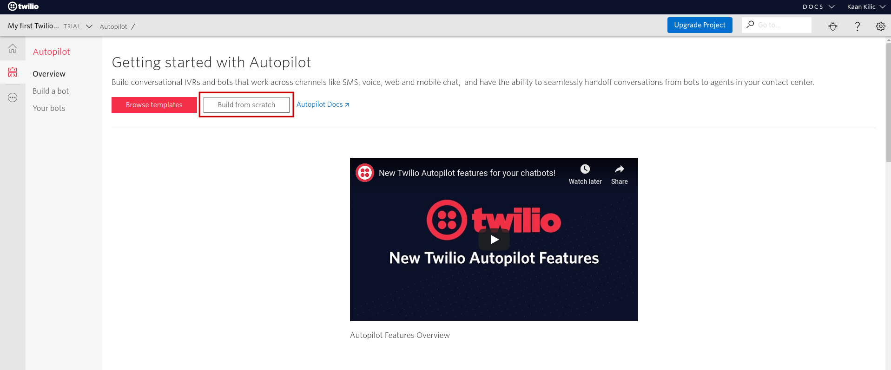
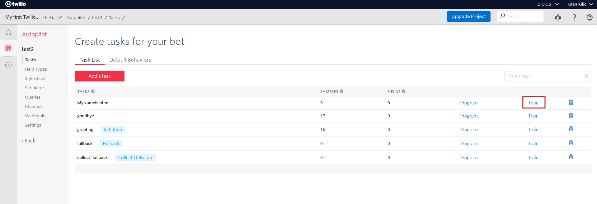
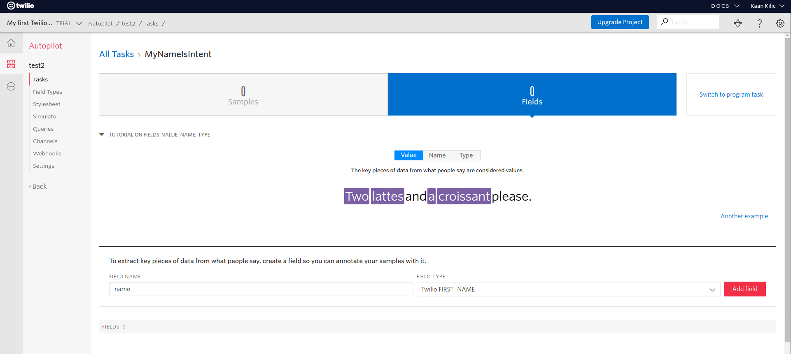
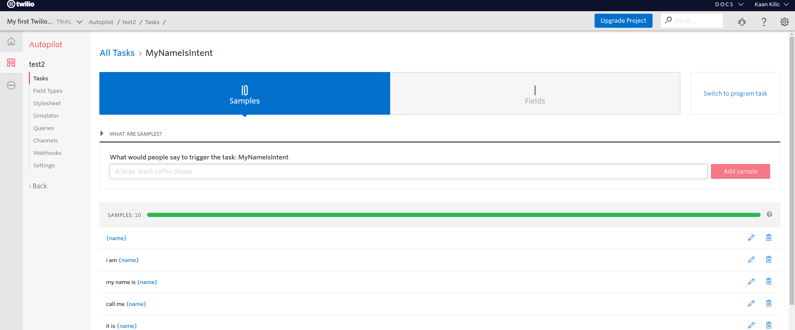
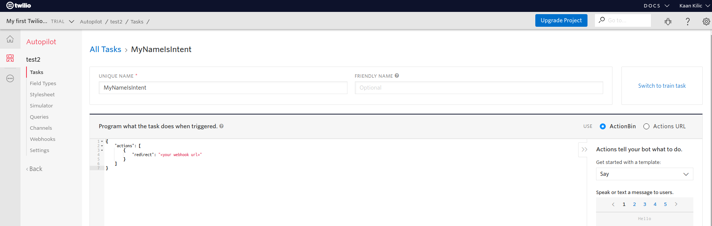
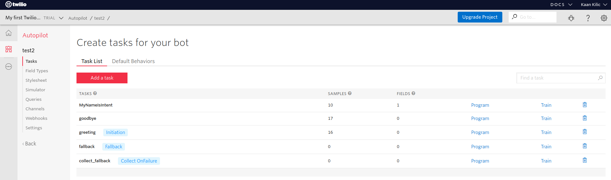
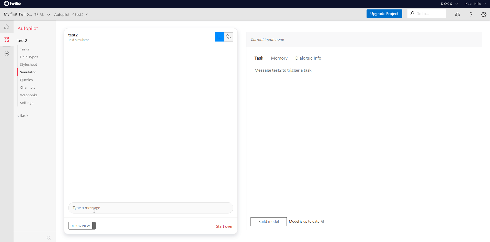

# Getting Started with Twilio Autopilot Using the Jovo Framework

In this tutorial, we will go over the complete process of setting up a basic bot on Twilio Autopilot using the Jovo Framework.

> This tutorial expects basic knowledge about the Jovo Framework. If you're completely new to it, check out the [Getting Started](https://www.jovo.tech/docs/quickstart) page first

* [Introduction](#introduction)
* [Create a Jovo Project](#create-a-jovo-project)
* [Creating your Twilio Autopilot Bot](#creating-your-twilio-autopilot-bot)
* [Testing your Twilio Autopilot Bot](#testing-your-twilio-autopilot-bot)
* [Next Up](#next-up)

## Introduction

The [Twilio Autopilot platform](https://www.twilio.com/autopilot) allows you to build, train, and deploy bots that work across web and mobile chat, SMS, WhatsApp, and your contact center. Its biggest strength is the wide variety of channels it provides for your users to access your bot. These range from phone numbers (calls & SMS) to chat apps like Facebook Messenger, WhatsApp, or even Slack. Besides that, the platform is deeply integrated with the other products of Twilio.

In this tutorial, we will first create an Autopilot bot, modify its language model, and create a Jovo project to handle the requests.

## Create a Jovo Project

Before everything else, create a new Jovo project and the `jovo-platform-twilioautopilot` package as a dependency:

```sh
$ jovo new twilio-autopilot-hello-world

$ npm install --save jovo-platform-twilioautopilot
```

Now open the `src/app.js` file in your project and add the platform to the other plugins:

```js
'use strict';

// ------------------------------------------------------------------
// APP INITIALIZATION
// ------------------------------------------------------------------

const { App } = require('jovo-framework');
const { Alexa } = require('jovo-platform-alexa');
const { GoogleAssistant } = require('jovo-platform-googleassistant');
const { JovoDebugger } = require('jovo-plugin-debugger');
const { FileDb } = require('jovo-db-filedb');

const { Autopilot } = require('jovo-platform-twilioautopilot');

const app = new App();

app.use(
    new Alexa(),
    new GoogleAssistant(),
    new JovoDebugger(),
    new FileDb(),

    new Autopilot()
);

// ...
```

That's all you need to do on the Jovo side. Now, it's time to create the bot.

## Creating your Twilio Autopilot Bot

First, open up the [Twilio Console](https://www.twilio.com/console). On there, open up the list of products and select Autopilot:


Now, select *Build from Scratch* and give your bot a name:



A basic bot has four tasks (intents). We will add another one called "MyNameIsIntent". After that, it's time to add the utterances for that intent:



Since we want the user to parse their name when they trigger the "MyNameIsIntent", we have to first define the necessary field (slot). Simply name it "name" and set the *field type* to "Twilio.FIRST_NAME":



After that, we add the utterances in the *Samples* tab. In each utterance, we mark the field using curly brackets:



Now we have to define how the fulfillment of the task will work. The Autopilot platform allows you to either provide a static JSON as a response for each task or lets you set an endpoint to which the request will be sent to. In our case, it's the latter. 

To set the fulfillment of our task, switch over to the *program task* tab. You can find it right next to the *Fields* and *Samples* tabs.

We will use the [Jovo Webhook](https://www.jovo.tech/docs/jovo-webhook) as our endpoint. To get the URL, run the `jovo run` command in the root directory of your project and copy it from your terminal:

```sh
$ jovo run
```

After that, set the JSON of your Autopilot bot's task to:

```js
{
	"actions": [
		{
			"redirect": "<your webhook url>"
		}
	]
}
```



Now press the red *Save* button at the bottom of the page. Last but not least, you have to add the same JSON to the other tasks so these are redirected to your Jovo project's endpoint as well.

After you're done with that, press the *Build model* button right next to the *Save* button for all of your changes to take effect.

## Testing your Twilio Autopilot Bot

First, run your Jovo Webhook using the `jovo run` command:

```sh
$ jovo run
```

After that, open the platform's simulator:



In the simulator, you can test your bot. Currently, only two tasks (intents) are working, namely `LAUNCH` and `MyNameIsIntent`. The others are not included in your project's handler yet. Here's how a possible interaction will look like:



## Next Up

While we got the basic project working, the Twilio Autopilot platform provides a couple of other features, that we should have a quick look at. But, before that, we have to talk about a small issue with the Jovo Framework integration.

Incoming requests from Twilio Autopilot don't specify whether the request is from a new session or an existing one. Parts of the Jovo functionality depend on that information, e.g. the [NEW_SESSION](https://www.jovo.tech/docs/routing/intents#new_session) intent. To be able to use the functionality without the parameter, you have the option to save the current session's ID in your database. The new entries would have the following scheme: 

```js
{
    "userId": "...",
    "userData": {
        "data": {...}
        "session": {
            "lastUpdatedAt": "ISO 8601 string",
            "id": "session ID"
        }
    }
}
```

You can enable it in your project's `config.js` file:

```js
// src/config.js

module.exports = {
    
    user: {
        sessionData: {
            enabled: true,
            id: true
        },
    },

    // ...
};
```

Now back to Twilio Autopilot's features. All of the Autopilot specific objects and functions are accessed using the `$autopilotBot` object. Some of them are directly integrated into the framework. For example, adding a card to your response:

```js
this.$autopilotBot.showStandardCard(
  'Hello World',
  {
    label: 'Hello World Image',
    url: 'https://www.url.to/hello-world.png'
  }
);
```


The others (e.g. [collect, redirect, handoff](https://www.twilio.com/docs/autopilot/actions)) can be accessed using the `setActions()` function. It allows you to define the [array of actions](https://www.twilio.com/docs/autopilot/actions#example-actions-json) that make up the response to the platform's request yourself:

```js
this.$autopilotBot.setActions([
  {
    say: 'Hi there! I\'m Jaimie your new Assistant. How can I help you'
  },
  {
    play: {
      loop: 2,
      url: 'https://api.twilio.com/cowbell.mp3'
    }
  },
  {
    redirect: 'task://customer-satisfaction-survey'
  }
]);
```

That's all you need to build your Autopilot bot. You can find a more detailed explanation of the integration in our [docs](https://www.jovo.tech/docs/twilio-autopilot).

**Any questions? You can reach us on [Twitter](https://twitter.com/jovotech) or [Slack](https://www.jovo.tech/slack).**

<!--[metadata]: { "description": "Learn how get started with the Twilio Autopilot platform using the Jovo Framework", "author": "kaan-kilic", "tags": "Twilio Autopilot, Getting Started", "og-image": "" }-->