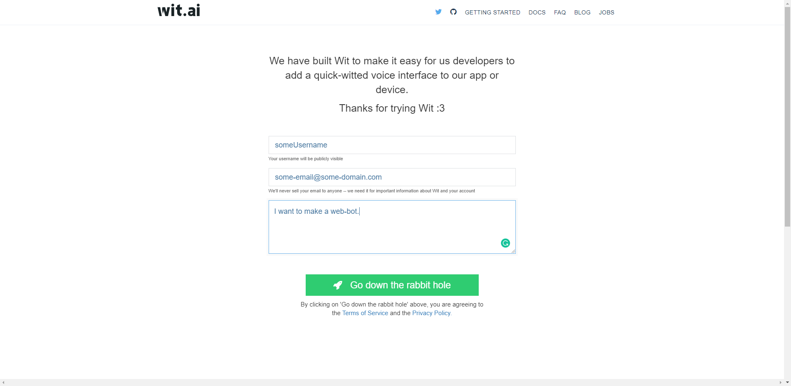
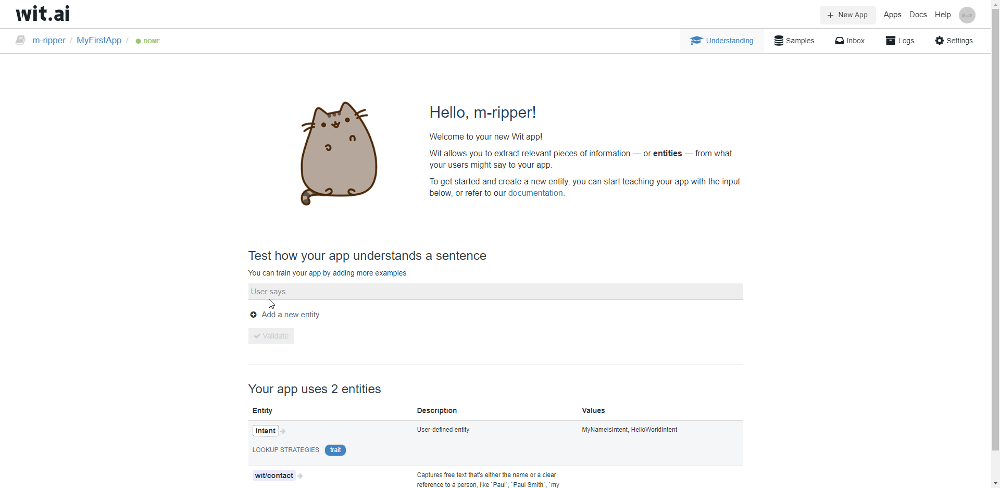
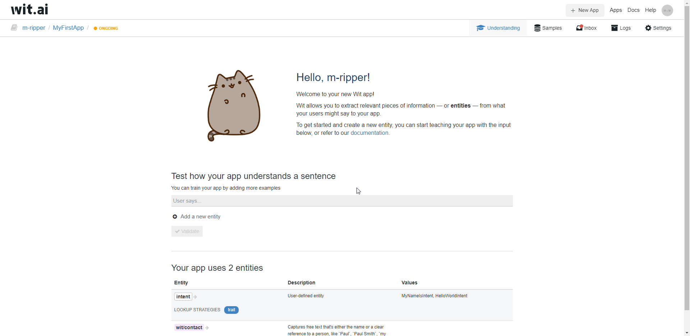

# Build a Voice-Enabled Web App with Jovo

In this tutorial, we will go over the complete process of setting up a voice-enabled web app with the Jovo Framework.


> This tutorial expects basic knowledge about the Jovo Framework. If you're completely new to it, check out the [Getting Started](https://www.jovo.tech/docs/quickstart) page first

## Introduction
First we will create a new Jovo app, then make it compatible with the web-app and the last step will be setting up the web-app.

This is what the result will look like:


## Create A Jovo Project
We will first have to create a new Jovo project and add the `jovo-platform-core` package as a dependency:
```sh
$ jovo new core-platform-web-hello-world

$ npm install jovo-platform-core --save
```

Now, that we have installed the `jovo-platform-core` package, we have to open the `src/app.js`-file and register the package:
```javascript
'use strict';

// ------------------------------------------------------------------
// APP INITIALIZATION
// ------------------------------------------------------------------

const { App } = require('jovo-framework');
const { Alexa } = require('jovo-platform-alexa');
const { GoogleAssistant } = require('jovo-platform-googleassistant');
const { JovoDebugger } = require('jovo-plugin-debugger');
const { FileDb } = require('jovo-db-filedb');

const { CorePlatform } = require('jovo-platform-core');

const app = new App();

const corePlatform = new CorePlatform();

app.use(
    new Alexa(),
    new GoogleAssistant(),
    new JovoDebugger(),
    new FileDb(),

    corePlatform
);
```

## Add a SLU integration
We will need a SLU integration to carry out the ASR- & NLU-processing. For this tutorial, we will be using Wit.ai because it is free and easy to setup.

### Create a Wit.ai bot

First of all, we will have to create an account and a bot on Wit.ai. \
For that, we have to go to [https://wit.ai/](https://wit.ai/) and click on 'Log in with GitHub' or 'Log in with Facebook'. \
If we do not have a Wit.ai account, we will be asked to create one:



This will redirect us to our first app called MyFirstApp.

In case we already have a Wit.ai account, we will create a new app for this tutorial by clicking on 'New App', filling out the form and submitting it via clicking 'Create App'.

Now, that we have a Wit.ai app, we can start modifying the language model. 
The first thing we are going to do is to add the HelloWorldIntent:


After adding the HelloWorldIntent, we have to wait until the status on the top left, next to the bot name changes to 'Done' again. \
Now, we can add more sample utterances to the HelloWorldIntent:


Our HelloWorldIntent is good to go now, so let's start adding the MyNameIsIntent:


Now, we have to wait again until the status is 'Done' again and then we can add the missing sample utterances for the MyNameIsIntent:



After we have added the missing sample utterances, we are going to name the slot, so that the input is available via the property 'name':



The last thing we will have to do here is to copy the API-token. For that we have to click on 'Settings' and copy the 'Server Access Token':


We will need this token in a couple of seconds.

### Integrate Wit.ai

Our Wit.ai bot is ready to be used. We only have to make our app use Wit.ai for ASR and NLU now.
To do that, we have to add the `jovo-slu-witai` package:

```sh
$ npm install jovo-slu-witai --save
```

With the dependency installed, we can register the `jovo-slu-witai` integration to the Core platform:

```javascript
'use strict';

// ------------------------------------------------------------------
// APP INITIALIZATION
// ------------------------------------------------------------------

const { App } = require('jovo-framework');
const { Alexa } = require('jovo-platform-alexa');
const { GoogleAssistant } = require('jovo-platform-googleassistant');
const { JovoDebugger } = require('jovo-plugin-debugger');
const { FileDb } = require('jovo-db-filedb');

const { CorePlatform } = require('jovo-platform-core');
const { WitAiSlu } = require('jovo-slu-witai');

const app = new App();

const corePlatform = new CorePlatform();

corePlatform.use(
    new WitAiSlu({
        token: '<YOUR_API_TOKEN>'
    })
)

app.use(
    new Alexa(),
    new GoogleAssistant(),
    new JovoDebugger(),
    new FileDb(),

    corePlatform
);
```

Now, we only have to replace '<YOUR_API_TOKEN>' with the API-token from Wit.ai.

We can now start the Jovo app by executing `jovo run`, assuming you have the [Jovo CLI](https://www.jovo.tech/docs/cli) installed.
An url will be logged to the console. Copy it, because it is needed to make the web-app communicate with the Jovo app.

## Setup the Web App
For this tutorial, we will be using an example web-app, which is available [here](https://github.com/jovotech/jovo-framework/tree/master/examples/typescript/core-platform-clients/vue/one-pager).

>  With [GitZip](https://kinolien.github.io/gitzip/) for example, it is possible to download just the subdirectory. A GitHub API Access Token is not needed, because the repository is public!

Now that we have the web-app locally, we can install it's dependencies:

```sh
$ npm install
```

When this is done, we can start the web-app by executing `npm run serve`. 
A link will be posted to the console that you can click to open the web-app.

If you open the link, the website should like this:


But we are not quite there yet, we will have to do one last thing. We have to make the web-app communicate with the Jovo app. \
To do so, we have to open `src/main.ts` and change the `WEBHOOK_URL` to the url we copied after executing `jovo run`.

Now, everything should be setup!

## Going Further
