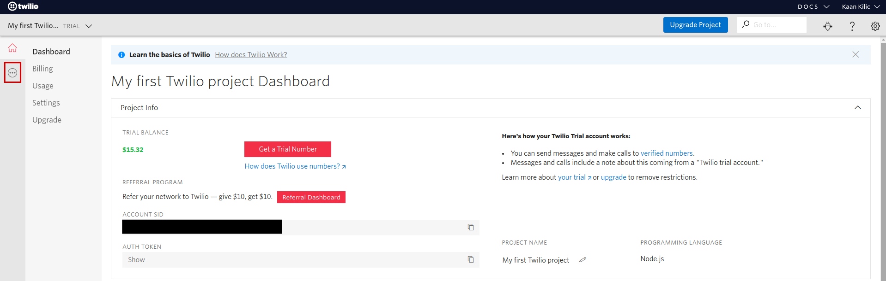
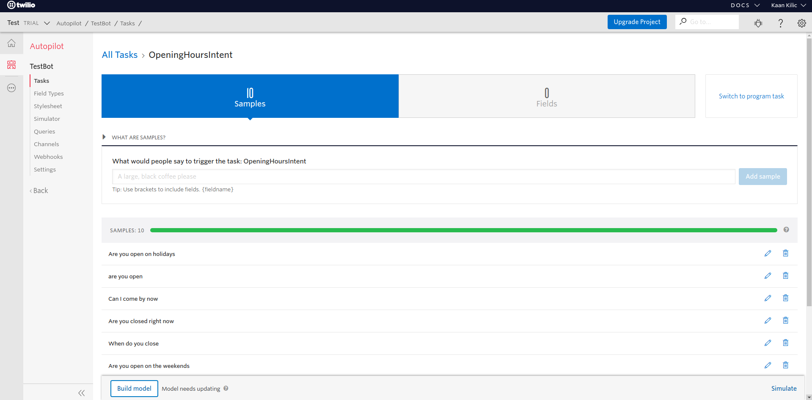
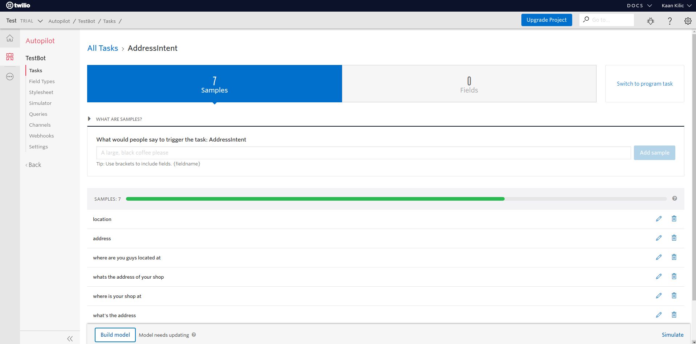
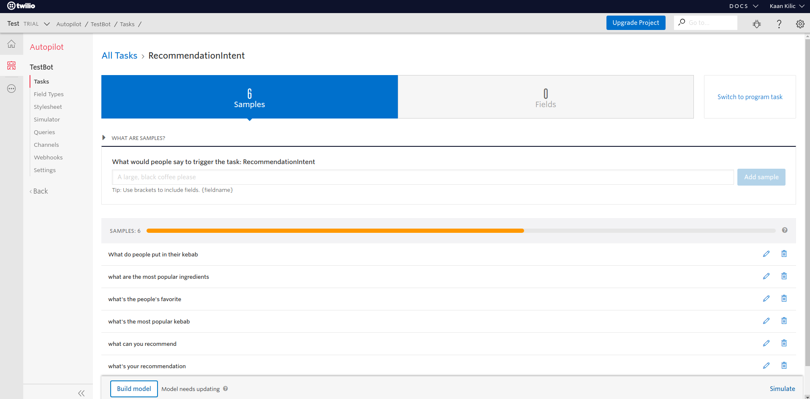
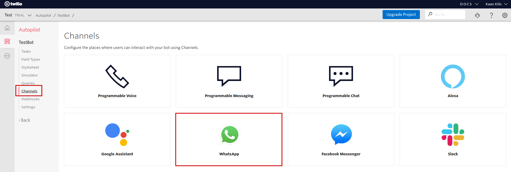
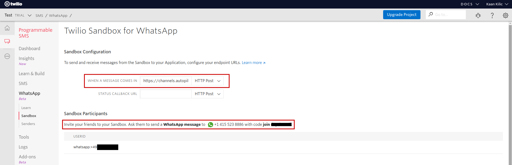
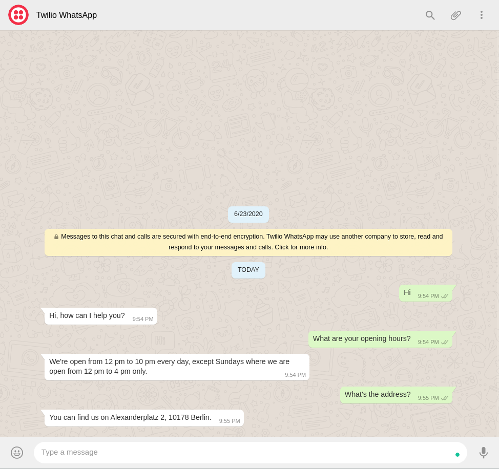

# WhatsApp Getting Started

In this tutorial we will build a small restaurant chatbot that can be accessed using WhatApp with the help of Twilio Autopilot.

* [Introduction](#introduction)
* [Create your Jovo Project](#create-your-jovo-project)
* [Create your Twilio Autopilot Bot](#create-your-twilio-autopilot-bot)
* [Configure Twilio WhatsApp Sandbox](#configure-twilio-whatsapp-sandbox)
* [Next Steps](#next-steps)

## Introduction

WhatsApp is the biggest messaging platform out there. With the launch of WhatsApp Business back in 2018 businesses are now able to connect with customers as well. Most of the customers requests tend to be questions about the business and its products. A job that fits a chatbot perfectly. In this short tutorial, we will build a chatbot for a fictional kebab restaurant that can handle simple questions like, opening hours or the address of the shop.

But, the focus of the tutorial is not the bot itself, but rather the deployment to WhatsApp. Sadly the WhatsApp Business API is restricted. You can only access it using one of Facebook's many partners. In this case we will use Twilio and its Autopilot platform.

> Note: We will use Twilio's WhatsApp Sandbox to build our bot. To deploy to production we would need a WhatsApp Business Profile as well as [request access to the WhatsApp Business API for our Twilio number](https://www.twilio.com/whatsapp/request-access). Since that process is well documented by Twilio and not really part of the deployment with Jovo, we will skip it in this tutorial. The switch from Sandbox to production is seamless so we're not loosing out on much anyways.

## Create your Jovo Project 

Let's get started by creating a new Jovo project. We will use the `autopilot` template which has the platform package already installed and initialized:

```sh
$ jovo new my-whatsapp-bot --template autopilot
```

After that, we move to the project's directory and start the Jovo Webhook:

```sh
$ cd my-whatsapp-bot
$ jovo run
```

The console should print out the Webhook's URL. Copy that. We will need it in a minute.

## Create your Twilio Autopilot Bot

Now, we open up [Twilio](https://www.twilio.com/console). On there, we select the Autopilot from the list of products:



Now, we select *Build from Scratch* and give our bot a name:


Now, let's add some basic intents for our kebab restaurant bot.

First, an `OpeningHoursIntent` which gets triggered when people ask for times at which the shop is open, with the following samples:

```
Are you open on holidays
are you open
Can I come by now
Are you closed right now
When do you close
Are you open on the weekends
Are you guys open right now
opening hours
When do you guys open
What are your opening hours
```



Second, an `AddressIntent` which gets triggered when people ask for the shop's address:

```
location
address
where are you guys located at
whats the address of your shop
where is your shop at
what's the address
Where is your store located at
```



Last but not least, a `RecommendationIntent` which gets triggered when people ask for a recommendation:

```
recommend me something please
can you recommend me something
What do people put in their kebab
what are the most popular ingredients
what's the people's favorite
what's the most popular kebab
what can you recommend
what's your recommendation
```



> Note: this bot is by no means ready for production. It's a just simple demo.

After that, we go over **each** of the bot's tasks and set the JSON to redirect the request to our Jovo Webhook URL:

```js
{
	"actions": [
		{
			"redirect": "https://webhook.jovo.cloud/<your-id>"
		}
	]
}
```


Before we move on to the deployment part of the tutorial, let's quickly add the handlers for the new intents to our Jovo project. For that, open up your project's `app.js` file and replace the current handler with the following:

```js
LAUNCH() {
  return this.toIntent('HelloWorldIntent');
},

HelloWorldIntent() {
  return this.ask('Hi, how can I help you?');
},

OpeningHoursIntent() {
  return this.ask('We\'re open from 12 pm to 10 pm every day, except Sundays where we are open from 12 pm to 4 pm only.');
},

AddressIntent() {
  return this.ask('You can find us on Alexanderplatz 2, 10178 Berlin.');
},

RecommendationIntent() {
  return this.ask('Most people get a doner kebab with cucumber, tomatoes, lettuce, onion, red cabbage, peperoni, goat cheese, and yogurt sauce on top.');
}
```

Next up, we will configure the Twilio WhatsApp Sandbox and connect it with our Autopilot bot.

## Configure Twilio WhatsApp Sandbox

First up, we have to open up the **Channels** property of our bot and select WhatsApp:



There we have to copy the URL which has to be added to the Sandbox.

Speaking of which, it's time to configure it. For that we head over [Twilio Sandbox for WhatsApp](https://www.twilio.com/console/sms/whatsapp/sandbox)

On there, we will find a WhatsApp number as well as simple code like: *join abc-xyz*. We send the exact message to the phone number to register our WhatsApp account with the Sandbox. Our own phone number should show up as an user ID after that. After that, we add the URL which we copied earlier to the form marked below:



Now, we start our Jovo Webhook and send a *hey* to the sandbox number. We should receive a response from our bot:

```sh
$ jovo run
```



## Next Steps

After building your bot with the Twilio WhatsApp Sandbox, you have to request access to the WhatsApp API for your Twilio phone number to deploy your bot to production. The best resource for that is Twilio's guide [right here](https://www.twilio.com/whatsapp/request-access).

Besides that, you could look into other response formats, for example [images](https://www.jovo.tech/marketplace/jovo-platform-twilioautopilot#visual-output---show-action) to provide your user's a better experience..

**Any questions? You can reach us on [Twitter](https://twitter.com/jovotech) or [Slack](https://www.jovo.tech/slack).**

<!--[metadata]: { "description": "Learn how to get a bot running on WhatsApp using Twilio Autopilot and Jovo", "author": "kaan-kilic", "tags": "Twilio Autopilot, Getting Started, WhatsApp", "og-image": "" }-->
